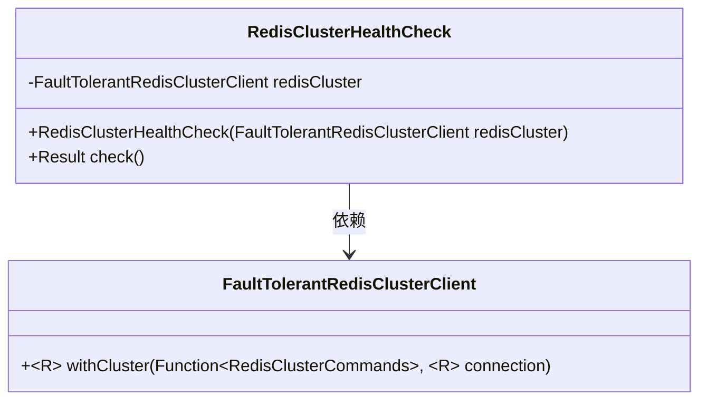
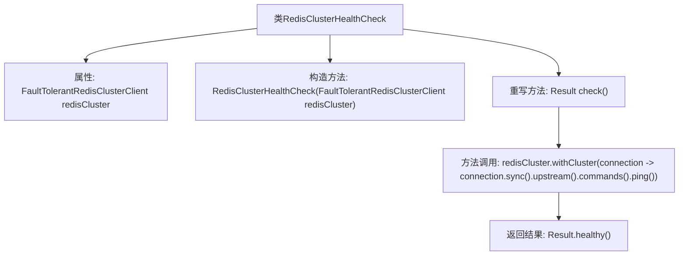

# 基础信息

|      |      |
|------|------|
| 名称 | RedisClusterHealthCheck |
| 编码语言 | .java |
| 代码路径 | Signal-Server/service/src/main/java/org/whispersystems/textsecuregcm/providers/RedisClusterHealthCheck.java |
| 包名 | org.whispersystems.textsecuregcm.providers |
| 依赖项 | ['com.codahale.metrics.health.HealthCheck', 'org.whispersystems.textsecuregcm.redis.FaultTolerantRedisClusterClient'] |
| 概述说明 | Redis集群健康检查类通过Ping命令验证集群状态。 |

# 说明

Redis集群健康检查类主要用于验证集群的运行状态。该检查通过执行Ping命令来确认集群中各节点的连通性和响应情况，确保集群整体健康。这种方法简单有效，能够快速检测出集群中的潜在问题，如节点宕机或网络故障，从而及时采取措施维护系统稳定性。

# 类列表 Class Summary

| 名称   | 类型  | 说明 |
|-------|------|-------------|
| RedisClusterHealthCheck | class | Redis集群健康检查类，通过Ping命令验证集群状态。 |

## 类 RedisClusterHealthCheck

|      |      |
|------|------|
| 访问范围 | public |
| 类型 | class |
| 名称 | RedisClusterHealthCheck |
| 说明 | Redis集群健康检查类，通过Ping命令验证集群状态。 |

### UML类图

**描述：**  
`RedisClusterHealthCheck` 类用于检查 Redis 集群的健康状态。它依赖于 `FaultTolerantRedisClusterClient` 类，通过调用 `withCluster` 方法来执行 Redis 的 `ping` 命令。如果 `ping` 命令成功执行，`check` 方法将返回 `Result.healthy()`，表示集群健康。

### 内部方法调用关系图

该流程图描述了`RedisClusterHealthCheck`类的结构和方法调用关系。类中包含一个属性`redisCluster`，一个构造方法用于初始化该属性，以及一个重写的`check()`方法。`check()`方法通过调用`redisCluster.withCluster()`来执行Ping操作，并返回健康状态`Result.healthy()`。该流程图清晰地展示了类的内部结构和方法的执行流程。

### 字段列表 Field List

| 名称  | 类型  | 说明 |
|-------|-------|------|
| redisCluster | FaultTolerantRedisClusterClient | 私有不可变的Redis集群客户端实例。 |

### 方法列表 Method List

| 名称  | 类型  | 说明 |
|-------|-------|------|
| check | Result | 该方法通过Redis集群连接执行Ping命令并返回健康状态。 |

