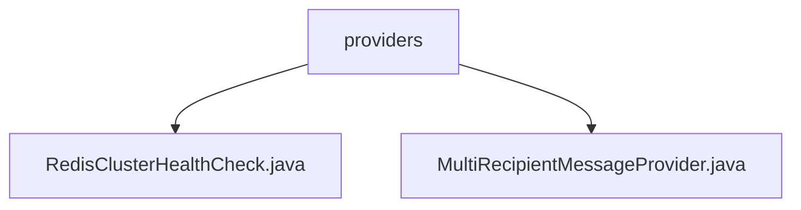

# 基础信息

|      |      |
|------|------|
| 名称 | providers |
| 编码语言 | .java |
| 代码路径 | Signal-Server/service/src/main/java/org/whispersystems/textsecuregcm/providers |
| 包名 | Signal-Server.service.src.main.java.org.whispersystems.textsecuregcm.providers |
| 概述说明 | Redis集群健康检查类验证节点连通性，确保集群稳定。多接收者消息处理类支持5000接收者和256KiB消息，提升传递效率。 |

# 说明

## 概述

该代码模块主要包含两个核心类：`RedisClusterHealthCheck` 和 `MultiRecipientMessageProvider`。`RedisClusterHealthCheck` 类负责监控和维护 Redis 集群的健康状态，通过执行 Ping 命令来检测节点的连通性和响应情况。`MultiRecipientMessageProvider` 类则专注于处理多接收者消息，支持大量接收者和较大消息的高效处理，确保消息传递的可靠性和效率。

## 主要业务场景

1. **Redis 集群健康检查**：`RedisClusterHealthCheck` 类用于在 Redis 集群中执行健康检查，确保集群中的各个节点正常运行。通过 Ping 命令，该类能够快速检测出节点宕机或网络故障等潜在问题，从而及时采取措施维护系统的稳定性。

2. **多接收者消息处理**：`MultiRecipientMessageProvider` 类用于处理多接收者消息，支持最多 5000 个接收者和最大 256KiB 的消息大小。该类具备验证媒体类型的功能，并能够解析消息内容，确保消息格式和类型的正确性。通过高效处理大量接收者和较大消息，提升了消息传递的可靠性和效率。

### 包内部结构视图

该流程图展示了Signal-Server项目中`providers`文件夹下的两个Java文件：`RedisClusterHealthCheck.java`和`MultiRecipientMessageProvider.java`。`providers`作为父节点，直接包含这两个文件，清晰地反映了它们之间的层级关系。

# 文件列表 File List

| 名称   | 类型  | 说明 |
|-------|------|-------------|
| [RedisClusterHealthCheck.java](RedisClusterHealthCheck.md) | file | Redis集群健康检查类通过Ping命令验证集群状态。 |
| [MultiRecipientMessageProvider.java](MultiRecipientMessageProvider.md) | file | MultiRecipientMessageProvider类处理多接收者消息，支持5000接收者和256KiB消息，验证媒体类型并解析。 |

