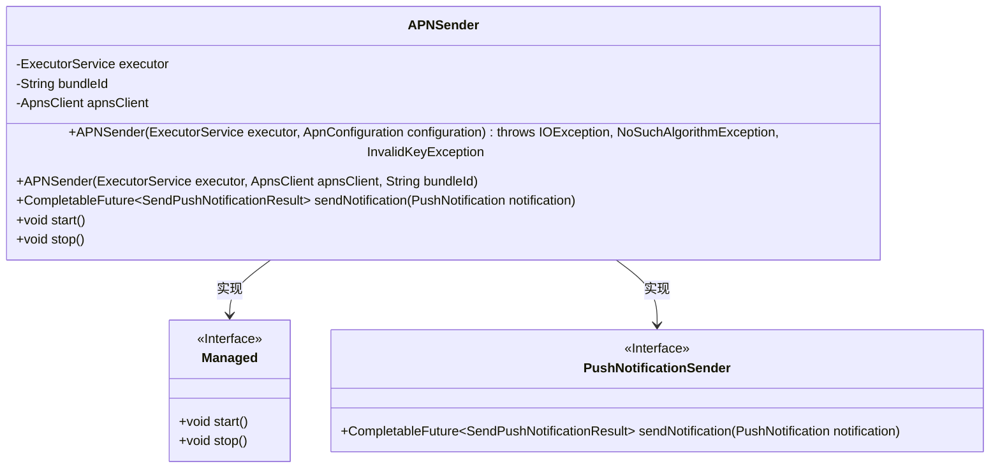
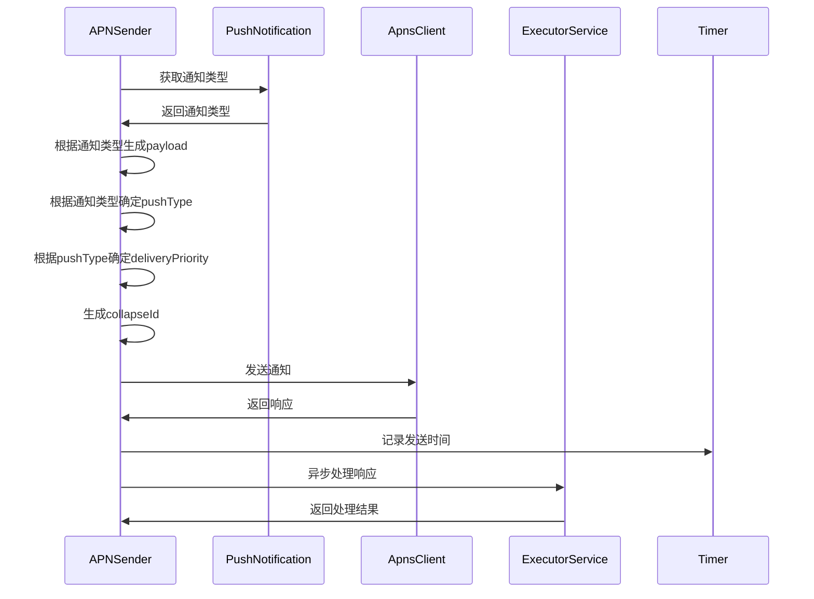

# 基础信息

|      |      |
|------|------|
| 名称 | APNSender |
| 编码语言 | .java |
| 代码路径 | Signal-Server/service/src/main/java/org/whispersystems/textsecuregcm/push/APNSender.java |
| 包名 | org.whispersystems.textsecuregcm.push |
| 依赖项 | ['org.whispersystems.textsecuregcm.metrics.MetricsUtil.name', 'com.eatthepath.pushy.apns.ApnsClient', 'com.eatthepath.pushy.apns.ApnsClientBuilder', 'com.eatthepath.pushy.apns.DeliveryPriority', 'com.eatthepath.pushy.apns.PushType', 'com.eatthepath.pushy.apns.auth.ApnsSigningKey', 'com.eatthepath.pushy.apns.util.SimpleApnsPayloadBuilder', 'com.eatthepath.pushy.apns.util.SimpleApnsPushNotification', 'com.google.common.annotations.VisibleForTesting', 'io.dropwizard.lifecycle.Managed', 'io.micrometer.core.instrument.Metrics', 'io.micrometer.core.instrument.Timer', 'java.io.ByteArrayInputStream', 'java.io.IOException', 'java.security.InvalidKeyException', 'java.security.NoSuchAlgorithmException', 'java.time.Duration', 'java.time.Instant', 'java.util.Optional', 'java.util.concurrent.CompletableFuture', 'java.util.concurrent.ExecutorService', 'org.whispersystems.textsecuregcm.configuration.ApnConfiguration'] |
| 概述说明 | APNSender类通过ApnsClient发送多种类型和优先级的APNS推送通知，支持计时和结果处理。 |

# 说明

APNSender类专门用于发送APNS推送通知，具备处理多种通知类型和优先级的功能。该类通过ApnsClient实现发送逻辑，并包含计时机制和结果处理流程，确保推送通知的准确性和效率。

# 类列表 Class Summary

| 名称   | 类型  | 说明 |
|-------|------|-------------|
| APNSender | class | APNSender类用于发送APNS推送通知，支持多种通知类型和优先级，使用ApnsClient处理发送逻辑，包含计时和结果处理。 |

## 类 APNSender

|      |      |
|------|------|
| 访问范围 | public |
| 类型 | class |
| 名称 | APNSender |
| 说明 | APNSender类用于发送APNS推送通知，支持多种通知类型和优先级，使用ApnsClient处理发送逻辑，包含计时和结果处理。 |

### UML类图

**描述：**
`APNSender`类实现了`Managed`和`PushNotificationSender`接口，负责发送APNS（Apple Push Notification Service）通知。它包含一个线程池`executor`、一个应用标识`bundleId`和一个APNS客户端`apnsClient`。`sendNotification`方法根据通知类型和优先级构建不同的推送负载，并通过`apnsClient`发送通知。`start`和`stop`方法分别用于启动和停止服务。

### 内部方法调用关系图

```mermaid
graph TD
    A["类APNSender"]
    B["属性: ExecutorService executor"]
    C["属性: String bundleId"]
    D["属性: ApnsClient apnsClient"]
    E["常量: String APN_NSE_NOTIFICATION_PAYLOAD"]
    F["常量: String APN_BACKGROUND_PAYLOAD"]
    G["常量: Instant MAX_EXPIRATION"]
    H["常量: String APNS_CA_FILENAME"]
    I["常量: Timer SEND_NOTIFICATION_TIMER"]
    J["构造方法: APNSender(ExecutorService executor, ApnConfiguration configuration)"]
    K["构造方法: APNSender(ExecutorService executor, ApnsClient apnsClient, String bundleId)"]
    L["方法: CompletableFuture<SendPushNotificationResult> sendNotification(PushNotification notification)"]
    M["方法: void start()"]
    N["方法: void stop()"]

    A --> B
    A --> C
    A --> D
    A --> E
    A --> F
    A --> G
    A --> H
    A --> I
    A --> J
    A --> K
    A --> L
    A --> M
    A --> N
```

这段代码定义了一个名为 `APNSender` 的类，用于发送 Apple Push Notification Service (APNS) 通知。该类包含多个属性和方法，用于配置和发送不同类型的推送通知。代码通过构造方法初始化 APNS 客户端，并通过 `sendNotification` 方法处理通知的发送逻辑。`sendNotification` 方法根据通知类型生成不同的 payload 和 pushType，并通过 `ApnsClient` 发送通知。最后，代码通过 `ExecutorService` 异步处理发送结果，并记录发送时间。

### 字段列表 Field List

| 名称  | 类型  | 说明 |
|-------|-------|------|
| apnsClient | ApnsClient | 私有APNS客户端实例。 |
| executor | ExecutorService | 私有且不可变的线程池执行器。 |
| bundleId | String | 私有字符串变量bundleId。 |
| APN_NSE_NOTIFICATION_PAYLOAD = new SimpleApnsPayloadBuilder()      .setMutableContent(true)      .setLocalizedAlertMessage("APN_Message")      .build() | String | 测试用APN通知负载，包含可变内容和本地化消息。 |
| MAX_EXPIRATION = Instant.ofEpochMilli(Integer.MAX_VALUE * 1000L) | Instant | 测试用静态常量MAX_EXPIRATION，值为最大整数时间戳。 |
| APNS_CA_FILENAME = "apns-certificates.pem" | String | 定义常量APNS_CA_FILENAME为"apns-certificates.pem"。 |
| SEND_NOTIFICATION_TIMER = Metrics.timer(name(APNSender.class, "sendNotification")) | Timer | APNSender类中定义了一个名为sendNotification的私有静态计时器。 |
| APN_BACKGROUND_PAYLOAD = new SimpleApnsPayloadBuilder()      .setContentAvailable(true)      .build() | String | APN_BACKGROUND_PAYLOAD 是用于测试的静态常量，包含可用内容的简单APNs负载。 |

### 方法列表 Method List

| 名称  | 类型  | 说明 |
|-------|-------|------|
| stop | void | 重写stop方法，关闭apnsClient并等待完成。 |
| start | void | 重写start方法，无具体实现。 |
| sendNotification | CompletableFuture<SendPushNotificationResult> | 根据通知类型构建推送内容，发送通知并记录结果。 |

