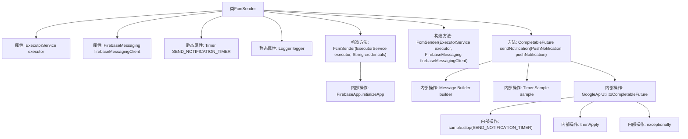

# 基础信息

|      |      |
|------|------|
| 名称 | FcmSender |
| 编码语言 | .java |
| 代码路径 | Signal-Server/service/src/main/java/org/whispersystems/textsecuregcm/push/FcmSender.java |
| 包名 | org.whispersystems.textsecuregcm.push |
| 依赖项 | ['org.whispersystems.textsecuregcm.metrics.MetricsUtil.name', 'com.google.auth.oauth2.GoogleCredentials', 'com.google.common.annotations.VisibleForTesting', 'com.google.common.util.concurrent.ThreadFactoryBuilder', 'com.google.firebase.FirebaseApp', 'com.google.firebase.FirebaseOptions', 'com.google.firebase.ThreadManager', 'com.google.firebase.messaging.AndroidConfig', 'com.google.firebase.messaging.FirebaseMessaging', 'com.google.firebase.messaging.FirebaseMessagingException', 'com.google.firebase.messaging.Message', 'com.google.firebase.messaging.MessagingErrorCode', 'io.micrometer.core.instrument.Metrics', 'io.micrometer.core.instrument.Timer', 'java.io.ByteArrayInputStream', 'java.io.IOException', 'java.nio.charset.StandardCharsets', 'java.util.Optional', 'java.util.concurrent.CompletableFuture', 'java.util.concurrent.ExecutorService', 'java.util.concurrent.ThreadFactory', 'org.slf4j.Logger', 'org.slf4j.LoggerFactory', 'org.whispersystems.textsecuregcm.util.ExceptionUtils', 'org.whispersystems.textsecuregcm.util.GoogleApiUtil'] |
| 概述说明 | FcmSender类通过Firebase发送推送通知，支持异步、优先级和错误处理。 |

# 说明

FcmSender类是一个用于通过Firebase发送推送通知的工具，具备异步处理功能，能够高效处理通知发送任务。该类支持设置推送通知的优先级，确保重要通知能够及时送达。此外，FcmSender类还包含完善的错误处理机制，能够在发送过程中捕获并处理可能出现的异常，确保系统的稳定性和可靠性。

# 类列表 Class Summary

| 名称   | 类型  | 说明 |
|-------|------|-------------|
| FcmSender | class | FcmSender类通过Firebase发送推送通知，支持异步处理、优先级设置和错误处理。 |

## 类 FcmSender

|      |      |
|------|------|
| 访问范围 | public |
| 类型 | class |
| 名称 | FcmSender |
| 说明 | FcmSender类通过Firebase发送推送通知，支持异步处理、优先级设置和错误处理。 |

### UML类图

```mermaid
classDiagram
    class PushNotificationSender {
        <<Interface>>
        +CompletableFuture~SendPushNotificationResult~ sendNotification(PushNotification pushNotification)
    }

    class FcmSender {
        -ExecutorService executor
        -FirebaseMessaging firebaseMessagingClient
        -Timer SEND_NOTIFICATION_TIMER
        -Logger logger
        +FcmSender(ExecutorService executor, String credentials) throws IOException
        +FcmSender(ExecutorService executor, FirebaseMessaging firebaseMessagingClient)
        +CompletableFuture~SendPushNotificationResult~ sendNotification(PushNotification pushNotification)
    }

    class PushNotification {
        +String deviceToken()
        +boolean urgent()
        +String notificationType()
        +String data()
    }

    class SendPushNotificationResult {
        +boolean success
        +Optional~String~ errorCode
        +boolean unregistered
        +Optional~String~ additionalInfo
        +SendPushNotificationResult(boolean success, Optional~String~ errorCode, boolean unregistered, Optional~String~ additionalInfo)
    }

    class FirebaseMessaging {
        +CompletableFuture~String~ sendAsync(Message message)
    }

    class Message {
        +Builder builder()
    }

    class Builder {
        +Builder setToken(String token)
        +Builder setAndroidConfig(AndroidConfig androidConfig)
        +Builder putData(String key, String value)
        +Message build()
    }

    class AndroidConfig {
        +Builder builder()
    }

    class ExecutorService {
        <<Interface>>
    }

    class Timer {
        +Sample start()
        +void stop(Timer timer)
    }

    class Logger {
        +void warn(String message, Throwable throwable)
    }

    class GoogleApiUtil {
        +CompletableFuture~R~ toCompletableFuture(ApiFuture~R~ apiFuture, ExecutorService executor)
    }

    class ExceptionUtils {
        +Function~Throwable, SendPushNotificationResult~ exceptionallyHandler(Class~T~ exceptionClass, Function~T, SendPushNotificationResult~ handler)
    }

    PushNotificationSender <|.. FcmSender : 实现
    FcmSender --> PushNotification : 使用
    FcmSender --> SendPushNotificationResult : 返回
    FcmSender --> FirebaseMessaging : 使用
    FcmSender --> ExecutorService : 使用
    FcmSender --> Timer : 使用
    FcmSender --> Logger : 使用
    FcmSender --> GoogleApiUtil : 使用
    FcmSender --> ExceptionUtils : 使用
    Message --> Builder : 使用
    AndroidConfig --> Builder : 使用
```

这段代码描述了一个 `FcmSender` 类，它实现了 `PushNotificationSender` 接口，用于通过 Firebase Cloud Messaging (FCM) 发送推送通知。`FcmSender` 类依赖于 `ExecutorService` 来管理异步任务，并使用 `FirebaseMessaging` 客户端来发送消息。`sendNotification` 方法处理通知的发送，并根据不同的通知类型设置相应的数据。代码中还包含了对错误的处理，特别是对 `FirebaseMessagingException` 的处理，以确保在发送失败时能够返回适当的错误信息。

### 内部方法调用关系图

这段代码定义了一个名为 `FcmSender` 的类，用于通过 Firebase Cloud Messaging (FCM) 发送推送通知。类中包含两个构造方法，分别用于初始化 Firebase 应用和直接注入 FirebaseMessaging 实例。`sendNotification` 方法负责构建消息、设置优先级、处理不同类型的通知，并通过异步方式发送通知。代码还包含了计时器和异常处理逻辑，以确保发送过程的监控和错误处理。

### 字段列表 Field List

| 名称  | 类型  | 说明 |
|-------|-------|------|
| executor | ExecutorService | 私有且不可变的线程池执行器。 |
| firebaseMessagingClient | FirebaseMessaging | 私有Firebase消息客户端实例。 |
| SEND_NOTIFICATION_TIMER = Metrics.timer(name(FcmSender.class, "sendNotification")) | Timer | FcmSender类中定义了一个名为SEND_NOTIFICATION_TIMER的静态定时器。 |
| logger = LoggerFactory.getLogger(FcmSender.class) | Logger | FcmSender类中定义了一个私有的静态日志记录器。 |

### 方法列表 Method List

| 名称  | 类型  | 说明 |
|-------|-------|------|
| sendNotification | CompletableFuture<SendPushNotificationResult> | 发送推送通知方法，构建消息并处理异常，返回发送结果。 |

