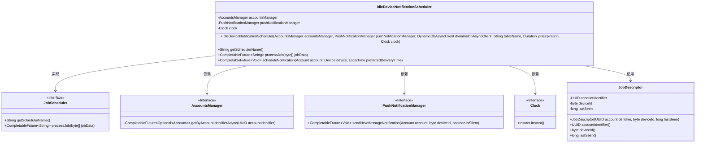

# 基础信息

|      |      |
|------|------|
| 名称 | IdleDeviceNotificationScheduler |
| 编码语言 | .java |
| 代码路径 | Signal-Server/service/src/main/java/org/whispersystems/textsecuregcm/push/IdleDeviceNotificationScheduler.java |
| 包名 | org.whispersystems.textsecuregcm.push |
| 依赖项 | ['com.fasterxml.jackson.core.JsonProcessingException', 'com.google.common.annotations.VisibleForTesting', 'org.whispersystems.textsecuregcm.identity.IdentityType', 'org.whispersystems.textsecuregcm.scheduler.JobScheduler', 'org.whispersystems.textsecuregcm.scheduler.SchedulingUtil', 'org.whispersystems.textsecuregcm.storage.Account', 'org.whispersystems.textsecuregcm.storage.AccountsManager', 'org.whispersystems.textsecuregcm.storage.Device', 'org.whispersystems.textsecuregcm.util.SystemMapper', 'software.amazon.awssdk.services.dynamodb.DynamoDbAsyncClient', 'javax.annotation.Nullable', 'java.io.IOException', 'java.time.Clock', 'java.time.Duration', 'java.time.Instant', 'java.time.LocalTime', 'java.util.UUID', 'java.util.concurrent.CompletableFuture'] |
| 概述说明 | 空闲设备通知调度器负责监控设备状态并发送推送通知。 |

# 说明

空闲设备通知调度器负责管理设备通知，其主要功能包括检查设备状态并根据状态变化发送推送通知。该调度器确保设备在空闲时能够及时接收到相关通知，提升设备管理的效率和用户体验。

# 类列表 Class Summary

| 名称   | 类型  | 说明 |
|-------|------|-------------|
| IdleDeviceNotificationScheduler | class | 空闲设备通知调度器管理设备通知，检查设备状态并发送推送通知。 |

## 类 IdleDeviceNotificationScheduler

|      |      |
|------|------|
| 访问范围 | public |
| 类型 | class |
| 名称 | IdleDeviceNotificationScheduler |
| 说明 | 空闲设备通知调度器管理设备通知，检查设备状态并发送推送通知。 |

### UML类图

**描述：**  
`IdleDeviceNotificationScheduler` 是一个继承自 `JobScheduler` 的类，用于调度和管理空闲设备的通知任务。它依赖于 `AccountsManager` 来获取账户信息，`PushNotificationManager` 来发送推送通知，以及 `Clock` 来获取当前时间。`JobDescriptor` 是一个记录类，用于存储任务的相关信息。该类的主要功能包括处理任务、调度通知以及处理任务数据。

### 内部方法调用关系图

这段代码定义了一个名为 `IdleDeviceNotificationScheduler` 的类，用于调度和管理空闲设备的通知任务。该类继承自 `JobScheduler`，并包含多个属性和方法，用于处理与账户、设备、推送通知相关的逻辑。流程图展示了类的主要结构和方法之间的调用关系，包括构造方法、获取调度器名称、处理任务、调度通知等步骤。

### 字段列表 Field List

| 名称  | 类型  | 说明 |
|-------|-------|------|
| pushNotificationManager | PushNotificationManager | 私有推送通知管理器实例。 |
| clock | Clock | 私有且不可变的时钟实例。 |
| accountsManager | AccountsManager | 私有账户管理器实例变量。 |

### 方法列表 Method List

| 名称  | 类型  | 说明 |
|-------|-------|------|
| getSchedulerName | String | 该方法返回调度器名称为"IdleDeviceNotification"。 |
| processJob | CompletableFuture<String> | 异步处理任务，检查设备状态并发送通知，返回相应状态。 |
| scheduleNotification | CompletableFuture<Void> | 根据账户和设备信息，在指定时间安排通知任务。 |

