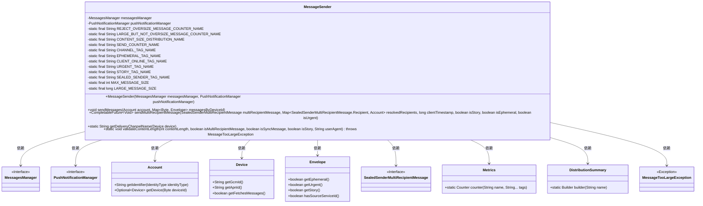

# 基础信息

|      |      |
|------|------|
| 名称 | MessageSender |
| 编码语言 | .java |
| 代码路径 | Signal-Server/service/src/main/java/org/whispersystems/textsecuregcm/push/MessageSender.java |
| 包名 | org.whispersystems.textsecuregcm.push |
| 依赖项 | ['com.codahale.metrics.MetricRegistry.name', 'org.whispersystems.textsecuregcm.entities.MessageProtos.Envelope', 'com.google.common.annotations.VisibleForTesting', 'io.dropwizard.util.DataSize', 'io.micrometer.core.instrument.DistributionSummary', 'io.micrometer.core.instrument.Metrics', 'java.util.Map', 'java.util.concurrent.CompletableFuture', 'io.micrometer.core.instrument.Tag', 'io.micrometer.core.instrument.Tags', 'org.signal.libsignal.protocol.SealedSenderMultiRecipientMessage', 'org.whispersystems.textsecuregcm.controllers.MessageController', 'org.whispersystems.textsecuregcm.identity.IdentityType', 'org.whispersystems.textsecuregcm.metrics.MetricsUtil', 'org.whispersystems.textsecuregcm.metrics.UserAgentTagUtil', 'org.whispersystems.textsecuregcm.storage.Account', 'org.whispersystems.textsecuregcm.storage.Device', 'org.whispersystems.textsecuregcm.storage.MessagesManager', 'org.whispersystems.textsecuregcm.util.Util'] |
| 概述说明 | MessageSender类负责发送消息、管理推送通知，支持单/多设备发送，验证消息大小并统计。 |

# 说明

MessageSender类是一个用于发送消息并管理推送通知的功能模块。它支持向单个设备或多个设备发送消息，并具备处理消息大小验证的功能，确保消息符合规定的大小限制。此外，该类还负责统计消息发送的相关数据，提供对发送操作的监控和分析能力。通过这些功能，MessageSender类能够高效地管理和执行消息推送任务，确保消息传递的准确性和可靠性。

# 类列表 Class Summary

| 名称   | 类型  | 说明 |
|-------|------|-------------|
| MessageSender | class | MessageSender类负责发送消息并管理推送通知，支持单设备和多设备发送，处理消息大小验证和统计。 |

## 类 MessageSender

|      |      |
|------|------|
| 访问范围 | public |
| 类型 | class |
| 名称 | MessageSender |
| 说明 | MessageSender类负责发送消息并管理推送通知，支持单设备和多设备发送，处理消息大小验证和统计。 |

### UML类图

**描述：**  
`MessageSender` 类负责发送消息到目标设备，并在设备未连接时通过推送通知提醒。它依赖于 `MessagesManager` 和 `PushNotificationManager` 来管理消息和推送通知。类中定义了多个静态常量用于监控和限制消息大小，并提供了多种发送消息的方法，包括单设备发送和多设备发送。此外，`MessageSender` 还提供了验证消息长度的方法，以防止消息过大。

### 内部方法调用关系图

```mermaid
graph TD
    A["类MessageSender"]
    B["属性: MessagesManager messagesManager"]
    C["属性: PushNotificationManager pushNotificationManager"]
    D["构造方法: MessageSender(MessagesManager, PushNotificationManager)"]
    E["方法: void sendMessages(Account, Map<Byte, Envelope>)"]
    F["方法: CompletableFuture<Void> sendMultiRecipientMessage(SealedSenderMultiRecipientMessage, Map<SealedSenderMultiRecipientMessage.Recipient, Account>, long, boolean, boolean, boolean)"]
    G["方法: static String getDeliveryChannelName(Device)"]
    H["方法: static void validateContentLength(int, boolean, boolean, boolean, String)"]
    I["调用: messagesManager.insert"]
    J["调用: pushNotificationManager.sendNewMessageNotification"]
    K["调用: Metrics.counter"]
    L["调用: messagesManager.insertMultiRecipientMessage"]
    M["调用: DistributionSummary.builder"]
    N["调用: Metrics.globalRegistry.register"]
    O["调用: Metrics.counter.increment"]
    P["调用: throw new MessageTooLargeException"]

    A --> B
    A --> C
    A --> D
    A --> E
    A --> F
    A --> G
    A --> H
    E --> I
    E --> J
    E --> K
    F --> L
    F --> J
    F --> K
    H --> M
    H --> N
    H --> O
    H --> P
```

**描述：**  
`MessageSender` 类负责消息的发送与管理，包含两个主要方法：`sendMessages` 和 `sendMultiRecipientMessage`，分别用于向单个账户和多个接收者发送消息。该类还包含辅助方法 `getDeliveryChannelName` 用于获取设备的消息传递通道名称，以及 `validateContentLength` 用于验证消息内容长度是否超出限制。在发送消息时，会根据设备的状态决定是否发送推送通知，并通过 `Metrics` 类记录相关统计信息。

### 字段列表 Field List

| 名称  | 类型  | 说明 |
|-------|-------|------|
| messagesManager | MessagesManager | 私有且不可变的MessagesManager实例。 |
| pushNotificationManager | PushNotificationManager | 私有不可变的推送通知管理器实例。 |
| LARGE_BUT_NOT_OVERSIZE_MESSAGE_COUNTER_NAME = name(MessageController.class, "largeMessage") | String | 定义大消息计数器名称，关联MessageController类。 |
| SEND_COUNTER_NAME = name(MessageSender.class, "sendMessage") | String | 定义发送消息计数器名称常量。 |
| STORY_TAG_NAME = "story" | String | 定义常量STORY_TAG_NAME，值为"story"。 |
| MAX_MESSAGE_SIZE = (int) DataSize.kibibytes(256).toBytes() | int | 测试可见的常量MAX_MESSAGE_SIZE，值为256KB。 |
| URGENT_TAG_NAME = "urgent" | String | 定义常量字符串变量URGENT_TAG_NAME，值为"urgent"。 |
| LARGE_MESSAGE_SIZE = DataSize.kibibytes(8).toBytes() | long | 定义静态常量LARGE_MESSAGE_SIZE为8KiB的字节数。 |
| CHANNEL_TAG_NAME = "channel" | String | 定义了一个名为CHANNEL_TAG_NAME的私有静态常量，其值为"channel"。 |
| CLIENT_ONLINE_TAG_NAME = "clientOnline" | String | 定义静态常量字符串CLIENT_ONLINE_TAG_NAME，值为"clientOnline"。 |
| CONTENT_SIZE_DISTRIBUTION_NAME = MetricsUtil.name(MessageController.class, "messageContentSize") | String | 定义常量CONTENT_SIZE_DISTRIBUTION_NAME，用于消息内容大小分布。 |
| SEALED_SENDER_TAG_NAME = "sealedSender" | String | 定义了一个名为SEALED_SENDER_TAG_NAME的私有静态常量字符串，值为"sealedSender"。 |
| EPHEMERAL_TAG_NAME = "ephemeral" | String | 定义了一个私有静态常量字符串变量EPHEMERAL_TAG_NAME，值为"ephemeral"。 |
| REJECT_OVERSIZE_MESSAGE_COUNTER_NAME = name(MessageController.class, "rejectOversizeMessage") | String | 定义常量REJECT_OVERSIZE_MESSAGE_COUNTER_NAME用于记录超大消息拒绝计数。 |

### 方法列表 Method List

| 名称  | 类型  | 说明 |
|-------|-------|------|
| sendMessages | void | 方法发送消息并处理通知和统计。 |
| getDeliveryChannelName | String | 根据设备信息返回其推送通道名称。 |
| sendMultiRecipientMessage | CompletableFuture<Void> | 发送多收件人消息，处理通知与指标记录。 |
| validateContentLength | void | 验证消息长度，记录统计信息，超限抛出异常。 |

