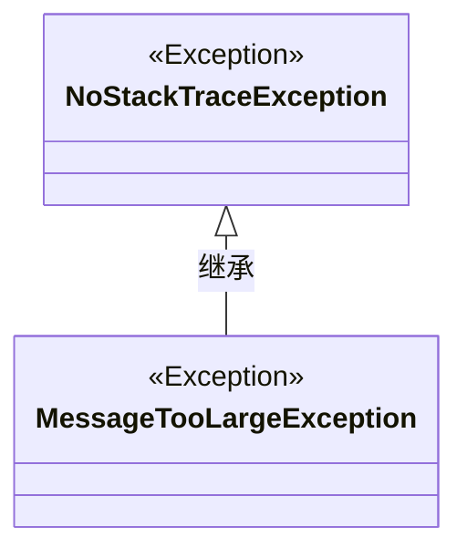
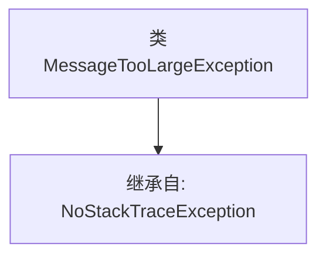

# 基础信息

|      |      |
|------|------|
| 名称 | MessageTooLargeException |
| 编码语言 | .java |
| 代码路径 | Signal-Server/service/src/main/java/org/whispersystems/textsecuregcm/push/MessageTooLargeException.java |
| 包名 | org.whispersystems.textsecuregcm.push |
| 依赖项 | ['org.whispersystems.textsecuregcm.util.NoStackTraceException'] |
| 概述说明 | MessageTooLargeException继承自NoStackTraceException。 |

# 说明

MessageTooLargeException是一种异常类，它继承自NoStackTraceException。这种异常通常用于处理消息过大的情况，表明在某个操作中传递的消息超出了允许的大小限制。由于它继承自NoStackTraceException，因此在抛出此异常时不会生成堆栈跟踪信息，这有助于减少资源消耗和日志大小。

# 类列表 Class Summary

| 名称   | 类型  | 说明 |
|-------|------|-------------|
| MessageTooLargeException | class | MessageTooLargeException继承自NoStackTraceException。 |

## 类 MessageTooLargeException

|      |      |
|------|------|
| 访问范围 | public |
| 类型 | class |
| 名称 | MessageTooLargeException |
| 说明 | MessageTooLargeException继承自NoStackTraceException。 |

### UML类图

**描述：**  
`MessageTooLargeException` 是一个自定义异常类，继承自 `NoStackTraceException`。它用于在消息过大时抛出异常，且不包含堆栈跟踪信息。这种设计适用于需要轻量级异常处理的场景，避免了堆栈跟踪的开销。

### 内部方法调用关系图

这段代码定义了一个名为 `MessageTooLargeException` 的类，该类继承自 `NoStackTraceException`。`MessageTooLargeException` 是一个自定义异常类，通常用于表示消息过大的异常情况。由于它继承自 `NoStackTraceException`，因此该异常不会包含堆栈跟踪信息，这在某些场景下可以提高性能或简化异常处理逻辑。

### 字段列表 Field List

| 名称  | 类型  | 说明 |
|-------|-------|------|

### 方法列表 Method List

| 名称  | 类型  | 说明 |
|-------|-------|------|

