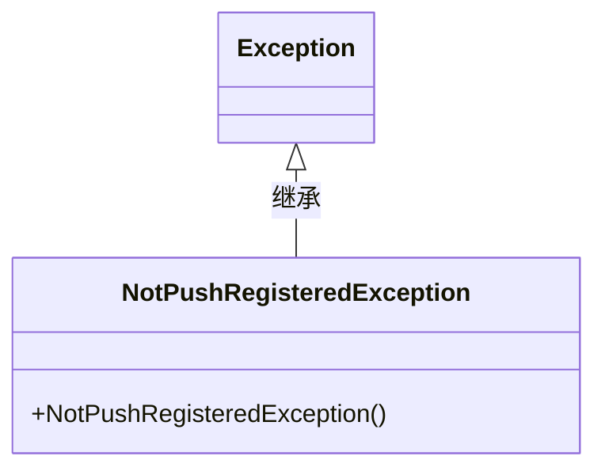
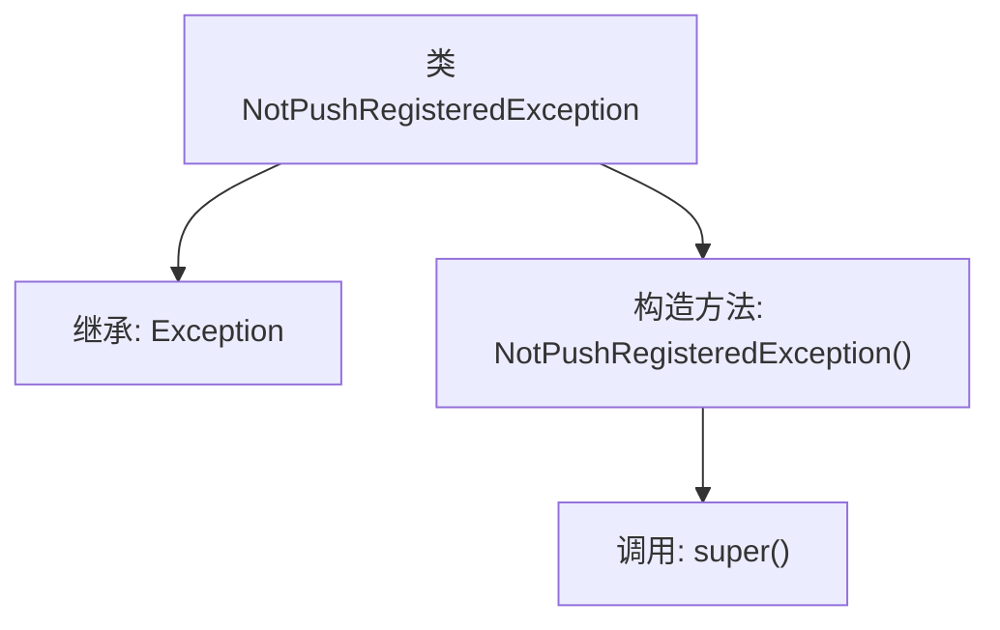

# 基础信息

|      |      |
|------|------|
| 名称 | NotPushRegisteredException |
| 编码语言 | .java |
| 代码路径 | Signal-Server/service/src/main/java/org/whispersystems/textsecuregcm/push/NotPushRegisteredException.java |
| 包名 | org.whispersystems.textsecuregcm.push |
| 依赖项 | [] |
| 概述说明 | NotPushRegisteredException是自定义异常类，继承自Exception。 |

# 说明

NotPushRegisteredException是一个自定义的异常类，它继承自Java中的Exception类。这个异常类用于处理特定场景下的异常情况，具体应用场景未详细说明。通过继承Exception，NotPushRegisteredException具备了标准异常类的基本功能，可以用于捕获和处理特定的错误或异常状态。

# 类列表 Class Summary

| 名称   | 类型  | 说明 |
|-------|------|-------------|
| NotPushRegisteredException | class | NotPushRegisteredException是继承自Exception的自定义异常类。 |

## 类 NotPushRegisteredException

|      |      |
|------|------|
| 访问范围 | public |
| 类型 | class |
| 名称 | NotPushRegisteredException |
| 说明 | NotPushRegisteredException是继承自Exception的自定义异常类。 |

### UML类图

这段代码定义了一个名为 `NotPushRegisteredException` 的自定义异常类，它继承自 Java 标准库中的 `Exception` 类。该异常类包含一个无参构造函数，调用父类的构造函数进行初始化。通过继承 `Exception`，`NotPushRegisteredException` 具备了异常处理的基本功能，可以用于在特定条件下抛出和捕获异常。这种自定义异常通常用于表示某种业务逻辑中的错误状态，例如未注册推送服务的情况。

### 内部方法调用关系图

该流程图描述了 `NotPushRegisteredException` 类的结构及其内部关系。该类继承自 `Exception`，并包含一个无参构造方法 `NotPushRegisteredException()`，该方法内部调用了父类的构造方法 `super()`。流程图清晰地展示了类的继承关系和构造方法的调用顺序。

### 字段列表 Field List

| 名称  | 类型  | 说明 |
|-------|-------|------|

### 方法列表 Method List

| 名称  | 类型  | 说明 |
|-------|-------|------|

