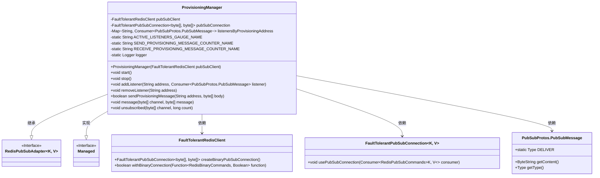
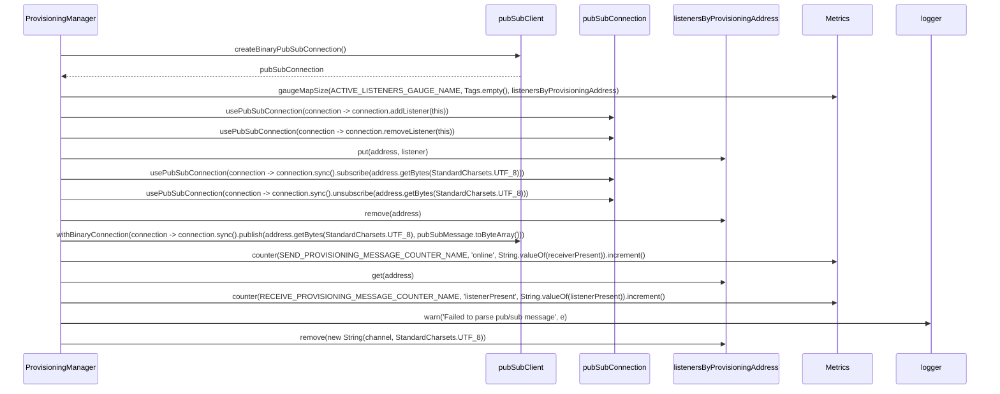

# 基础信息

|      |      |
|------|------|
| 名称 | ProvisioningManager |
| 编码语言 | .java |
| 代码路径 | Signal-Server/service/src/main/java/org/whispersystems/textsecuregcm/push/ProvisioningManager.java |
| 包名 | org.whispersystems.textsecuregcm.push |
| 依赖项 | ['com.codahale.metrics.MetricRegistry.name', 'com.google.protobuf.ByteString', 'com.google.protobuf.InvalidProtocolBufferException', 'io.dropwizard.lifecycle.Managed', 'io.lettuce.core.pubsub.RedisPubSubAdapter', 'io.micrometer.core.instrument.Metrics', 'io.micrometer.core.instrument.Tags', 'java.nio.charset.StandardCharsets', 'java.util.Map', 'java.util.concurrent.ConcurrentHashMap', 'java.util.function.Consumer', 'org.slf4j.Logger', 'org.slf4j.LoggerFactory', 'org.whispersystems.textsecuregcm.redis.FaultTolerantPubSubConnection', 'org.whispersystems.textsecuregcm.redis.FaultTolerantRedisClient', 'org.whispersystems.textsecuregcm.redis.RedisOperation', 'org.whispersystems.textsecuregcm.storage.PubSubProtos'] |
| 概述说明 | ProvisioningManager类负责Redis发布订阅连接及消息处理。 |

# 说明

ProvisioningManager类负责管理Redis的发布订阅连接，主要功能包括处理消息的监听和发送。该类确保与Redis服务器的通信顺畅，支持实时消息的接收和分发，从而在应用程序中实现高效的消息传递机制。通过ProvisioningManager类，系统能够有效地管理和维护Redis的发布订阅功能，确保消息处理的可靠性和及时性。

# 类列表 Class Summary

| 名称   | 类型  | 说明 |
|-------|------|-------------|
| ProvisioningManager | class | ProvisioningManager类管理Redis发布订阅连接，处理消息监听和发送。 |

## 类 ProvisioningManager

|      |      |
|------|------|
| 访问范围 | public |
| 类型 | class |
| 名称 | ProvisioningManager |
| 说明 | ProvisioningManager类管理Redis发布订阅连接，处理消息监听和发送。 |

### UML类图

**描述：**
`ProvisioningManager`类继承自`RedisPubSubAdapter`并实现了`Managed`接口，负责管理Redis的发布订阅功能。它通过`FaultTolerantRedisClient`和`FaultTolerantPubSubConnection`与Redis进行交互，并使用`PubSubProtos.PubSubMessage`处理消息。类中包含多个方法用于启动、停止、添加和移除监听器，以及发送和接收消息。此外，类中还定义了多个静态变量用于监控和日志记录。

### 内部方法调用关系图

```mermaid
graph TD
    A["类ProvisioningManager"]
    B["属性: FaultTolerantRedisClient pubSubClient"]
    C["属性: FaultTolerantPubSubConnection<byte[], byte[]> pubSubConnection"]
    D["属性: Map<String, Consumer<PubSubProtos.PubSubMessage>> listenersByProvisioningAddress"]
    E["属性: String ACTIVE_LISTENERS_GAUGE_NAME"]
    F["属性: String SEND_PROVISIONING_MESSAGE_COUNTER_NAME"]
    G["属性: String RECEIVE_PROVISIONING_MESSAGE_COUNTER_NAME"]
    H["属性: Logger logger"]
    I["构造方法: ProvisioningManager(FaultTolerantRedisClient pubSubClient)"]
    J["方法: void start()"]
    K["方法: void stop()"]
    L["方法: void addListener(String address, Consumer<PubSubProtos.PubSubMessage> listener)"]
    M["方法: void removeListener(String address)"]
    N["方法: boolean sendProvisioningMessage(String address, byte[] body)"]
    O["方法: void message(byte[] channel, byte[] message)"]
    P["方法: void unsubscribed(byte[] channel, long count)"]

    A --> B
    A --> C
    A --> D
    A --> E
    A --> F
    A --> G
    A --> H
    A --> I
    A --> J
    A --> K
    A --> L
    A --> M
    A --> N
    A --> O
    A --> P
```

**描述：**
`ProvisioningManager` 类负责管理与 Redis 发布/订阅相关的操作，包括启动和停止连接、添加和移除监听器、发送和接收消息等。它使用 `FaultTolerantRedisClient` 和 `FaultTolerantPubSubConnection` 来处理 Redis 连接，并通过 `listenersByProvisioningAddress` 来管理监听器。该类还使用 `Metrics` 来监控活跃监听器和消息发送/接收的计数器，并通过 `Logger` 记录错误信息。

### 字段列表 Field List

| 名称  | 类型  | 说明 |
|-------|-------|------|
| pubSubConnection | FaultTolerantPubSubConnection<byte[], byte[]> | 私有最终容错发布订阅连接，类型为字节数组键值对。 |
| RECEIVE_PROVISIONING_MESSAGE_COUNTER_NAME =      name(ProvisioningManager.class, "receiveProvisioningMessage") | String | 定义接收配置消息计数器的静态常量。 |
| ACTIVE_LISTENERS_GAUGE_NAME = name(ProvisioningManager.class, "activeListeners") | String | ProvisioningManager类中定义了一个名为activeListeners的静态常量。 |
| pubSubClient | FaultTolerantRedisClient | 私有且容错的Redis发布订阅客户端。 |
| listenersByProvisioningAddress =      new ConcurrentHashMap<>() | Map<String, Consumer<PubSubProtos.PubSubMessage>> | 私有并发映射存储地址与消息消费者的对应关系。 |
| logger = LoggerFactory.getLogger(ProvisioningManager.class) | Logger | ProvisioningManager类中定义了一个私有的静态日志记录器。 |
| SEND_PROVISIONING_MESSAGE_COUNTER_NAME =      name(ProvisioningManager.class, "sendProvisioningMessage") | String | 定义常量SEND_PROVISIONING_MESSAGE_COUNTER_NAME，用于发送配置消息的计数器名称。 |

### 方法列表 Method List

| 名称  | 类型  | 说明 |
|-------|-------|------|
| start | void | 重写start方法，使用pubSubConnection并添加监听器。 |
| removeListener | void | 移除指定地址的监听器并取消订阅。 |
| unsubscribed | void | 该方法移除指定通道的监听器。 |
| stop | void | 重写stop方法，移除当前监听器。 |
| sendProvisioningMessage | boolean | 发送配置消息，构建消息并发布，返回接收者是否存在。 |
| message | void | 解析消息并调用监听器，记录指标，处理异常。 |
| addListener | void | 为指定地址添加消息监听器并订阅该地址。 |

