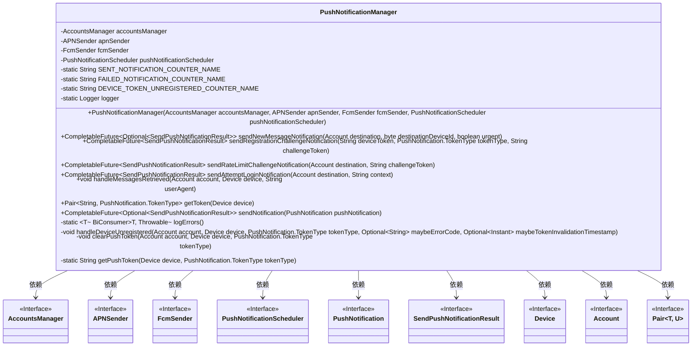

# 基础信息

|      |      |
|------|------|
| 名称 | PushNotificationManager |
| 编码语言 | .java |
| 代码路径 | Signal-Server/service/src/main/java/org/whispersystems/textsecuregcm/push/PushNotificationManager.java |
| 包名 | org.whispersystems.textsecuregcm.push |
| 依赖项 | ['org.whispersystems.textsecuregcm.metrics.MetricsUtil.name', 'com.google.common.annotations.VisibleForTesting', 'io.micrometer.core.instrument.Metrics', 'io.micrometer.core.instrument.Tags', 'java.time.Instant', 'java.util.Optional', 'java.util.concurrent.CompletableFuture', 'java.util.function.BiConsumer', 'org.apache.commons.lang3.StringUtils', 'org.slf4j.Logger', 'org.slf4j.LoggerFactory', 'org.whispersystems.textsecuregcm.storage.Account', 'org.whispersystems.textsecuregcm.storage.AccountsManager', 'org.whispersystems.textsecuregcm.storage.Device', 'org.whispersystems.textsecuregcm.util.Pair'] |
| 概述说明 | PushNotificationManager管理推送，支持APN和FCM，处理令牌失效和调度。 |

# 说明

PushNotificationManager是一个用于管理推送通知的工具，支持通过APN（Apple Push Notification）和FCM（Firebase Cloud Messaging）两种服务发送通知。它能够处理设备令牌失效的情况，确保通知能够准确送达。此外，该管理器还具备调度通知的功能，能够根据需求安排通知的发送时间。

# 类列表 Class Summary

| 名称   | 类型  | 说明 |
|-------|------|-------------|
| PushNotificationManager | class | PushNotificationManager管理推送通知，支持APN和FCM发送，处理设备令牌失效和调度通知。 |

## 类 PushNotificationManager

|      |      |
|------|------|
| 访问范围 | public |
| 类型 | class |
| 名称 | PushNotificationManager |
| 说明 | PushNotificationManager管理推送通知，支持APN和FCM发送，处理设备令牌失效和调度通知。 |

### UML类图

### 描述：
`PushNotificationManager` 类负责管理推送通知的发送和处理。它依赖于多个接口，如 `AccountsManager`、`APNSender`、`FcmSender` 和 `PushNotificationScheduler`，来处理不同设备的推送通知。类中包含了多种发送通知的方法，如发送新消息通知、注册挑战通知、速率限制挑战通知等。此外，还提供了处理设备未注册、清除推送令牌等功能。类图展示了 `PushNotificationManager` 与其他接口之间的依赖关系，清晰地反映了其在推送通知管理中的核心作用。

### 内部方法调用关系图

```mermaid
graph TD
    A["类PushNotificationManager"]
    B["属性: AccountsManager accountsManager"]
    C["属性: APNSender apnSender"]
    D["属性: FcmSender fcmSender"]
    E["属性: PushNotificationScheduler pushNotificationScheduler"]
    F["常量: SENT_NOTIFICATION_COUNTER_NAME"]
    G["常量: FAILED_NOTIFICATION_COUNTER_NAME"]
    H["常量: DEVICE_TOKEN_UNREGISTERED_COUNTER_NAME"]
    I["构造方法: PushNotificationManager"]
    J["方法: sendNewMessageNotification"]
    K["方法: sendRegistrationChallengeNotification"]
    L["方法: sendRateLimitChallengeNotification"]
    M["方法: sendAttemptLoginNotification"]
    N["方法: handleMessagesRetrieved"]
    O["方法: getToken"]
    P["方法: sendNotification"]
    Q["方法: logErrors"]
    R["方法: handleDeviceUnregistered"]
    S["方法: clearPushToken"]
    T["方法: getPushToken"]

    A --> B
    A --> C
    A --> D
    A --> E
    A --> F
    A --> G
    A --> H
    A --> I
    A --> J
    A --> K
    A --> L
    A --> M
    A --> N
    A --> O
    A --> P
    A --> Q
    A --> R
    A --> S
    A --> T
```

这段代码定义了一个`PushNotificationManager`类，用于管理推送通知的发送和处理。类中包含多个方法，分别用于发送不同类型的推送通知（如新消息通知、注册挑战通知、速率限制挑战通知等），以及处理设备未注册、消息检索等操作。代码通过调用`APNSender`、`FcmSender`和`PushNotificationScheduler`等依赖组件来完成具体的推送任务，并在推送过程中记录成功和失败的指标。整体流程清晰，涵盖了推送通知的发送、调度、错误处理和设备管理等多个方面。

### 字段列表 Field List

| 名称  | 类型  | 说明 |
|-------|-------|------|
| accountsManager | AccountsManager | 私有且不可变的AccountsManager实例变量。 |
| apnSender | APNSender | 私有且不可变的APNSender实例。 |
| fcmSender | FcmSender | 私有且不可变的FcmSender实例。 |
| logger = LoggerFactory.getLogger(PushNotificationManager.class) | Logger | PushNotificationManager类中定义了一个静态的Logger实例。 |
| SENT_NOTIFICATION_COUNTER_NAME = name(PushNotificationManager.class, "sentPushNotification") | String | PushNotificationManager类中定义了发送推送通知的计数器名称。 |
| DEVICE_TOKEN_UNREGISTERED_COUNTER_NAME = name(PushNotificationManager.class, "deviceTokenUnregistered") | String | PushNotificationManager类中定义设备令牌未注册计数器名称。 |
| FAILED_NOTIFICATION_COUNTER_NAME = name(PushNotificationManager.class, "failedPushNotification") | String | 定义失败推送通知计数器的静态常量名。 |
| pushNotificationScheduler | PushNotificationScheduler | 私有推送通知调度器实例。 |

### 方法列表 Method List

| 名称  | 类型  | 说明 |
|-------|-------|------|
| sendNewMessageNotification | CompletableFuture<Optional<SendPushNotificationResult>> | 发送新消息通知，获取设备令牌并调用发送通知方法。 |
| sendRegistrationChallengeNotification | CompletableFuture<SendPushNotificationResult> | 异步发送注册挑战通知，包含设备令牌、令牌类型和挑战令牌。 |
| logErrors | BiConsumer<T, Throwable> | 私有静态方法返回BiConsumer，用于记录错误并警告调度操作失败。 |
| clearPushToken | void | 清除设备推送令牌，若存在且未更改则更新为null。 |
| sendRateLimitChallengeNotification | CompletableFuture<SendPushNotificationResult> | 发送限速挑战通知，处理设备令牌并确保紧急通知响应存在。 |
| handleDeviceUnregistered | void | 处理设备注销，检查令牌过期，取消通知并清除推送令牌，记录指标。 |
| getToken | Pair<String, PushNotification.TokenType> | 获取设备推送令牌，优先使用GCM，其次APN，未注册则抛出异常。 |
| getPushToken | String | 根据设备类型获取推送令牌：FCM返回GCM ID，APN返回APN ID。 |
| handleMessagesRetrieved | void | 该方法用于取消指定账户和设备的推送通知计划，并在完成后记录错误。 |
| sendAttemptLoginNotification | CompletableFuture<SendPushNotificationResult> | 发送登录尝试通知，验证设备并获取令牌，确保高优先级通知响应。 |
| sendNotification | CompletableFuture<Optional<SendPushNotificationResult>> | 方法根据推送通知类型和紧急程度，调度或发送通知，记录成功或失败状态，并处理设备未注册情况。 |

