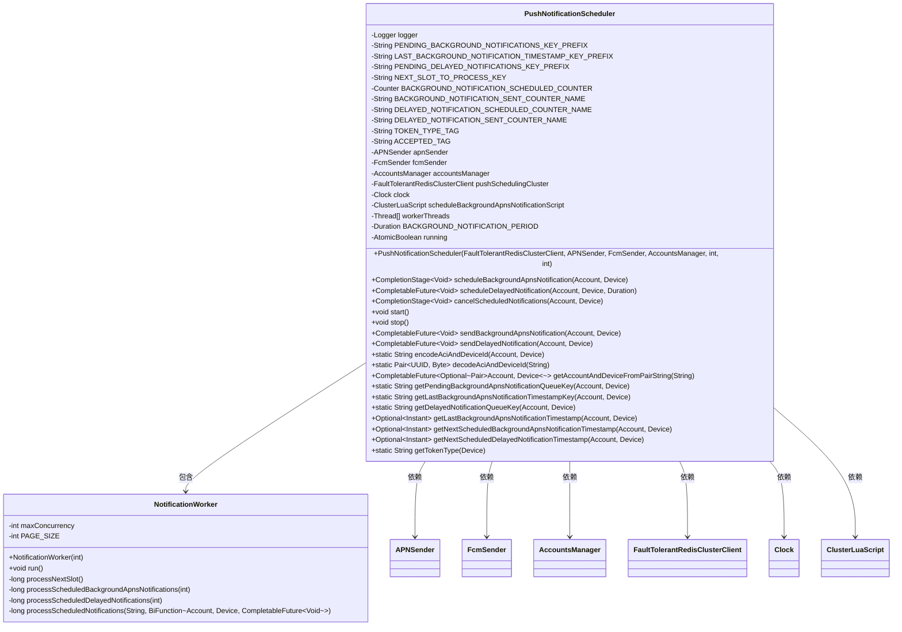

# 基础信息

|      |      |
|------|------|
| 名称 | PushNotificationScheduler |
| 编码语言 | .java |
| 代码路径 | Signal-Server/service/src/main/java/org/whispersystems/textsecuregcm/push/PushNotificationScheduler.java |
| 包名 | org.whispersystems.textsecuregcm.push |
| 依赖项 | ['org.whispersystems.textsecuregcm.metrics.MetricsUtil.name', 'com.google.common.annotations.VisibleForTesting', 'io.dropwizard.lifecycle.Managed', 'io.lettuce.core.Range', 'io.lettuce.core.ScriptOutputType', 'io.lettuce.core.SetArgs', 'io.lettuce.core.cluster.SlotHash', 'io.micrometer.core.instrument.Counter', 'io.micrometer.core.instrument.Metrics', 'java.io.IOException', 'java.time.Clock', 'java.time.Duration', 'java.time.Instant', 'java.util.List', 'java.util.Optional', 'java.util.UUID', 'java.util.concurrent.CompletableFuture', 'java.util.concurrent.CompletionStage', 'java.util.concurrent.atomic.AtomicBoolean', 'java.util.concurrent.atomic.AtomicLong', 'java.util.function.BiFunction', 'org.apache.commons.lang3.StringUtils', 'org.slf4j.Logger', 'org.slf4j.LoggerFactory', 'org.whispersystems.textsecuregcm.redis.ClusterLuaScript', 'org.whispersystems.textsecuregcm.redis.FaultTolerantRedisClusterClient', 'org.whispersystems.textsecuregcm.storage.Account', 'org.whispersystems.textsecuregcm.storage.AccountsManager', 'org.whispersystems.textsecuregcm.storage.Device', 'org.whispersystems.textsecuregcm.util.Pair', 'org.whispersystems.textsecuregcm.util.RedisClusterUtil', 'org.whispersystems.textsecuregcm.util.Util', 'reactor.core.publisher.Mono'] |
| 概述说明 | PushNotificationScheduler类管理推送通知调度，支持APNs和FCM，使用Redis集群。 |

# 说明

PushNotificationScheduler类是一个用于管理后台和延迟推送通知调度与发送的工具，支持APNs和FCM两种推送服务。该类通过Redis集群进行任务管理，确保推送通知的高效调度和可靠发送。其核心功能包括处理后台任务、管理延迟推送以及利用Redis集群实现任务的分布式管理，从而提升推送系统的性能和稳定性。

# 类列表 Class Summary

| 名称   | 类型  | 说明 |
|-------|------|-------------|
| PushNotificationScheduler | class | PushNotificationScheduler类用于管理后台和延迟推送通知的调度与发送，支持APNs和FCM，使用Redis集群进行任务管理。 |

## 类 PushNotificationScheduler

|      |      |
|------|------|
| 访问范围 | public |
| 类型 | class |
| 名称 | PushNotificationScheduler |
| 说明 | PushNotificationScheduler类用于管理后台和延迟推送通知的调度与发送，支持APNs和FCM，使用Redis集群进行任务管理。 |

### UML类图

**描述：**
`PushNotificationScheduler` 是一个用于调度和管理推送通知的类，主要负责处理后台和延迟通知的发送。它依赖于 `APNSender` 和 `FcmSender` 来发送通知，并使用 `AccountsManager` 来管理账户信息。`PushNotificationScheduler` 还使用了 `FaultTolerantRedisClusterClient` 来处理 Redis 集群中的任务调度，并通过 `NotificationWorker` 类来执行具体的通知处理任务。该类提供了多种方法来调度、取消和发送通知，并能够处理不同类型的设备令牌。

### 内部方法调用关系图

这段代码定义了一个 `PushNotificationScheduler` 类，用于管理和调度推送通知。它包含了多个属性和方法，用于处理后台通知、延迟通知的调度、发送和取消。代码中还定义了一个内部类 `NotificationWorker`，用于在后台处理通知任务。通过使用 Redis 集群来管理通知队列，并提供了多种方法来操作这些队列。代码中还包含了多个测试相关的方法，方便进行单元测试和集成测试。

### 字段列表 Field List

| 名称  | 类型  | 说明 |
|-------|-------|------|
| clock | Clock | 私有且不可变的时钟对象。 |
| workerThreads | Thread[] | 私有线程数组用于存储工作线程。 |
| apnSender | APNSender | 私有且不可变的APNSender实例。 |
| logger = LoggerFactory.getLogger(PushNotificationScheduler.class) | Logger | PushNotificationScheduler类中定义了一个私有的静态Logger对象。 |
| BACKGROUND_NOTIFICATION_PERIOD = Duration.ofMinutes(20) | Duration | 测试可见的后台通知周期为20分钟。 |
| DELAYED_NOTIFICATION_SENT_COUNTER_NAME = name(PushNotificationScheduler.class, "delayedNotificationSent") | String | 定义延迟通知发送计数器的静态常量名称。 |
| BACKGROUND_NOTIFICATION_SCHEDULED_COUNTER = Metrics.counter(name(PushNotificationScheduler.class, "backgroundNotification", "scheduled")) | Counter | 定义后台通知调度计数器，用于统计推送通知调度次数。 |
| ACCEPTED_TAG = "accepted" | String | 定义常量字符串ACCEPTED_TAG，值为"accepted"。 |
| accountsManager | AccountsManager | 私有不可变的账户管理器实例。 |
| fcmSender | FcmSender | 类中声明了一个私有且不可变的FcmSender类型变量fcmSender。 |
| LAST_BACKGROUND_NOTIFICATION_TIMESTAMP_KEY_PREFIX = "LAST_BACKGROUND_NOTIFICATION" | String | 定义常量用于存储后台通知的最后时间戳键前缀。 |
| running = new AtomicBoolean(false) | AtomicBoolean | 私有原子布尔变量running初始值为false。 |
| pushSchedulingCluster | FaultTolerantRedisClusterClient | 私有不可变的Redis集群客户端用于推送调度。 |
| TOKEN_TYPE_TAG = "tokenType" | String | 定义常量字符串TOKEN_TYPE_TAG，值为"tokenType"。 |
| BACKGROUND_NOTIFICATION_SENT_COUNTER_NAME = name(PushNotificationScheduler.class, "backgroundNotification", "sent") | String | 定义背景通知发送计数器名称的静态常量。 |
| PENDING_BACKGROUND_NOTIFICATIONS_KEY_PREFIX = "PENDING_BACKGROUND_APN" | String | 私有静态常量用于标识待处理后台通知的前缀。 |
| PENDING_DELAYED_NOTIFICATIONS_KEY_PREFIX = "DELAYED" | String | 定义常量PENDING_DELAYED_NOTIFICATIONS_KEY_PREFIX，值为"DELAYED"。 |
| NEXT_SLOT_TO_PROCESS_KEY = "pending_notification_next_slot" | String | 测试用静态常量，存储待处理通知的下一个槽位键名。 |
| DELAYED_NOTIFICATION_SCHEDULED_COUNTER_NAME = name(PushNotificationScheduler.class, "delayedNotificationScheduled") | String | PushNotificationScheduler类中延迟通知调度计数器名称定义。 |
| scheduleBackgroundApnsNotificationScript | ClusterLuaScript | 私有最终变量存储集群Lua脚本，用于调度后台APNs通知。 |

### 方法列表 Method List

| 名称  | 类型  | 说明 |
|-------|-------|------|
| getAccountAndDeviceFromPairString | CompletableFuture<Optional<Pair<Account, Device>>> | 从字符串获取账户和设备，返回异步结果。 |
| encodeAciAndDeviceId | String | 测试用方法：编码账户和设备ID为字符串。 |
| getPendingBackgroundApnsNotificationQueueKey | String | 生成Redis队列键，包含槽位哈希标签。 |
| scheduleDelayedNotification | CompletableFuture<Void> | 异步调度延迟通知，存储队列并更新计数器。 |
| getTokenType | String | 根据设备ID判断令牌类型，返回apns、fcm或unknown。 |
| getNextScheduledDelayedNotificationTimestamp | Optional<Instant> | 方法获取账户和设备的下一个延迟通知时间戳，返回可选Instant对象。 |
| stop | void | 该方法停止线程，并等待所有工作线程完成。 |
| getDelayedNotificationQueueKey | String | 测试用方法：生成延迟通知队列键，基于账户和设备信息。 |
| cancelBackgroundApnsNotifications | CompletableFuture<Void> | 取消指定账户和设备的后台APNs通知任务。 |
| getDelayedNotificationQueueKey | String | 生成延迟通知队列键，包含前缀和槽位哈希标签。 |
| decodeAciAndDeviceId | Pair<UUID, Byte> | 解码ACI和设备ID，检查输入有效性并返回UUID和字节对。 |
| getLastBackgroundApnsNotificationTimestampKey | String | 生成账户和设备背景通知时间戳键。 |
| getLastBackgroundApnsNotificationTimestamp | Optional<Instant> | 获取设备最后APNS后台通知时间戳的测试可见方法。 |
| sendDelayedNotification | CompletableFuture<Void> | 发送延迟通知，根据设备类型选择APN或FCM发送，记录发送结果。 |
| cancelScheduledNotifications | CompletionStage<Void> | 取消指定账户和设备的定时通知，包括后台APNS通知和延迟通知。 |
| getNextScheduledBackgroundApnsNotificationTimestamp | Optional<Instant> | 方法返回指定账户和设备的下一计划后台APNS通知时间戳。 |
| getPendingBackgroundApnsNotificationQueueKey | String | 获取待处理后台APNs通知队列键的方法，基于账户和设备信息。 |
| cancelDelayedNotifications | CompletableFuture<Void> | 取消延迟通知的方法，使用异步操作移除队列中的指定账户和设备信息。 |
| scheduleBackgroundApnsNotification | CompletionStage<Void> | 方法调度后台APNs通知，需设备有APNs令牌，执行异步脚本并计数。 |
| sendBackgroundApnsNotification | CompletableFuture<Void> | 发送后台APNs通知，检查设备APN ID，设置时间戳并发送通知，记录成功计数。 |
| start | void | 同步启动方法，设置运行标志并启动所有工作线程。 |

