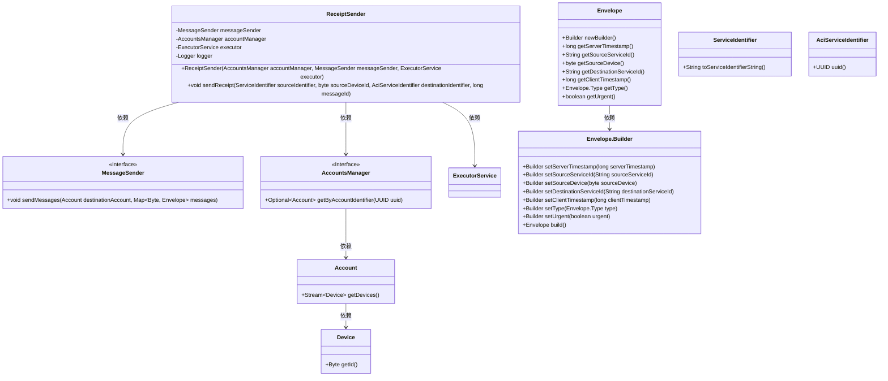

# 基础信息

|      |      |
|------|------|
| 名称 | ReceiptSender |
| 编码语言 | .java |
| 代码路径 | Signal-Server/service/src/main/java/org/whispersystems/textsecuregcm/push/ReceiptSender.java |
| 包名 | org.whispersystems.textsecuregcm.push |
| 依赖项 | ['io.micrometer.core.instrument.Metrics', 'io.micrometer.core.instrument.binder.jvm.ExecutorServiceMetrics', 'java.util.concurrent.ExecutorService', 'java.util.stream.Collectors', 'org.slf4j.Logger', 'org.slf4j.LoggerFactory', 'org.whispersystems.textsecuregcm.entities.MessageProtos.Envelope', 'org.whispersystems.textsecuregcm.identity.AciServiceIdentifier', 'org.whispersystems.textsecuregcm.identity.ServiceIdentifier', 'org.whispersystems.textsecuregcm.metrics.MetricsUtil', 'org.whispersystems.textsecuregcm.storage.AccountsManager', 'org.whispersystems.textsecuregcm.storage.Device'] |
| 概述说明 | ReceiptSender类通过线程池异步发送收据，依赖账户管理和消息发送服务。 |

# 说明

ReceiptSender类负责发送收据，其功能依赖于账户管理和消息发送服务。为了提高效率，该类通过线程池实现任务的异步处理，确保收据发送操作不会阻塞主线程，从而提升系统整体性能和响应速度。

# 类列表 Class Summary

| 名称   | 类型  | 说明 |
|-------|------|-------------|
| ReceiptSender | class | ReceiptSender类用于发送收据，依赖账户管理和消息发送服务，通过线程池异步处理任务。 |

## 类 ReceiptSender

|      |      |
|------|------|
| 访问范围 | public |
| 类型 | class |
| 名称 | ReceiptSender |
| 说明 | ReceiptSender类用于发送收据，依赖账户管理和消息发送服务，通过线程池异步处理任务。 |

### UML类图

### 描述
`ReceiptSender`类负责发送收据消息，依赖于`MessageSender`、`AccountsManager`和`ExecutorService`接口。`sendReceipt`方法根据源和目标标识符生成收据消息，并通过`messageSender`发送。`AccountsManager`用于获取目标账户信息，`ExecutorService`用于异步执行发送任务。`Envelope`类用于构建消息内容，`ServiceIdentifier`和`AciServiceIdentifier`类用于标识源和目标服务。

### 内部方法调用关系图

**描述：**  
该流程图描述了`ReceiptSender`类的核心逻辑。首先，`ReceiptSender`类包含三个主要属性：`messageSender`、`accountManager`和`executor`。构造方法初始化这些属性，并在`executor`上添加监控。`sendReceipt`方法首先检查源标识符和目标标识符是否相同，如果相同则直接返回。否则，通过`executor`提交一个任务，任务中尝试获取目标账户并构建消息，最后发送消息。如果过程中出现异常，会记录警告日志；如果账户不存在，则记录信息日志。

### 字段列表 Field List

| 名称  | 类型  | 说明 |
|-------|-------|------|
| messageSender | MessageSender | 私有且不可变的MessageSender实例。 |
| accountManager | AccountsManager | 私有且不可变的账户管理器实例。 |
| logger = LoggerFactory.getLogger(ReceiptSender.class) | Logger | ReceiptSender类中定义了静态日志记录器logger。 |
| executor | ExecutorService | 私有且不可变的线程池执行器实例。 |

### 方法列表 Method List

| 名称  | 类型  | 说明 |
|-------|-------|------|
| sendReceipt | void | 发送回执方法，检查源和目标标识符，异步发送消息，处理异常。 |

