# 基础信息

|      |      |
|------|------|
| 名称 | WebSocketConnectionEventManager |
| 编码语言 | .java |
| 代码路径 | Signal-Server/service/src/main/java/org/whispersystems/textsecuregcm/push/WebSocketConnectionEventManager.java |
| 包名 | org.whispersystems.textsecuregcm.push |
| 依赖项 | ['com.google.common.annotations.VisibleForTesting', 'com.google.protobuf.InvalidProtocolBufferException', 'io.dropwizard.lifecycle.Managed', 'io.lettuce.core.cluster.SlotHash', 'io.lettuce.core.cluster.event.ClusterTopologyChangedEvent', 'io.lettuce.core.cluster.models.partitions.RedisClusterNode', 'io.lettuce.core.cluster.pubsub.RedisClusterPubSubAdapter', 'io.micrometer.core.instrument.Counter', 'io.micrometer.core.instrument.Metrics', 'io.micrometer.core.instrument.Tags', 'java.nio.charset.StandardCharsets', 'java.util.ArrayList', 'java.util.Collection', 'java.util.HashMap', 'java.util.List', 'java.util.Map', 'java.util.Objects', 'java.util.UUID', 'java.util.concurrent.CompletableFuture', 'java.util.concurrent.CompletionStage', 'java.util.concurrent.ConcurrentHashMap', 'java.util.concurrent.Executor', 'java.util.concurrent.atomic.AtomicReference', 'java.util.function.Function', 'javax.annotation.Nullable', 'org.slf4j.Logger', 'org.slf4j.LoggerFactory', 'org.whispersystems.textsecuregcm.auth.DisconnectionRequestListener', 'org.whispersystems.textsecuregcm.entities.MessageProtos', 'org.whispersystems.textsecuregcm.metrics.MetricsUtil', 'org.whispersystems.textsecuregcm.redis.FaultTolerantPubSubClusterConnection', 'org.whispersystems.textsecuregcm.redis.FaultTolerantRedisClusterClient', 'org.whispersystems.textsecuregcm.storage.AccountsManager', 'org.whispersystems.textsecuregcm.util.RedisClusterUtil', 'org.whispersystems.textsecuregcm.util.UUIDUtil', 'org.whispersystems.textsecuregcm.util.Util'] |
| 概述说明 | WebSocketConnectionEventManager处理连接、断开及消息通知。 |

# 说明

WebSocketConnectionEventManager负责管理和处理WebSocket连接相关的事件。其主要功能包括监控客户端的连接和断开状态，以及处理客户端发送的消息通知。通过该管理器，能够有效维护WebSocket连接的稳定性和实时通信的可靠性。

# 类列表 Class Summary

| 名称   | 类型  | 说明 |
|-------|------|-------------|
| WebSocketConnectionEventManager | class | WebSocketConnectionEventManager管理WebSocket连接事件，处理客户端连接、断开及消息通知。 |

## 类 WebSocketConnectionEventManager

|      |      |
|------|------|
| 访问范围 | public |
| 类型 | class |
| 名称 | WebSocketConnectionEventManager |
| 说明 | WebSocketConnectionEventManager管理WebSocket连接事件，处理客户端连接、断开及消息通知。 |

### UML类图

```mermaid
classDiagram
    class WebSocketConnectionEventManager {
        -AccountsManager accountsManager
        -PushNotificationManager pushNotificationManager
        -FaultTolerantRedisClusterClient clusterClient
        -Executor listenerEventExecutor
        -Executor asyncOperationQueueingExecutor
        -FaultTolerantPubSubClusterConnection~byte[], byte[]~ pubSubConnection
        -Map~AccountAndDeviceIdentifier, WebSocketConnectionEventListener~ listenersByAccountAndDeviceIdentifier
        -UUID serverId
        -byte[] CLIENT_CONNECTED_EVENT_BYTES
        -static Counter PUBLISH_CLIENT_CONNECTION_EVENT_ERROR_COUNTER
        -static Counter UNSUBSCRIBE_ERROR_COUNTER
        -static Counter PUB_SUB_EVENT_WITHOUT_LISTENER_COUNTER
        -static Counter MESSAGE_AVAILABLE_WITHOUT_LISTENER_COUNTER
        -static String LISTENER_GAUGE_NAME
        -static Logger logger
        +WebSocketConnectionEventManager(AccountsManager, PushNotificationManager, FaultTolerantRedisClusterClient, Executor, Executor)
        +void start()
        +void stop()
        +CompletionStage~Void~ handleClientConnected(UUID, byte, WebSocketConnectionEventListener)
        +CompletionStage~Void~ handleClientDisconnected(UUID, byte)
        +boolean isLocallyPresent(UUID, byte)
        +void handleDisconnectionRequest(UUID, Collection~Byte~)
        +void resubscribe(ClusterTopologyChangedEvent)
        +void unsubscribeIfMissingListener(AccountAndDeviceIdentifier)
        +void smessage(RedisClusterNode, byte[], byte[])
        +static byte[] getClientEventChannel(UUID, byte)
        -static AccountAndDeviceIdentifier parseClientEventChannel(byte[])
    }

    class AccountsManager {
        <<Interface>>
    }

    class PushNotificationManager {
        <<Interface>>
    }

    class FaultTolerantRedisClusterClient {
        <<Interface>>
    }

    class Executor {
        <<Interface>>
    }

    class FaultTolerantPubSubClusterConnection~byte[], byte[]~ {
        <<Interface>>
    }

    class WebSocketConnectionEventListener {
        <<Interface>>
        +void handleConnectionDisplaced(boolean)
        +void handleNewMessageAvailable()
        +void handleMessagesPersisted()
    }

    class RedisClusterPubSubAdapter~byte[], byte[]~ {
        <<Interface>>
    }

    class Managed {
        <<Interface>>
    }

    class DisconnectionRequestListener {
        <<Interface>>
    }

    class AccountAndDeviceIdentifier {
        -UUID accountIdentifier
        -byte deviceId
        +AccountAndDeviceIdentifier(UUID, byte)
    }

    WebSocketConnectionEventManager --> AccountsManager : 依赖
    WebSocketConnectionEventManager --> PushNotificationManager : 依赖
    WebSocketConnectionEventManager --> FaultTolerantRedisClusterClient : 依赖
    WebSocketConnectionEventManager --> Executor : 依赖
    WebSocketConnectionEventManager --> FaultTolerantPubSubClusterConnection~byte[], byte[]~ : 依赖
    WebSocketConnectionEventManager --> WebSocketConnectionEventListener : 依赖
    WebSocketConnectionEventManager --> RedisClusterPubSubAdapter~byte[], byte[]~ : 实现
    WebSocketConnectionEventManager --> Managed : 实现
    WebSocketConnectionEventManager --> DisconnectionRequestListener : 实现
    WebSocketConnectionEventManager --> AccountAndDeviceIdentifier : 依赖
```

**描述：**  
`WebSocketConnectionEventManager` 是一个复杂的类，负责管理 WebSocket 连接事件，依赖于多个接口和类，如 `AccountsManager`、`PushNotificationManager` 和 `FaultTolerantRedisClusterClient`。它实现了 `RedisClusterPubSubAdapter`、`Managed` 和 `DisconnectionRequestListener` 接口，用于处理客户端的连接和断开事件。该类通过 `ConcurrentHashMap` 管理客户端监听器，并使用 Redis 集群进行事件发布和订阅。它还提供了方法来处理客户端的连接、断开、以及本地存在性检查等功能。

### 内部方法调用关系图

```mermaid
graph TD
    A["类WebSocketConnectionEventManager"]
    B["属性: AccountsManager accountsManager"]
    C["属性: PushNotificationManager pushNotificationManager"]
    D["属性: FaultTolerantRedisClusterClient clusterClient"]
    E["属性: Executor listenerEventExecutor"]
    F["属性: Executor asyncOperationQueueingExecutor"]
    G["属性: FaultTolerantPubSubClusterConnection pubSubConnection"]
    H["属性: Map listenersByAccountAndDeviceIdentifier"]
    I["属性: UUID serverId"]
    J["属性: byte[] CLIENT_CONNECTED_EVENT_BYTES"]
    K["属性: Counter PUBLISH_CLIENT_CONNECTION_EVENT_ERROR_COUNTER"]
    L["属性: Counter UNSUBSCRIBE_ERROR_COUNTER"]
    M["属性: Counter PUB_SUB_EVENT_WITHOUT_LISTENER_COUNTER"]
    N["属性: Counter MESSAGE_AVAILABLE_WITHOUT_LISTENER_COUNTER"]
    O["属性: String LISTENER_GAUGE_NAME"]
    P["属性: Logger logger"]
    Q["方法: start()"]
    R["方法: stop()"]
    S["方法: handleClientConnected(UUID accountIdentifier, byte deviceId, WebSocketConnectionEventListener listener)"]
    T["方法: handleClientDisconnected(UUID accountIdentifier, byte deviceId)"]
    U["方法: isLocallyPresent(UUID accountUuid, byte deviceId)"]
    V["方法: handleDisconnectionRequest(UUID accountIdentifier, Collection<Byte> deviceIds)"]
    W["方法: resubscribe(ClusterTopologyChangedEvent clusterTopologyChangedEvent)"]
    X["方法: unsubscribeIfMissingListener(AccountAndDeviceIdentifier accountAndDeviceIdentifier)"]
    Y["方法: smessage(RedisClusterNode node, byte[] shardChannel, byte[] message)"]
    Z["方法: getClientEventChannel(UUID accountIdentifier, byte deviceId)"]
    AA["方法: parseClientEventChannel(byte[] eventChannelBytes)"]

    A --> B
    A --> C
    A --> D
    A --> E
    A --> F
    A --> G
    A --> H
    A --> I
    A --> J
    A --> K
    A --> L
    A --> M
    A --> N
    A --> O
    A --> P
    A --> Q
    A --> R
    A --> S
    A --> T
    A --> U
    A --> V
    A --> W
    A --> X
    A --> Y
    A --> Z
    A --> AA
```

**描述：**
`WebSocketConnectionEventManager` 类负责管理WebSocket连接事件，包括客户端连接、断开连接、消息处理等。它通过Redis集群实现发布/订阅模式，确保事件的实时传递和处理。类中包含多个方法，如`start()`和`stop()`用于启动和停止事件管理器，`handleClientConnected()`和`handleClientDisconnected()`用于处理客户端连接和断开事件，`smessage()`用于处理收到的消息。此外，类中还包含多个计数器，用于监控事件处理的错误和状态。

### 字段列表 Field List

| 名称  | 类型  | 说明 |
|-------|-------|------|
| accountsManager | AccountsManager | 私有且不可变的账户管理器实例。 |
| CLIENT_CONNECTED_EVENT_BYTES = ClientEvent.newBuilder()      .setClientConnected(ClientConnectedEvent.newBuilder()          .setServerId(UUIDUtil.toByteString(serverId))          .build())      .build()      .toByteArray() | byte[] | 生成客户端连接事件的字节数组，包含服务器ID信息。 |
| PUB_SUB_EVENT_WITHOUT_LISTENER_COUNTER =      Metrics.counter(MetricsUtil.name(WebSocketConnectionEventManager.class, "pubSubEventWithoutListener")) | Counter | 定义计数器统计无监听者的发布订阅事件。 |
| listenersByAccountAndDeviceIdentifier | Map<AccountAndDeviceIdentifier, WebSocketConnectionEventListener> | 私有映射存储账户与设备标识符对应的WebSocket连接监听器。 |
| clusterClient | FaultTolerantRedisClusterClient | 私有终端的容错Redis集群客户端实例。 |
| pushNotificationManager | PushNotificationManager | 私有且不可变的推送通知管理器实例。 |
| serverId = UUID.randomUUID() | UUID | 生成唯一服务器标识符。 |
| MESSAGE_AVAILABLE_WITHOUT_LISTENER_COUNTER =      Metrics.counter(MetricsUtil.name(WebSocketConnectionEventManager.class, "messageAvailableWithoutListener")) | Counter | WebSocket连接事件管理器中未监听消息的计数器。 |
| asyncOperationQueueingExecutor | Executor | 私有且不可变的异步操作队列执行器。 |
| pubSubConnection | FaultTolerantPubSubClusterConnection<byte[], byte[]> | 可空私有变量pubSubConnection，类型为FaultTolerantPubSubClusterConnection。 |
| logger = LoggerFactory.getLogger(WebSocketConnectionEventManager.class) | Logger | WebSocket连接事件管理器的日志记录器初始化。 |
| UNSUBSCRIBE_ERROR_COUNTER =      Metrics.counter(MetricsUtil.name(WebSocketConnectionEventManager.class, "unsubscribeError")) | Counter | 定义私有静态计数器用于统计WebSocket连接管理中取消订阅错误次数。 |
| PUBLISH_CLIENT_CONNECTION_EVENT_ERROR_COUNTER =      Metrics.counter(MetricsUtil.name(WebSocketConnectionEventManager.class, "publishClientConnectionEventError")) | Counter | 定义私有静态计数器，用于记录发布客户端连接事件错误。 |
| listenerEventExecutor | Executor | 私有最终执行器用于监听事件。 |
| LISTENER_GAUGE_NAME =      MetricsUtil.name(WebSocketConnectionEventManager.class, "listeners") | String | 定义私有静态常量LISTENER_GAUGE_NAME，用于WebSocket连接事件管理器的监听器指标名称。 |

### 方法列表 Method List

| 名称  | 类型  | 说明 |
|-------|-------|------|
| getClientEventChannel | byte[] | 生成客户端事件通道字节数组，包含账户标识和设备ID。 |
| parseClientEventChannel | AccountAndDeviceIdentifier | 解析客户端事件通道，提取账户标识符和设备ID。 |
| start | void | 重写start方法，创建并订阅集群拓扑变更事件。 |
| unsubscribeIfMissingListener | void | 若无监听器则取消订阅，避免阻塞操作。 |
| stop | void | 同步停止方法，关闭并移除发布订阅连接监听器。 |
| handleDisconnectionRequest | void | 处理断开连接请求，遍历设备ID并调用对应监听器。 |
| isLocallyPresent | boolean | 检查账户和设备ID是否在本地存在。 |
| handleClientDisconnected | CompletionStage<Void> | 处理客户端断开连接，异步取消订阅并确保线程安全。 |
| smessage | void | 处理Redis消息，解析事件并执行相应监听器操作。 |
| handleClientConnected | CompletionStage<Void> | 处理客户端连接，订阅事件通道，发布连接事件，确保原子操作。 |
| resubscribe | void | 方法重新订阅集群拓扑变化事件，按槽组织订阅并批量处理。 |

