# 基础信息

|      |      |
|------|------|
| 名称 | push |
| 编码语言 | .java |
| 代码路径 | Signal-Server/service/src/main/java/org/whispersystems/textsecuregcm/push |
| 包名 | Signal-Server.service.src.main.java.org.whispersystems.textsecuregcm.push |
| 概述说明 | 空闲设备通知调度器管理设备状态并发送推送通知，提升管理效率和用户体验。 |

# 说明

## 概述
该代码模块主要围绕推送通知的管理和发送功能展开，涵盖了从设备状态检查、消息发送、推送通知调度到异常处理的完整流程。模块通过多个类协同工作，确保推送通知的高效、可靠和及时送达。核心功能包括设备状态监控、消息发送、推送通知调度、错误处理以及与Redis和WebSocket的集成。模块支持多种推送服务（如APNs和FCM），并通过异步处理和线程池优化系统性能。

## 主要业务场景
1. **设备状态监控与通知调度**：`IdleDeviceNotificationScheduler`负责检查设备状态，并在设备空闲时发送推送通知，提升设备管理效率和用户体验。
2. **消息发送与管理**：`MessageSender`类支持向单个或多个设备发送消息，并处理消息大小验证和发送数据的统计，确保消息传递的准确性和可靠性。
3. **推送通知发送**：`FcmSender`和`APNSender`分别通过Firebase和APNs发送推送通知，支持优先级设置和异步处理，确保重要通知及时送达。
4. **异常处理**：`MessageTooLargeException`和`NotPushRegisteredException`等异常类用于处理消息过大或设备未注册推送等特定场景，减少资源消耗和日志大小。
5. **Redis集成与消息分发**：`ProvisioningManager`和`PushNotificationScheduler`通过Redis集群管理推送任务的调度和分发，确保消息处理的可靠性和及时性。
6. **WebSocket连接管理**：`WebSocketConnectionEventManager`监控WebSocket连接状态，处理客户端消息通知，维护实时通信的稳定性。
7. **推送通知调度与管理**：`PushNotificationManager`支持通过APNs和FCM发送通知，处理设备令牌失效情况，并具备通知调度功能，确保通知准确送达。

### 包内部结构视图

```mermaid
graph TD
    push --> IdleDeviceNotificationScheduler.java
    push --> MessageSender.java
    push --> FcmSender.java
    push --> MessageTooLargeException.java
    push --> ProvisioningManager.java
    push --> PushNotificationScheduler.java
    push --> ReceiptSender.java
    push --> SendPushNotificationResult.java
    push --> APNSender.java
    push --> NotPushRegisteredException.java
    push --> PushNotification.java
    push --> PushNotificationSender.java
    push --> WebSocketConnectionEventListener.java
    push --> WebSocketConnectionEventManager.java
    push --> PushNotificationManager.java
```

该流程图展示了`push`目录下的所有文件及其层级关系。`push`作为根节点，直接连接到多个Java文件，包括`IdleDeviceNotificationScheduler.java`、`MessageSender.java`、`FcmSender.java`等。这些文件均属于`push`目录，且没有进一步的子目录结构。

# 文件列表 File List

| 名称   | 类型  | 说明 |
|-------|------|-------------|
| [PushNotification.java](PushNotification.md) | file | 信息为空，无法生成概要描述。 |
| [SendPushNotificationResult.java](SendPushNotificationResult.md) | file | 输入内容为空，请提供具体信息以便生成概要描述。 |
| [ProvisioningManager.java](ProvisioningManager.md) | file | ProvisioningManager类负责Redis发布订阅连接及消息处理。 |
| [IdleDeviceNotificationScheduler.java](IdleDeviceNotificationScheduler.md) | file | 空闲设备通知调度器负责监控设备状态并发送推送通知。 |
| [WebSocketConnectionEventManager.java](WebSocketConnectionEventManager.md) | file | WebSocketConnectionEventManager处理连接、断开及消息通知。 |
| [PushNotificationManager.java](PushNotificationManager.md) | file | PushNotificationManager管理推送，支持APN和FCM，处理令牌失效和调度。 |
| [WebSocketConnectionEventListener.java](WebSocketConnectionEventListener.md) | file | 无内容可总结。 |
| [PushNotificationSender.java](PushNotificationSender.md) | file | 信息为空，无法生成概要描述。 |
| [NotPushRegisteredException.java](NotPushRegisteredException.md) | file | NotPushRegisteredException是自定义异常类，继承自Exception。 |
| [APNSender.java](APNSender.md) | file | APNSender类通过ApnsClient发送多种类型和优先级的APNS推送通知，支持计时和结果处理。 |
| [ReceiptSender.java](ReceiptSender.md) | file | ReceiptSender类通过线程池异步发送收据，依赖账户管理和消息发送服务。 |
| [PushNotificationScheduler.java](PushNotificationScheduler.md) | file | PushNotificationScheduler类管理推送通知调度，支持APNs和FCM，使用Redis集群。 |
| [MessageTooLargeException.java](MessageTooLargeException.md) | file | MessageTooLargeException继承自NoStackTraceException。 |
| [FcmSender.java](FcmSender.md) | file | FcmSender类通过Firebase发送推送通知，支持异步、优先级和错误处理。 |
| [MessageSender.java](MessageSender.md) | file | MessageSender类负责发送消息、管理推送通知，支持单/多设备发送，验证消息大小并统计。 |

