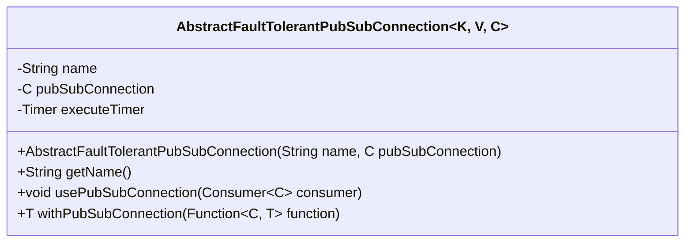
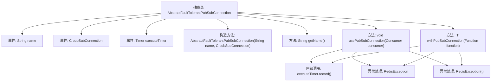

# 基础信息

|      |      |
|------|------|
| 名称 | AbstractFaultTolerantPubSubConnection |
| 编码语言 | .java |
| 代码路径 | Signal-Server/service/src/main/java/org/whispersystems/textsecuregcm/redis/AbstractFaultTolerantPubSubConnection.java |
| 包名 | org.whispersystems.textsecuregcm.redis |
| 依赖项 | ['org.whispersystems.textsecuregcm.metrics.MetricsUtil.name', 'io.lettuce.core.RedisException', 'io.lettuce.core.pubsub.StatefulRedisPubSubConnection', 'io.micrometer.core.instrument.Metrics', 'io.micrometer.core.instrument.Timer', 'java.util.function.Consumer', 'java.util.function.Function'] |
| 概述说明 | 抽象类实现Redis容错发布订阅，支持连接管理和函数调用。 |

# 说明

该抽象类实现了Redis容错发布订阅连接，主要包含名称、连接和计时器等关键组件。它支持连接的使用和函数调用，确保在发布订阅过程中具备容错能力。通过计时器管理连接状态，确保系统在出现故障时能够自动恢复，从而提升系统的稳定性和可靠性。

# 类列表 Class Summary

| 名称   | 类型  | 说明 |
|-------|------|-------------|
| AbstractFaultTolerantPubSubConnection | class | 抽象类实现Redis容错发布订阅连接，包含名称、连接和计时器，支持连接使用和函数调用。 |

## 类 AbstractFaultTolerantPubSubConnection

|      |      |
|------|------|
| 访问范围 | abstract |
| 类型 | class |
| 名称 | AbstractFaultTolerantPubSubConnection |
| 说明 | 抽象类实现Redis容错发布订阅连接，包含名称、连接和计时器，支持连接使用和函数调用。 |

### UML类图

这段代码定义了一个抽象类 `AbstractFaultTolerantPubSubConnection`，它支持泛型 `K`、`V` 和 `C`，其中 `C` 必须继承自 `StatefulRedisPubSubConnection`。该类用于处理具有容错能力的发布/订阅连接，包含一个定时器 `executeTimer` 来记录操作的执行时间。类中提供了两个主要方法：`usePubSubConnection` 和 `withPubSubConnection`，分别用于执行消费者和函数操作，并在出现异常时抛出 `RedisException`。

### 内部方法调用关系图

该流程图描述了 `AbstractFaultTolerantPubSubConnection` 抽象类的结构和主要方法。类包含三个属性：`name`、`pubSubConnection` 和 `executeTimer`，并提供了构造方法和两个主要方法 `usePubSubConnection` 和 `withPubSubConnection`。这两个方法都使用了 `executeTimer.record()` 来记录执行时间，并处理可能抛出的 `RedisException` 异常。

### 字段列表 Field List

| 名称  | 类型  | 说明 |
|-------|-------|------|
| name | String | 声明了一个私有且不可变的字符串类型变量name。 |
| executeTimer | Timer | 声明一个私有的最终计时器变量executeTimer。 |
| pubSubConnection | C | 私有且不可变的C类型pubSubConnection实例。 |

### 方法列表 Method List

| 名称  | 类型  | 说明 |
|-------|-------|------|
| getName | String | 该方法返回字符串类型的name属性值。 |
| usePubSubConnection | void | 使用PubSub连接执行消费者操作，捕获并处理异常。 |
| withPubSubConnection | T | 方法`withPubSubConnection`执行函数并记录时间，捕获异常并抛出`RedisException`。 |

