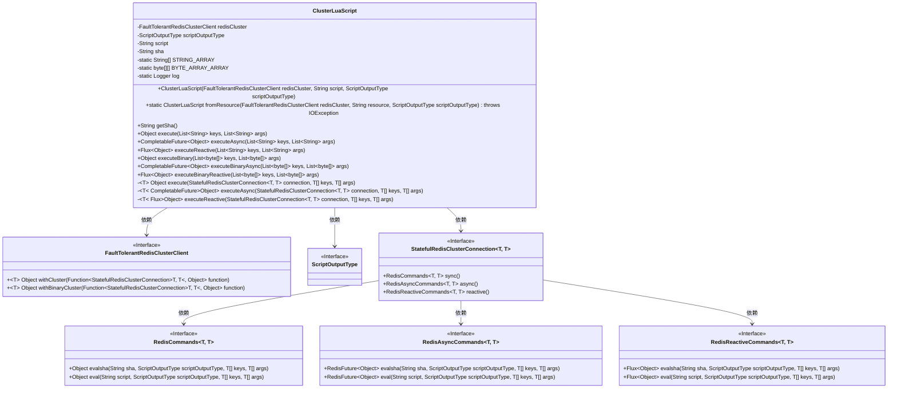

# 基础信息

|      |      |
|------|------|
| 名称 | ClusterLuaScript |
| 编码语言 | .java |
| 代码路径 | Signal-Server/service/src/main/java/org/whispersystems/textsecuregcm/redis/ClusterLuaScript.java |
| 包名 | org.whispersystems.textsecuregcm.redis |
| 依赖项 | ['com.google.common.annotations.VisibleForTesting', 'io.lettuce.core.RedisException', 'io.lettuce.core.RedisNoScriptException', 'io.lettuce.core.ScriptOutputType', 'io.lettuce.core.cluster.api.StatefulRedisClusterConnection', 'java.io.IOException', 'java.io.InputStream', 'java.nio.charset.StandardCharsets', 'java.security.MessageDigest', 'java.security.NoSuchAlgorithmException', 'java.util.HexFormat', 'java.util.List', 'java.util.concurrent.CompletableFuture', 'org.slf4j.Logger', 'org.slf4j.LoggerFactory', 'reactor.core.publisher.Flux', 'reactor.core.publisher.Mono'] |
| 概述说明 | ClusterLuaScript类在Redis集群中执行Lua脚本，支持同步、异步和响应式操作，处理脚本缓存。 |

# 说明

ClusterLuaScript类是一个用于在Redis集群中执行Lua脚本的工具，支持同步、异步和响应式三种操作模式。它能够高效地处理脚本缓存，确保脚本执行的性能优化。通过该类，开发者可以灵活地在Redis集群中运行Lua脚本，满足不同场景下的需求，同时简化了脚本管理和执行过程。

# 类列表 Class Summary

| 名称   | 类型  | 说明 |
|-------|------|-------------|
| ClusterLuaScript | class | ClusterLuaScript类用于在Redis集群中执行Lua脚本，支持同步、异步和响应式操作，并处理脚本缓存。 |

## 类 ClusterLuaScript

|      |      |
|------|------|
| 访问范围 | public |
| 类型 | class |
| 名称 | ClusterLuaScript |
| 说明 | ClusterLuaScript类用于在Redis集群中执行Lua脚本，支持同步、异步和响应式操作，并处理脚本缓存。 |

### UML类图

**描述**：`ClusterLuaScript` 类用于在 Redis 集群中执行 Lua 脚本，支持同步、异步和响应式操作。它依赖于 `FaultTolerantRedisClusterClient` 来管理 Redis 集群连接，并通过 `StatefulRedisClusterConnection` 与 Redis 进行交互。该类提供了多种执行脚本的方法，并处理脚本的 SHA-1 哈希值以确保脚本的唯一性。

### 内部方法调用关系图

```mermaid
graph TD
    A["类ClusterLuaScript"]
    B["属性: FaultTolerantRedisClusterClient redisCluster"]
    C["属性: ScriptOutputType scriptOutputType"]
    D["属性: String script"]
    E["属性: String sha"]
    F["静态属性: String[] STRING_ARRAY"]
    G["静态属性: byte[][] BYTE_ARRAY_ARRAY"]
    H["静态属性: Logger log"]
    I["静态方法: fromResource(FaultTolerantRedisClusterClient redisCluster, String resource, ScriptOutputType scriptOutputType)"]
    J["构造方法: ClusterLuaScript(FaultTolerantRedisClusterClient redisCluster, String script, ScriptOutputType scriptOutputType)"]
    K["方法: String getSha()"]
    L["方法: Object execute(List<String> keys, List<String> args)"]
    M["方法: CompletableFuture<Object> executeAsync(List<String> keys, List<String> args)"]
    N["方法: Flux<Object> executeReactive(List<String> keys, List<String> args)"]
    O["方法: Object executeBinary(List<byte[]> keys, List<byte[]> args)"]
    P["方法: CompletableFuture<Object> executeBinaryAsync(List<byte[]> keys, List<byte[]> args)"]
    Q["方法: Flux<Object> executeBinaryReactive(List<byte[]> keys, List<byte[]> args)"]
    R["私有方法: <T> Object execute(StatefulRedisClusterConnection<T, T> connection, T[] keys, T[] args)"]
    S["私有方法: <T> CompletableFuture<Object> executeAsync(StatefulRedisClusterConnection<T, T> connection, T[] keys, T[] args)"]
    T["私有方法: <T> Flux<Object> executeReactive(StatefulRedisClusterConnection<T, T> connection, T[] keys, T[] args)"]

    A --> B
    A --> C
    A --> D
    A --> E
    A --> F
    A --> G
    A --> H
    A --> I
    A --> J
    A --> K
    A --> L
    A --> M
    A --> N
    A --> O
    A --> P
    A --> Q
    L --> R
    M --> S
    N --> T
    O --> R
    P --> S
    Q --> T
```

这段代码定义了一个名为`ClusterLuaScript`的类，用于管理和执行Lua脚本与Redis集群的交互。类中包含多个方法，支持同步、异步和响应式执行脚本，并处理脚本的加载、哈希计算及异常处理。流程图展示了类的属性、构造方法、公共方法和私有方法之间的调用关系，清晰地描述了代码的结构和逻辑流程。

### 字段列表 Field List

| 名称  | 类型  | 说明 |
|-------|-------|------|
| sha | String | 定义私有不可变字符串变量sha。 |
| script | String | 私有且不可变的字符串变量script。 |
| redisCluster | FaultTolerantRedisClusterClient | 私有只读的Redis集群客户端实例。 |
| scriptOutputType | ScriptOutputType | 私有且不可变的脚本输出类型变量。 |
| BYTE_ARRAY_ARRAY = new byte[0][] | byte[][] | 声明一个空二维字节数组常量BYTE_ARRAY_ARRAY。 |
| log = LoggerFactory.getLogger(ClusterLuaScript.class) | Logger | ClusterLuaScript类中定义了一个私有的静态日志记录器。 |
| STRING_ARRAY = new String[0] | String[] | 定义空字符串数组常量STRING_ARRAY。 |

### 方法列表 Method List

| 名称  | 类型  | 说明 |
|-------|-------|------|
| executeBinaryAsync | CompletableFuture<Object> | 异步执行二进制命令，返回CompletableFuture结果。 |
| execute | Object | 方法执行Redis集群操作，传入键和参数列表。 |
| getSha | String | 测试可见方法返回sha值。 |
| executeReactive | Flux<Object> | 方法执行Redis集群操作，传入键和参数列表，返回响应式流。 |
| fromResource | ClusterLuaScript | 从资源加载Lua脚本，创建ClusterLuaScript对象，处理异常。 |
| executeAsync | CompletableFuture<Object> | 异步执行Redis脚本，异常时重试或抛出异常。 |
| executeBinary | Object | 该方法执行Redis集群二进制命令，接收键和参数列表并返回结果。 |
| executeBinaryReactive | Flux<Object> | 该方法通过Redis集群执行二进制数据的异步操作。 |
| executeReactive | Flux<Object> | 该方法通过Redis集群连接执行Lua脚本，优先使用SHA校验，失败时改用脚本内容执行。 |
| execute | Object | 执行Redis脚本，先尝试evalsha，失败后改用eval，捕获异常并记录日志。 |
| executeAsync | CompletableFuture<Object> | 异步执行Redis集群操作，传入键和参数列表。 |

