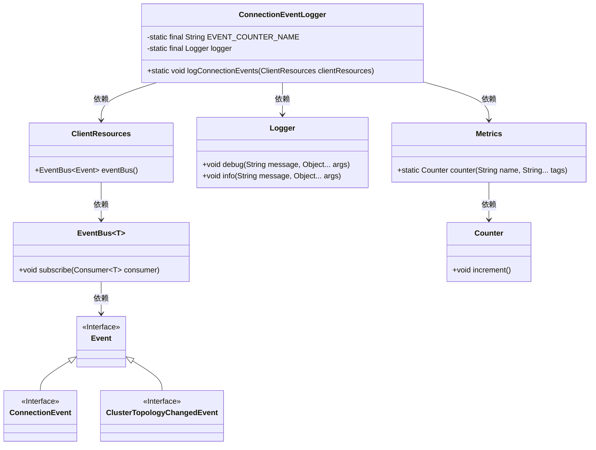
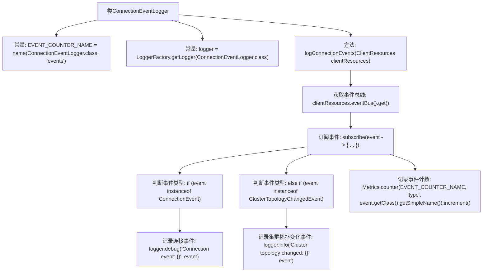

# 基础信息

|      |      |
|------|------|
| 名称 | ConnectionEventLogger |
| 编码语言 | .java |
| 代码路径 | Signal-Server/service/src/main/java/org/whispersystems/textsecuregcm/redis/ConnectionEventLogger.java |
| 包名 | org.whispersystems.textsecuregcm.redis |
| 依赖项 | ['org.whispersystems.textsecuregcm.metrics.MetricsUtil.name', 'io.lettuce.core.cluster.event.ClusterTopologyChangedEvent', 'io.lettuce.core.event.connection.ConnectionEvent', 'io.lettuce.core.resource.ClientResources', 'io.micrometer.core.instrument.Metrics', 'org.slf4j.Logger', 'org.slf4j.LoggerFactory'] |
| 概述说明 | ConnectionEventLogger类记录连接与集群拓扑变化，更新事件计数器。 |

# 说明

ConnectionEventLogger类负责记录连接事件和集群拓扑结构的变化，同时更新相关的事件计数器，以跟踪和监控系统的连接状态和集群变化情况。

# 类列表 Class Summary

| 名称   | 类型  | 说明 |
|-------|------|-------------|
| ConnectionEventLogger | class | ConnectionEventLogger类记录连接和集群拓扑变化事件，并更新事件计数器。 |

## 类 ConnectionEventLogger

|      |      |
|------|------|
| 访问范围 | public |
| 类型 | class |
| 名称 | ConnectionEventLogger |
| 说明 | ConnectionEventLogger类记录连接和集群拓扑变化事件，并更新事件计数器。 |

### UML类图

**描述：**  
`ConnectionEventLogger` 类用于记录连接事件和集群拓扑变化事件。它依赖于 `ClientResources` 获取事件总线，并通过 `Logger` 记录事件信息，同时使用 `Metrics` 进行事件计数。`EventBus` 负责订阅事件，事件类型包括 `ConnectionEvent` 和 `ClusterTopologyChangedEvent`，它们都继承自 `Event` 接口。整个设计通过事件驱动的方式，实现了对连接和集群拓扑变化的监控与记录。

### 内部方法调用关系图

这段代码定义了一个`ConnectionEventLogger`类，用于记录与连接相关的事件。类中包含两个常量`EVENT_COUNTER_NAME`和`logger`，以及一个方法`logConnectionEvents`。该方法通过订阅事件总线，判断事件类型并记录相应的日志信息，同时使用`Metrics`类记录事件计数。流程图展示了类内部的常量定义、方法调用以及事件处理逻辑的流程。

### 字段列表 Field List

| 名称  | 类型  | 说明 |
|-------|-------|------|
| EVENT_COUNTER_NAME = name(ConnectionEventLogger.class, "events") | String | 定义事件计数器名称，关联ConnectionEventLogger类。 |
| logger = LoggerFactory.getLogger(ConnectionEventLogger.class) | Logger | 定义静态日志记录器，用于ConnectionEventLogger类。 |

### 方法列表 Method List

| 名称  | 类型  | 说明 |
|-------|-------|------|
| logConnectionEvents | void | 记录客户端连接和集群拓扑变化事件，并增加事件计数器。 |

