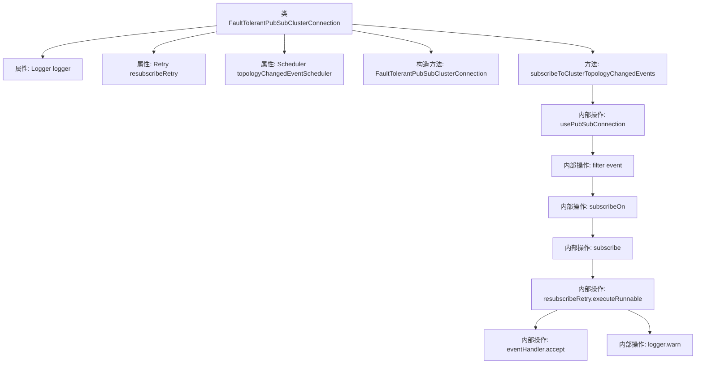

# 基础信息

|      |      |
|------|------|
| 名称 | FaultTolerantPubSubClusterConnection |
| 编码语言 | .java |
| 代码路径 | Signal-Server/service/src/main/java/org/whispersystems/textsecuregcm/redis/FaultTolerantPubSubClusterConnection.java |
| 包名 | org.whispersystems.textsecuregcm.redis |
| 依赖项 | ['io.github.resilience4j.retry.Retry', 'io.lettuce.core.cluster.event.ClusterTopologyChangedEvent', 'io.lettuce.core.cluster.pubsub.StatefulRedisClusterPubSubConnection', 'org.slf4j.Logger', 'org.slf4j.LoggerFactory', 'reactor.core.scheduler.Scheduler', 'java.util.function.Consumer'] |
| 概述说明 | FaultTolerantPubSubClusterConnection类处理Redis集群拓扑变化，支持重订阅和事件过滤。 |

# 说明

FaultTolerantPubSubClusterConnection类主要用于处理Redis集群拓扑变化事件，具备重订阅和事件过滤功能。它确保在集群拓扑发生变化时，能够自动重新订阅相关频道，并通过事件过滤机制有效管理事件处理，从而增强系统的容错性和稳定性。

# 类列表 Class Summary

| 名称   | 类型  | 说明 |
|-------|------|-------------|
| FaultTolerantPubSubClusterConnection | class | FaultTolerantPubSubClusterConnection类用于处理Redis集群拓扑变化事件，支持重订阅和事件过滤。 |


## 类 FaultTolerantPubSubClusterConnection

|      |      |
|------|------|
| 访问范围 | public |
| 类型 | class |
| 名称 | FaultTolerantPubSubClusterConnection |
| 说明 | FaultTolerantPubSubClusterConnection类用于处理Redis集群拓扑变化事件，支持重订阅和事件过滤。 |


### UML类图

```mermaid
classDiagram
    class AbstractFaultTolerantPubSubConnection~K, V, T~ {
        <<Abstract>>
        +AbstractFaultTolerantPubSubConnection(String name, T pubSubConnection)
    }

    class FaultTolerantPubSubClusterConnection~K, V~ {
        -Logger logger
        -Retry resubscribeRetry
        -Scheduler topologyChangedEventScheduler
        +FaultTolerantPubSubClusterConnection(String name, StatefulRedisClusterPubSubConnection~K, V~ pubSubConnection, Retry resubscribeRetry, Scheduler topologyChangedEventScheduler)
        +void subscribeToClusterTopologyChangedEvents(Consumer~ClusterTopologyChangedEvent~ eventHandler)
    }

    class StatefulRedisClusterPubSubConnection~K, V~ {
        +void setNodeMessagePropagation(boolean enabled)
        +List~RedisClusterNode~ getPartitions()
    }

    class ClusterTopologyChangedEvent {
        +List~RedisClusterNode~ before()
        +List~RedisClusterNode~ after()
    }

    class Retry {
        +void executeRunnable(Runnable runnable)
    }

    class Scheduler {
        +void subscribeOn(Scheduler scheduler)
    }

    class Consumer~T~ {
        <<Interface>>
        +void accept(T t)
    }

    AbstractFaultTolerantPubSubConnection~K, V, StatefulRedisClusterPubSubConnection~K, V~ <|-- FaultTolerantPubSubClusterConnection~K, V~
    FaultTolerantPubSubClusterConnection~K, V~ --> StatefulRedisClusterPubSubConnection~K, V~ : 依赖
    FaultTolerantPubSubClusterConnection~K, V~ --> Retry : 依赖
    FaultTolerantPubSubClusterConnection~K, V~ --> Scheduler : 依赖
    FaultTolerantPubSubClusterConnection~K, V~ --> Consumer~ClusterTopologyChangedEvent~ : 依赖
    ClusterTopologyChangedEvent --> RedisClusterNode : 包含
```

**描述：**  
`FaultTolerantPubSubClusterConnection` 是一个继承自 `AbstractFaultTolerantPubSubConnection` 的类，用于处理 Redis 集群的发布/订阅连接，具有容错机制。它依赖于 `StatefulRedisClusterPubSubConnection` 来管理集群连接，使用 `Retry` 进行重试操作，并通过 `Scheduler` 调度拓扑变化事件。该类通过 `subscribeToClusterTopologyChangedEvents` 方法订阅集群拓扑变化事件，并在事件发生时执行相应的处理逻辑。


### 内部方法调用关系图



这段代码定义了一个名为`FaultTolerantPubSubClusterConnection`的类，用于处理Redis集群拓扑变化事件的订阅。类中包含构造方法和一个主要方法`subscribeToClusterTopologyChangedEvents`，该方法通过过滤和订阅事件来监听集群拓扑变化，并在事件发生时执行重新订阅操作。流程图展示了类的属性、构造方法以及方法内部的调用关系，详细描述了从事件过滤到最终处理的全过程。

### 字段列表 Field List

| 名称  | 类型  | 说明 |
|-------|-------|------|
| topologyChangedEventScheduler | Scheduler | 私有调度器用于处理拓扑变化事件。 |
| logger = LoggerFactory.getLogger(FaultTolerantPubSubClusterConnection.class) | Logger | 在类中定义了一个私有的日志记录器实例。 |
| resubscribeRetry | Retry | 私有最终重试对象resubscribeRetry。 |

### 方法列表 Method List

| 名称  | 类型  | 说明 |
|-------|-------|------|
| subscribeToClusterTopologyChangedEvents | void | 订阅集群拓扑变化事件，过滤相关节点并重订阅通知。 |


