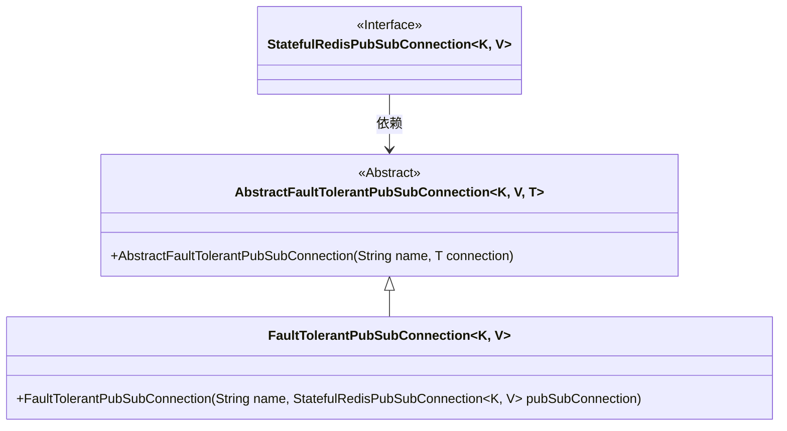
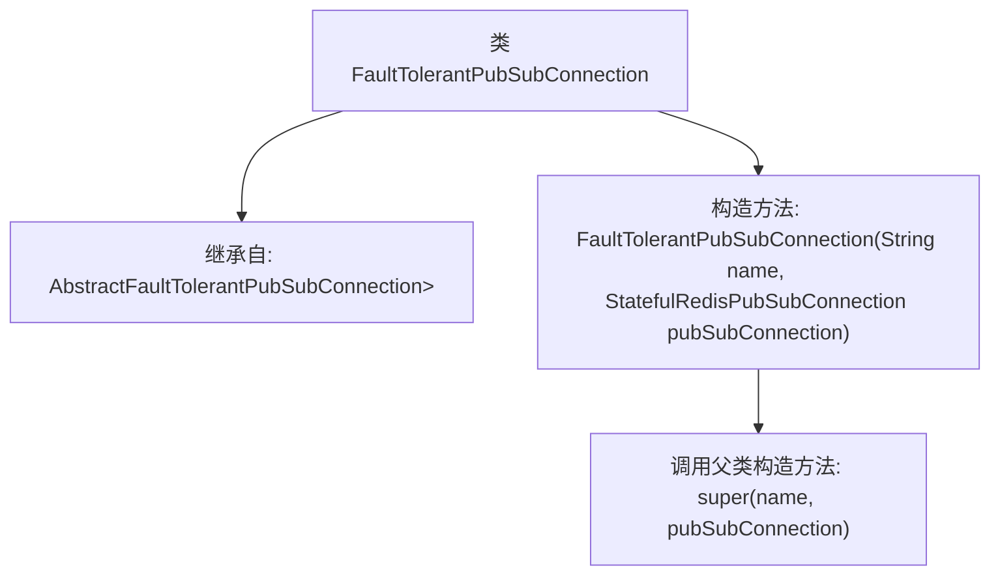

# 基础信息

|      |      |
|------|------|
| 名称 | FaultTolerantPubSubConnection |
| 编码语言 | .java |
| 代码路径 | Signal-Server/service/src/main/java/org/whispersystems/textsecuregcm/redis/FaultTolerantPubSubConnection.java |
| 包名 | org.whispersystems.textsecuregcm.redis |
| 依赖项 | ['io.lettuce.core.pubsub.StatefulRedisPubSubConnection'] |
| 概述说明 | FaultTolerantPubSubConnection继承Abstract类，使用StatefulRedisPubSubConnection。 |

# 说明

FaultTolerantPubSubConnection类继承自AbstractFaultTolerantPubSubConnection，并采用StatefulRedisPubSubConnection作为其实现基础。这种设计使得FaultTolerantPubSubConnection具备了抽象类中定义的容错能力，同时利用StatefulRedisPubSubConnection提供的状态管理功能，确保在发布订阅模式下的可靠连接与消息传递。

# 类列表 Class Summary

| 名称   | 类型  | 说明 |
|-------|------|-------------|
| FaultTolerantPubSubConnection | class | FaultTolerantPubSubConnection继承AbstractFaultTolerantPubSubConnection，使用StatefulRedisPubSubConnection。 |

## 类 FaultTolerantPubSubConnection

|      |      |
|------|------|
| 访问范围 | public |
| 类型 | class |
| 名称 | FaultTolerantPubSubConnection |
| 说明 | FaultTolerantPubSubConnection继承AbstractFaultTolerantPubSubConnection，使用StatefulRedisPubSubConnection。 |

### UML类图

类图描述：`FaultTolerantPubSubConnection` 类继承自 `AbstractFaultTolerantPubSubConnection`，并依赖于 `StatefulRedisPubSubConnection` 接口。`AbstractFaultTolerantPubSubConnection` 是一个泛型抽象类，接受类型参数 `K` 和 `V`，以及一个泛型类型 `T`。`FaultTolerantPubSubConnection` 类通过构造函数接收 `StatefulRedisPubSubConnection` 实例，并将其传递给父类构造函数。

### 内部方法调用关系图

这段代码定义了一个名为`FaultTolerantPubSubConnection`的类，该类继承自`AbstractFaultTolerantPubSubConnection`。类中包含一个构造方法，该构造方法接受两个参数：`name`和`pubSubConnection`，并在内部调用父类的构造方法进行初始化。这段代码的主要作用是创建一个具有容错能力的发布订阅连接，并确保其继承自指定的父类。

### 字段列表 Field List

| 名称  | 类型  | 说明 |
|-------|-------|------|

### 方法列表 Method List

| 名称  | 类型  | 说明 |
|-------|-------|------|

