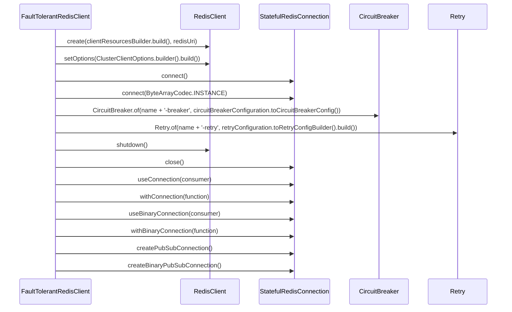

# 基础信息

|      |      |
|------|------|
| 名称 | FaultTolerantRedisClient |
| 编码语言 | .java |
| 代码路径 | Signal-Server/service/src/main/java/org/whispersystems/textsecuregcm/redis/FaultTolerantRedisClient.java |
| 包名 | org.whispersystems.textsecuregcm.redis |
| 依赖项 | ['io.github.resilience4j.circuitbreaker.CircuitBreaker', 'io.github.resilience4j.retry.Retry', 'io.lettuce.core.ClientOptions', 'io.lettuce.core.RedisClient', 'io.lettuce.core.RedisCommandTimeoutException', 'io.lettuce.core.RedisException', 'io.lettuce.core.RedisURI', 'io.lettuce.core.TimeoutOptions', 'io.lettuce.core.api.StatefulRedisConnection', 'io.lettuce.core.cluster.ClusterClientOptions', 'io.lettuce.core.cluster.ClusterTopologyRefreshOptions', 'io.lettuce.core.codec.ByteArrayCodec', 'io.lettuce.core.pubsub.StatefulRedisPubSubConnection', 'io.lettuce.core.resource.ClientResources', 'org.whispersystems.textsecuregcm.configuration.CircuitBreakerConfiguration', 'org.whispersystems.textsecuregcm.configuration.RedisConfiguration', 'org.whispersystems.textsecuregcm.configuration.RetryConfiguration', 'org.whispersystems.textsecuregcm.util.CircuitBreakerUtil', 'reactor.core.scheduler.Schedulers', 'java.time.Duration', 'java.util.ArrayList', 'java.util.List', 'java.util.function.Consumer', 'java.util.function.Function'] |
| 概述说明 | 容错Redis客户端，支持字符串和二进制连接，集成断路器与重试机制。 |

# 说明

FaultTolerantRedisClient类是一个具备容错功能的Redis客户端实现，支持字符串和二进制数据连接。该类集成了断路器机制和重试机制，确保在Redis服务出现故障时能够自动进行故障隔离和重试操作，从而提高系统的稳定性和可靠性。

# 类列表 Class Summary

| 名称   | 类型  | 说明 |
|-------|------|-------------|
| FaultTolerantRedisClient | class | FaultTolerantRedisClient类实现容错Redis客户端，支持字符串和二进制连接，集成断路器与重试机制。 |

## 类 FaultTolerantRedisClient

|      |      |
|------|------|
| 访问范围 | public |
| 类型 | class |
| 名称 | FaultTolerantRedisClient |
| 说明 | FaultTolerantRedisClient类实现容错Redis客户端，支持字符串和二进制连接，集成断路器与重试机制。 |

### UML类图

```mermaid
classDiagram
    class FaultTolerantRedisClient {
        -String name
        -RedisClient redisClient
        -StatefulRedisConnection~String, String~ stringConnection
        -StatefulRedisConnection~byte[], byte[]~ binaryConnection
        -List~StatefulRedisPubSubConnection~?, ?~~ pubSubConnections
        -CircuitBreaker circuitBreaker
        -Retry retry
        +FaultTolerantRedisClient(String name, RedisConfiguration redisConfiguration, ClientResources.Builder clientResourcesBuilder)
        +FaultTolerantRedisClient(String name, ClientResources.Builder clientResourcesBuilder, RedisURI redisUri, Duration commandTimeout, CircuitBreakerConfiguration circuitBreakerConfiguration, RetryConfiguration retryConfiguration)
        +void shutdown()
        +String getName()
        +void useConnection(Consumer~StatefulRedisConnection~String, String~~ consumer)
        +~T~ withConnection(Function~StatefulRedisConnection~String, String~, T~ function)
        +void useBinaryConnection(Consumer~StatefulRedisConnection~byte[], byte[]~~ consumer)
        +~T~ withBinaryConnection(Function~StatefulRedisConnection~byte[], byte[]~, T~ function)
        +~K, V~ void useConnection(StatefulRedisConnection~K, V~ connection, Consumer~StatefulRedisConnection~K, V~~ consumer)
        +~T, K, V~ T withConnection(StatefulRedisConnection~K, V~ connection, Function~StatefulRedisConnection~K, V~, T~ function)
        +FaultTolerantPubSubConnection~String, String~ createPubSubConnection()
        +FaultTolerantPubSubConnection~byte[], byte[]~ createBinaryPubSubConnection()
    }

    class CircuitBreaker {
        <<Interface>>
        +void executeRunnable(Runnable runnable)
        +~T~ executeCallable(Callable~T~ callable)
    }

    class Retry {
        <<Interface>>
        +void executeRunnable(Runnable runnable)
        +~T~ executeCallable(Callable~T~ callable)
    }

    class FaultTolerantPubSubConnection~K, V~ {
        -String name
        -StatefulRedisPubSubConnection~K, V~ pubSubConnection
        +FaultTolerantPubSubConnection(String name, StatefulRedisPubSubConnection~K, V~ pubSubConnection)
    }

    class RedisClient {
        +RedisClient create(ClientResources clientResources, RedisURI redisUri)
        +void setOptions(ClusterClientOptions options)
        +StatefulRedisConnection~String, String~ connect()
        +StatefulRedisConnection~byte[], byte[]~ connect(ByteArrayCodec codec)
        +StatefulRedisPubSubConnection~String, String~ connectPubSub()
        +StatefulRedisPubSubConnection~byte[], byte[]~ connectPubSub(ByteArrayCodec codec)
        +void shutdown()
    }

    class StatefulRedisConnection~K, V~ {
        <<Interface>>
    }

    class StatefulRedisPubSubConnection~K, V~ {
        <<Interface>>
    }

    FaultTolerantRedisClient --> RedisClient : 依赖
    FaultTolerantRedisClient --> CircuitBreaker : 依赖
    FaultTolerantRedisClient --> Retry : 依赖
    FaultTolerantRedisClient --> StatefulRedisConnection : 依赖
    FaultTolerantRedisClient --> StatefulRedisPubSubConnection : 依赖
    FaultTolerantRedisClient --> FaultTolerantPubSubConnection : 依赖
```

这段代码定义了一个`FaultTolerantRedisClient`类，用于与Redis服务器进行容错连接。该类依赖于`RedisClient`、`CircuitBreaker`和`Retry`等组件，支持字符串和二进制数据的连接与操作。`FaultTolerantRedisClient`提供了多种方法来执行Redis命令，并通过`CircuitBreaker`和`Retry`机制处理异常和重试。此外，它还支持创建发布/订阅连接，并提供了关闭连接的`shutdown`方法。

### 内部方法调用关系图

```mermaid
graph TD
    A["类FaultTolerantRedisClient"]
    B["属性: String name"]
    C["属性: RedisClient redisClient"]
    D["属性: StatefulRedisConnection<String, String> stringConnection"]
    E["属性: StatefulRedisConnection<byte[], byte[]> binaryConnection"]
    F["属性: List<StatefulRedisPubSubConnection<?, ?>> pubSubConnections"]
    G["属性: CircuitBreaker circuitBreaker"]
    H["属性: Retry retry"]
    I["构造方法: FaultTolerantRedisClient(String name, RedisConfiguration redisConfiguration, ClientResources.Builder clientResourcesBuilder)"]
    J["构造方法: FaultTolerantRedisClient(String name, ClientResources.Builder clientResourcesBuilder, RedisURI redisUri, Duration commandTimeout, CircuitBreakerConfiguration circuitBreakerConfiguration, RetryConfiguration retryConfiguration)"]
    K["方法: void shutdown()"]
    L["方法: String getName()"]
    M["方法: void useConnection(Consumer<StatefulRedisConnection<String, String>> consumer)"]
    N["方法: <T> T withConnection(Function<StatefulRedisConnection<String, String>, T> function)"]
    O["方法: void useBinaryConnection(Consumer<StatefulRedisConnection<byte[], byte[]>> consumer)"]
    P["方法: <T> T withBinaryConnection(Function<StatefulRedisConnection<byte[], byte[]>, T> function)"]
    Q["方法: <K, V> void useConnection(StatefulRedisConnection<K, V> connection, Consumer<StatefulRedisConnection<K, V>> consumer)"]
    R["方法: <T, K, V> T withConnection(StatefulRedisConnection<K, V> connection, Function<StatefulRedisConnection<K, V>, T> function)"]
    S["方法: FaultTolerantPubSubConnection<String, String> createPubSubConnection()"]
    T["方法: FaultTolerantPubSubConnection<byte[], byte[]> createBinaryPubSubConnection()"]

    A --> B
    A --> C
    A --> D
    A --> E
    A --> F
    A --> G
    A --> H
    A --> I
    A --> J
    A --> K
    A --> L
    A --> M
    A --> N
    A --> O
    A --> P
    A --> Q
    A --> R
    A --> S
    A --> T
```

**描述：**  
`FaultTolerantRedisClient` 类是一个高容错的 Redis 客户端，支持多种连接类型（字符串、二进制、发布/订阅）和操作。它通过 `CircuitBreaker` 和 `Retry` 机制实现了对 Redis 操作的容错处理，确保在出现异常时能够自动重试或中断操作。类中包含了多个构造方法和操作方法，用于初始化 Redis 连接、执行命令、关闭连接等。

### 字段列表 Field List

| 名称  | 类型  | 说明 |
|-------|-------|------|
| circuitBreaker | CircuitBreaker | 私有不可变的断路器实例。 |
| retry | Retry | 私有且不可变的Retry类型变量retry。 |
| stringConnection | StatefulRedisConnection<String, String> | 私有且不可变的字符串类型Redis连接实例。 |
| name | String | 私有不可变字符串变量name。 |
| redisClient | RedisClient | 私有Redis客户端实例变量。 |
| binaryConnection | StatefulRedisConnection<byte[], byte[]> | 私有变量binaryConnection为字节数组类型的StatefulRedisConnection对象。 |
| pubSubConnections = new ArrayList<>() | List<StatefulRedisPubSubConnection<?, ?>> | 私有列表存储StatefulRedisPubSubConnection对象。 |

### 方法列表 Method List

| 名称  | 类型  | 说明 |
|-------|-------|------|
| withBinaryConnection | T | 方法withBinaryConnection接收函数参数，返回与二进制Redis连接执行的结果。 |
| useBinaryConnection | void | 使用二进制连接执行Redis操作。 |
| useConnection | void | 该方法使用连接，执行传入的消费者操作。 |
| createPubSubConnection | FaultTolerantPubSubConnection<String, String> | 创建并返回一个容错的Redis发布订阅连接。 |
| useConnection | void | 使用连接执行操作，处理异常并抛出RedisException。 |
| shutdown | void | 关闭字符串连接、所有发布订阅连接及Redis客户端。 |
| createBinaryPubSubConnection | FaultTolerantPubSubConnection<byte[], byte[]> | 创建二进制发布订阅连接并确保容错性。 |
| withConnection | T | 方法`withConnection`使用函数处理Redis连接并返回结果。 |
| getName | String | 该方法返回名为name的字符串变量。 |
| withConnection | T | 使用连接执行函数，处理Redis异常，支持重试和熔断。 |

