# 基础信息

|      |      |
|------|------|
| 名称 | FaultTolerantRedisClusterClient |
| 编码语言 | .java |
| 代码路径 | Signal-Server/service/src/main/java/org/whispersystems/textsecuregcm/redis/FaultTolerantRedisClusterClient.java |
| 包名 | org.whispersystems.textsecuregcm.redis |
| 依赖项 | ['io.github.resilience4j.core.IntervalFunction', 'io.github.resilience4j.reactor.retry.RetryOperator', 'io.github.resilience4j.retry.Retry', 'io.github.resilience4j.retry.RetryConfig', 'io.lettuce.core.ClientOptions', 'io.lettuce.core.RedisCommandTimeoutException', 'io.lettuce.core.RedisException', 'io.lettuce.core.RedisURI', 'io.lettuce.core.TimeoutOptions', 'io.lettuce.core.cluster.ClusterClientOptions', 'io.lettuce.core.cluster.ClusterTopologyRefreshOptions', 'io.lettuce.core.cluster.RedisClusterClient', 'io.lettuce.core.cluster.api.StatefulRedisClusterConnection', 'io.lettuce.core.cluster.event.ClusterTopologyChangedEvent', 'io.lettuce.core.cluster.pubsub.StatefulRedisClusterPubSubConnection', 'io.lettuce.core.codec.ByteArrayCodec', 'io.lettuce.core.resource.ClientResources', 'java.time.Duration', 'java.util.ArrayList', 'java.util.Collections', 'java.util.List', 'java.util.function.Consumer', 'java.util.function.Function', 'org.reactivestreams.Publisher', 'org.whispersystems.textsecuregcm.configuration.CircuitBreakerConfiguration', 'org.whispersystems.textsecuregcm.configuration.RedisClusterConfiguration', 'org.whispersystems.textsecuregcm.configuration.RetryConfiguration', 'org.whispersystems.textsecuregcm.util.CircuitBreakerUtil', 'reactor.core.publisher.Flux', 'reactor.core.publisher.Mono', 'reactor.core.scheduler.Schedulers'] |
| 概述说明 | 高容错Redis集群客户端，支持字符串和二进制连接，具备重试和拓扑变化处理功能。 |

# 说明

高容错Redis集群客户端是一款专为Redis集群设计的客户端工具，支持字符串和二进制数据连接。该客户端具备强大的容错能力，能够在网络波动或节点故障时自动重试，确保数据操作的可靠性。同时，它还具备拓扑变化处理功能，能够动态适应集群结构的变化，自动更新节点信息，保持与集群的稳定连接。该客户端适用于高可用性和高性能要求的Redis集群应用场景。

# 类列表 Class Summary

| 名称   | 类型  | 说明 |
|-------|------|-------------|
| FaultTolerantRedisClusterClient | class | 高容错Redis集群客户端，支持字符串和二进制连接，提供重试机制和拓扑变化处理。 |


## 类 FaultTolerantRedisClusterClient

|      |      |
|------|------|
| 访问范围 | public |
| 类型 | class |
| 名称 | FaultTolerantRedisClusterClient |
| 说明 | 高容错Redis集群客户端，支持字符串和二进制连接，提供重试机制和拓扑变化处理。 |


### UML类图

```mermaid
classDiagram
    class FaultTolerantRedisClusterClient {
        -String name
        -RedisClusterClient clusterClient
        -StatefulRedisClusterConnection~String, String~ stringConnection
        -StatefulRedisClusterConnection~byte[], byte[]~ binaryConnection
        -List~StatefulRedisClusterPubSubConnection~?, ?~~ pubSubConnections
        -Retry retry
        -Retry topologyChangedEventRetry
        +FaultTolerantRedisClusterClient(String name, RedisClusterConfiguration clusterConfiguration, ClientResources.Builder clientResourcesBuilder)
        +FaultTolerantRedisClusterClient(String name, ClientResources.Builder clientResourcesBuilder, Iterable~RedisURI~ redisUris, Duration commandTimeout, CircuitBreakerConfiguration circuitBreakerConfig, RetryConfiguration retryConfiguration)
        +void shutdown()
        +String getName()
        +void useCluster(Consumer~StatefulRedisClusterConnection~String, String~~ consumer)
        +~T~ withCluster(Function~StatefulRedisClusterConnection~String, String~, T~ function)
        +void useBinaryCluster(Consumer~StatefulRedisClusterConnection~byte[], byte[]~~ consumer)
        +~T~ withBinaryCluster(Function~StatefulRedisClusterConnection~byte[], byte[]~, T~ function)
        +~T~ withBinaryClusterReactive(Function~StatefulRedisClusterConnection~byte[], byte[]~, Publisher~T~~ function)
        +~K, V~ void useConnection(StatefulRedisClusterConnection~K, V~ connection, Consumer~StatefulRedisClusterConnection~K, V~~ consumer)
        +~T, K, V~ T withConnection(StatefulRedisClusterConnection~K, V~ connection, Function~StatefulRedisClusterConnection~K, V~, T~ function)
        +~T, K, V~ Publisher~T~ withConnectionReactive(StatefulRedisClusterConnection~K, V~ connection, Function~StatefulRedisClusterConnection~K, V~, Publisher~T~~ function)
        +FaultTolerantPubSubClusterConnection~String, String~ createPubSubConnection()
        +FaultTolerantPubSubClusterConnection~byte[], byte[]~ createBinaryPubSubConnection()
    }

    class RedisClusterClient {
        +static RedisClusterClient create(ClientResources clientResources, Iterable~RedisURI~ redisUris)
        +void setOptions(ClusterClientOptions options)
        +StatefulRedisClusterConnection~String, String~ connect()
        +StatefulRedisClusterConnection~byte[], byte[]~ connect(ByteArrayCodec codec)
        +StatefulRedisClusterPubSubConnection~String, String~ connectPubSub()
        +StatefulRedisClusterPubSubConnection~byte[], byte[]~ connectPubSub(ByteArrayCodec codec)
        +void shutdown()
        +ClientResources getResources()
        +List~RedisClusterNode~ getPartitions()
    }

    class StatefulRedisClusterConnection~K, V~ {
        +void close()
    }

    class StatefulRedisClusterPubSubConnection~K, V~ {
        +void close()
    }

    class LettuceShardCircuitBreaker {
        +LettuceShardCircuitBreaker(String name, CircuitBreakerConfig circuitBreakerConfig, Scheduler scheduler)
        +void setEventBus(EventBus eventBus)
    }

    class FaultTolerantPubSubClusterConnection~K, V~ {
        +FaultTolerantPubSubClusterConnection(String name, StatefulRedisClusterPubSubConnection~K, V~ pubSubConnection, Retry retry, Scheduler scheduler)
    }

    class Retry {
        +static Retry of(String name, RetryConfig retryConfig)
        +void executeRunnable(Runnable runnable)
        +~T~ executeCallable(Callable~T~ callable)
    }

    class CircuitBreakerUtil {
        +static void registerMetrics(Retry retry, Class~?~ clazz)
    }

    class RedisClusterConfiguration {
        +String getConfigurationUri()
        +Duration getTimeout()
        +CircuitBreakerConfiguration getCircuitBreakerConfiguration()
        +RetryConfiguration getRetryConfiguration()
    }

    class RedisURI {
        +static RedisURI createRedisUriWithTimeout(String uri, Duration timeout)
        +void setClientName(String clientName)
        +void setLibraryName(String libraryName)
        +void setLibraryVersion(String libraryVersion)
    }

    class ClusterClientOptions {
        +static Builder builder()
    }

    class ClusterTopologyRefreshOptions {
        +static Builder builder()
    }

    class TimeoutOptions {
        +static Builder builder()
    }

    class ClientResources {
        +static class Builder {
            +Builder nettyCustomizer(LettuceShardCircuitBreaker lettuceShardCircuitBreaker)
            +ClientResources build()
        }
    }

    class EventBus {
        +void publish(Object event)
    }

    class ClusterTopologyChangedEvent {
        +ClusterTopologyChangedEvent(List~RedisClusterNode~ previous, List~RedisClusterNode~ current)
    }

    class RedisClusterNode {
    }

    class Schedulers {
        +static Scheduler newSingle(String name, boolean daemon)
    }

    class RedisCommandTimeoutException {
    }

    class RedisException {
        +RedisException(Throwable cause)
    }

    class Publisher~T~ {
    }

    class Mono~T~ {
        +Mono~T~ transformDeferred(RetryOperator retryOperator)
    }

    class Flux~T~ {
        +Flux~T~ transformDeferred(RetryOperator retryOperator)
    }

    class RetryOperator {
        +static RetryOperator of(Retry retry)
    }

    FaultTolerantRedisClusterClient --> RedisClusterClient : 依赖
    FaultTolerantRedisClusterClient --> StatefulRedisClusterConnection~String, String~ : 依赖
    FaultTolerantRedisClusterClient --> StatefulRedisClusterConnection~byte[], byte[]~ : 依赖
    FaultTolerantRedisClusterClient --> StatefulRedisClusterPubSubConnection~?, ?~ : 依赖
    FaultTolerantRedisClusterClient --> LettuceShardCircuitBreaker : 依赖
    FaultTolerantRedisClusterClient --> Retry : 依赖
    FaultTolerantRedisClusterClient --> FaultTolerantPubSubClusterConnection~String, String~ : 依赖
    FaultTolerantRedisClusterClient --> FaultTolerantPubSubClusterConnection~byte[], byte[]~ : 依赖
    RedisClusterClient --> ClientResources : 依赖
    RedisClusterClient --> ClusterClientOptions : 依赖
    RedisClusterClient --> ClusterTopologyRefreshOptions : 依赖
    RedisClusterClient --> TimeoutOptions : 依赖
    RedisClusterClient --> EventBus : 依赖
    RedisClusterClient --> ClusterTopologyChangedEvent : 依赖
    RedisClusterClient --> RedisClusterNode : 依赖
    LettuceShardCircuitBreaker --> CircuitBreakerConfig : 依赖
    LettuceShardCircuitBreaker --> Scheduler : 依赖
    Retry --> RetryConfig : 依赖
    CircuitBreakerUtil --> Retry : 依赖
    RedisClusterConfiguration --> RedisURI : 依赖
    RedisClusterConfiguration --> CircuitBreakerConfiguration : 依赖
    RedisClusterConfiguration --> RetryConfiguration : 依赖
    RedisURI --> Duration : 依赖
    ClusterClientOptions --> ClientOptions.DisconnectedBehavior : 依赖
    ClusterTopologyRefreshOptions --> ClusterTopologyRefreshOptions.Builder : 依赖
    TimeoutOptions --> TimeoutOptions.Builder : 依赖
    ClientResources.Builder --> LettuceShardCircuitBreaker : 依赖
    EventBus --> ClusterTopologyChangedEvent : 依赖
    Publisher~T~ --> Mono~T~ : 依赖
    Publisher~T~ --> Flux~T~ : 依赖
    Mono~T~ --> RetryOperator : 依赖
    Flux~T~ --> RetryOperator : 依赖
    RetryOperator --> Retry : 依赖
```

**描述：**
`FaultTolerantRedisClusterClient` 是一个高容错的 Redis 集群客户端，封装了 Redis 集群的连接管理和操作。它支持字符串和二进制数据的连接，并提供了重试机制和拓扑变化事件的处理。类图中展示了 `FaultTolerantRedisClusterClient` 与其他相关类的关系，包括 `RedisClusterClient`、`StatefulRedisClusterConnection`、`LettuceShardCircuitBreaker` 等。通过这些类，`FaultTolerantRedisClusterClient` 实现了对 Redis 集群的高效、可靠的操作。


### 内部方法调用关系图

```mermaid
graph TD
    A["类FaultTolerantRedisClusterClient"]
    B["属性: String name"]
    C["属性: RedisClusterClient clusterClient"]
    D["属性: StatefulRedisClusterConnection<String, String> stringConnection"]
    E["属性: StatefulRedisClusterConnection<byte[], byte[]> binaryConnection"]
    F["属性: List<StatefulRedisClusterPubSubConnection<?, ?>> pubSubConnections"]
    G["属性: Retry retry"]
    H["属性: Retry topologyChangedEventRetry"]
    I["构造方法: FaultTolerantRedisClusterClient(String name, RedisClusterConfiguration clusterConfiguration, ClientResources.Builder clientResourcesBuilder)"]
    J["构造方法: FaultTolerantRedisClusterClient(String name, ClientResources.Builder clientResourcesBuilder, Iterable<RedisURI> redisUris, Duration commandTimeout, CircuitBreakerConfiguration circuitBreakerConfig, RetryConfiguration retryConfiguration)"]
    K["方法: void shutdown()"]
    L["方法: String getName()"]
    M["方法: void useCluster(Consumer<StatefulRedisClusterConnection<String, String>> consumer)"]
    N["方法: <T> T withCluster(Function<StatefulRedisClusterConnection<String, String>, T> function)"]
    O["方法: void useBinaryCluster(Consumer<StatefulRedisClusterConnection<byte[], byte[]>> consumer)"]
    P["方法: <T> T withBinaryCluster(Function<StatefulRedisClusterConnection<byte[], byte[]>, T> function)"]
    Q["方法: <T> Publisher<T> withBinaryClusterReactive(Function<StatefulRedisClusterConnection<byte[], byte[]>, Publisher<T>> function)"]
    R["方法: <K, V> void useConnection(StatefulRedisClusterConnection<K, V> connection, Consumer<StatefulRedisClusterConnection<K, V>> consumer)"]
    S["方法: <T, K, V> T withConnection(StatefulRedisClusterConnection<K, V> connection, Function<StatefulRedisClusterConnection<K, V>, T> function)"]
    T["方法: <T, K, V> Publisher<T> withConnectionReactive(StatefulRedisClusterConnection<K, V> connection, Function<StatefulRedisClusterConnection<K, V>, Publisher<T>> function)"]
    U["方法: FaultTolerantPubSubClusterConnection<String, String> createPubSubConnection()"]
    V["方法: FaultTolerantPubSubClusterConnection<byte[], byte[]> createBinaryPubSubConnection()"]

    A --> B
    A --> C
    A --> D
    A --> E
    A --> F
    A --> G
    A --> H
    A --> I
    A --> J
    A --> K
    A --> L
    A --> M
    A --> N
    A --> O
    A --> P
    A --> Q
    A --> R
    A --> S
    A --> T
    A --> U
    A --> V
```



该流程图展示了`FaultTolerantRedisClusterClient`类的结构和内部方法调用关系。类中包含多个属性，如`name`、`clusterClient`、`stringConnection`等，以及多个构造方法和公共方法。这些方法包括关闭连接、获取名称、使用集群连接、创建发布订阅连接等。流程图清晰地展示了类中各个方法之间的调用关系，帮助理解类的整体功能和行为。

### 字段列表 Field List

| 名称  | 类型  | 说明 |
|-------|-------|------|
| clusterClient | RedisClusterClient | 私有不可变的Redis集群客户端实例。 |
| stringConnection | StatefulRedisClusterConnection<String, String> | 私有状态化Redis集群连接字符串实例。 |
| name | String | 声明了一个私有且不可变的字符串变量name。 |
| retry | Retry | 私有且不可变的Retry实例。 |
| topologyChangedEventRetry | Retry | 私有最终重试对象用于拓扑变更事件。 |
| binaryConnection | StatefulRedisClusterConnection<byte[], byte[]> | 私有变量binaryConnection为StatefulRedisClusterConnection类型，使用字节数组键值。 |
| pubSubConnections = new ArrayList<>() | List<StatefulRedisClusterPubSubConnection<?, ?>> | 私有列表存储Redis集群发布订阅连接对象。 |

### 方法列表 Method List

| 名称  | 类型  | 说明 |
|-------|-------|------|
| useBinaryCluster | void | 使用二进制集群连接执行消费者操作。 |
| withBinaryClusterReactive | Publisher<T> | 方法返回Publisher，通过函数处理二进制Redis集群连接。 |
| useCluster | void | 该方法通过消费者接口操作Redis集群连接。 |
| withBinaryCluster | T | 使用二进制集群连接执行函数并返回结果。 |
| withConnection | T | 该方法通过Redis集群连接执行函数，捕获异常并处理。 |
| useConnection | void | 使用Redis集群连接执行操作，处理异常并重试。 |
| withCluster | T | 该方法通过集群连接执行给定函数并返回结果。 |
| createPubSubConnection | FaultTolerantPubSubClusterConnection<String, String> | 创建容错的Redis集群发布订阅连接，并添加到连接池中。 |
| getName | String | 该方法返回对象的名称属性值。 |
| createBinaryPubSubConnection | FaultTolerantPubSubClusterConnection<byte[], byte[]> | 创建二进制发布订阅连接，使用字节数组编解码器，确保容错和拓扑变化重试。 |
| shutdown | void | 关闭字符串和二进制连接，终止所有发布订阅连接，并关闭集群客户端。 |
| withConnectionReactive | Publisher<T> | 使用连接响应式方法，处理Redis集群连接并应用重试机制。 |


