# 基础信息

|      |      |
|------|------|
| 名称 | LettuceShardCircuitBreaker |
| 编码语言 | .java |
| 代码路径 | Signal-Server/service/src/main/java/org/whispersystems/textsecuregcm/redis/LettuceShardCircuitBreaker.java |
| 包名 | org.whispersystems.textsecuregcm.redis |
| 依赖项 | ['com.google.common.annotations.VisibleForTesting', 'io.github.resilience4j.circuitbreaker.CallNotPermittedException', 'io.github.resilience4j.circuitbreaker.CircuitBreaker', 'io.github.resilience4j.circuitbreaker.CircuitBreakerConfig', 'io.lettuce.core.RedisNoScriptException', 'io.lettuce.core.cluster.event.ClusterTopologyChangedEvent', 'io.lettuce.core.cluster.models.partitions.RedisClusterNode', 'io.lettuce.core.event.EventBus', 'io.lettuce.core.protocol.CommandHandler', 'io.lettuce.core.protocol.CompleteableCommand', 'io.lettuce.core.protocol.RedisCommand', 'io.lettuce.core.resource.NettyCustomizer', 'io.micrometer.core.instrument.Tags', 'io.netty.channel.Channel', 'io.netty.channel.ChannelDuplexHandler', 'io.netty.channel.ChannelHandlerContext', 'io.netty.channel.ChannelPromise', 'java.net.SocketAddress', 'java.util.Collection', 'java.util.Map', 'java.util.Set', 'java.util.concurrent.ConcurrentHashMap', 'java.util.concurrent.TimeUnit', 'java.util.concurrent.atomic.AtomicBoolean', 'java.util.stream.Collectors', 'java.util.stream.StreamSupport', 'org.apache.commons.lang3.StringUtils', 'org.slf4j.Logger', 'org.slf4j.LoggerFactory', 'org.whispersystems.textsecuregcm.util.CircuitBreakerUtil', 'reactor.core.scheduler.Scheduler'] |
| 概述说明 | LettuceShardCircuitBreaker实现NettyCustomizer，管理Redis集群断路器，处理拓扑变化和命令执行。 |

# 说明

LettuceShardCircuitBreaker实现了NettyCustomizer，主要用于管理Redis集群的断路器功能。该组件能够有效处理Redis集群的拓扑变化，确保在集群结构发生变化时系统仍能稳定运行。同时，它还负责监控和执行Redis命令，确保在异常情况下能够及时切断连接，防止系统崩溃或数据丢失。通过这一机制，LettuceShardCircuitBreaker提升了Redis集群的可靠性和稳定性。

# 类列表 Class Summary

| 名称   | 类型  | 说明 |
|-------|------|-------------|
| LettuceShardCircuitBreaker | class | LettuceShardCircuitBreaker实现NettyCustomizer，用于管理Redis集群的断路器，处理拓扑变化和命令执行。 |

## 类 LettuceShardCircuitBreaker

|      |      |
|------|------|
| 访问范围 | public |
| 类型 | class |
| 名称 | LettuceShardCircuitBreaker |
| 说明 | LettuceShardCircuitBreaker实现NettyCustomizer，用于管理Redis集群的断路器，处理拓扑变化和命令执行。 |

### UML类图

```mermaid
classDiagram
    class LettuceShardCircuitBreaker {
        -Logger logger
        -String clusterName
        -CircuitBreakerConfig circuitBreakerConfig
        -Scheduler scheduler
        -Set~String~ upstreamAddresses
        -EventBus eventBus
        +LettuceShardCircuitBreaker(String clusterName, CircuitBreakerConfig circuitBreakerConfig, Scheduler scheduler)
        -static String toShardAddress(RedisClusterNode redisClusterNode)
        +void setEventBus(EventBus eventBus)
        +void afterChannelInitialized(Channel channel)
    }

    class ChannelCircuitBreakerHandler {
        -Logger logger
        -String clusterName
        -CircuitBreakerConfig circuitBreakerConfig
        -AtomicBoolean registeredMetrics
        -Set~String~ upstreamAddresses
        -String shardAddress
        -CircuitBreaker breaker
        +ChannelCircuitBreakerHandler(String name, CircuitBreakerConfig circuitBreakerConfig, Set~String~ upstreamAddresses, EventBus eventBus, Scheduler scheduler)
        +void registerMetrics()
        +void connect(ChannelHandlerContext ctx, SocketAddress remoteAddress, SocketAddress localAddress, ChannelPromise promise)
        +void write(ChannelHandlerContext ctx, Object msg, ChannelPromise promise)
        -void instrumentCommand(CompleteableCommand~?~ command)
    }

    class NettyCustomizer {
        <<Interface>>
        +void afterChannelInitialized(Channel channel)
    }

    class EventBus {
        <<Interface>>
        +Observable~Event~ get()
    }

    class Scheduler {
        <<Interface>>
        // Scheduler methods
    }

    class CircuitBreakerConfig {
        // CircuitBreakerConfig methods
    }

    class RedisClusterNode {
        +URI getUri()
        +Role getRole()
    }

    class ClusterTopologyChangedEvent {
        +Set~RedisClusterNode~ before()
        +Set~RedisClusterNode~ after()
    }

    class CompleteableCommand~T~ {
        +void onComplete(BiConsumer~T, Throwable~ action)
    }

    class RedisCommand~K, V, R~ {
        +void completeExceptionally(Throwable ex)
    }

    class Channel {
        +Pipeline pipeline()
    }

    class ChannelHandlerContext {
        // ChannelHandlerContext methods
    }

    class ChannelPromise {
        // ChannelPromise methods
    }

    class CommandHandler {
        // CommandHandler methods
    }

    LettuceShardCircuitBreaker --> NettyCustomizer : 实现
    LettuceShardCircuitBreaker --> EventBus : 依赖
    LettuceShardCircuitBreaker --> Scheduler : 依赖
    LettuceShardCircuitBreaker --> CircuitBreakerConfig : 依赖
    LettuceShardCircuitBreaker --> RedisClusterNode : 依赖
    LettuceShardCircuitBreaker --> ClusterTopologyChangedEvent : 依赖
    LettuceShardCircuitBreaker --> Channel : 依赖
    LettuceShardCircuitBreaker --> CommandHandler : 依赖
    ChannelCircuitBreakerHandler --> CompleteableCommand : 依赖
    ChannelCircuitBreakerHandler --> RedisCommand : 依赖
    ChannelCircuitBreakerHandler --> ChannelHandlerContext : 依赖
    ChannelCircuitBreakerHandler --> ChannelPromise : 依赖
    NettyCustomizer --> Channel : 依赖
    EventBus --> ClusterTopologyChangedEvent : 依赖
    RedisClusterNode --> Role : 依赖
```

### 描述
该代码实现了一个基于Netty的自定义断路器`LettuceShardCircuitBreaker`，用于处理Redis集群的拓扑变化和命令执行。`LettuceShardCircuitBreaker`通过`NettyCustomizer`接口与Netty的Channel进行交互，并在Channel初始化后添加自定义的`ChannelCircuitBreakerHandler`。`ChannelCircuitBreakerHandler`负责监控Redis命令的执行，并在命令失败时触发断路器的逻辑。代码中使用了`EventBus`来监听集群拓扑变化事件，并根据事件更新上游节点的地址集合。

### 内部方法调用关系图

```mermaid
graph TD
    A["类LettuceShardCircuitBreaker"]
    B["属性: Logger logger"]
    C["属性: String clusterName"]
    D["属性: CircuitBreakerConfig circuitBreakerConfig"]
    E["属性: Scheduler scheduler"]
    F["属性: Set<String> upstreamAddresses"]
    G["属性: EventBus eventBus"]
    H["构造方法: LettuceShardCircuitBreaker(String clusterName, CircuitBreakerConfig circuitBreakerConfig, Scheduler scheduler)"]
    I["方法: static String toShardAddress(RedisClusterNode redisClusterNode)"]
    J["方法: void setEventBus(EventBus eventBus)"]
    K["方法: void afterChannelInitialized(Channel channel)"]
    L["内部类: ChannelCircuitBreakerHandler"]
    M["属性: Logger logger"]
    N["属性: String clusterName"]
    O["属性: CircuitBreakerConfig circuitBreakerConfig"]
    P["属性: AtomicBoolean registeredMetrics"]
    Q["属性: Set<String> upstreamAddresses"]
    R["属性: String shardAddress"]
    S["属性: CircuitBreaker breaker"]
    T["构造方法: ChannelCircuitBreakerHandler(String name, CircuitBreakerConfig circuitBreakerConfig, Set<String> upstreamAddresses, EventBus eventBus, Scheduler scheduler)"]
    U["方法: void registerMetrics()"]
    V["方法: void connect(ChannelHandlerContext ctx, SocketAddress remoteAddress, SocketAddress localAddress, ChannelPromise promise)"]
    W["方法: void write(ChannelHandlerContext ctx, Object msg, ChannelPromise promise)"]
    X["方法: void instrumentCommand(CompleteableCommand<?> command)"]

    A --> B
    A --> C
    A --> D
    A --> E
    A --> F
    A --> G
    A --> H
    A --> I
    A --> J
    A --> K
    A --> L
    L --> M
    L --> N
    L --> O
    L --> P
    L --> Q
    L --> R
    L --> S
    L --> T
    L --> U
    L --> V
    L --> W
    L --> X
```

这段代码定义了一个名为`LettuceShardCircuitBreaker`的类，用于管理Redis集群中的断路器逻辑。它包含一个内部类`ChannelCircuitBreakerHandler`，用于处理与Redis命令相关的断路器逻辑。主要功能包括初始化断路器、处理Redis命令、监控集群拓扑变化以及注册和更新断路器指标。代码通过事件总线监听集群拓扑变化，并根据变化动态调整断路器的状态。

### 字段列表 Field List

| 名称  | 类型  | 说明 |
|-------|-------|------|
| eventBus | EventBus | 私有事件总线变量声明。 |
| upstreamAddresses = ConcurrentHashMap.newKeySet() | Set<String> | 使用ConcurrentHashMap的线程安全集合存储上游地址。 |
| circuitBreakerConfig | CircuitBreakerConfig | 私有且不可变的熔断器配置对象。 |
| scheduler | Scheduler | 私有不可变的调度器实例。 |
| logger = LoggerFactory.getLogger(LettuceShardCircuitBreaker.class) | Logger | LettuceShardCircuitBreaker类中定义了一个私有的静态Logger实例。 |
| clusterName | String | 定义了一个私有且不可变的字符串变量clusterName。 |

### 方法列表 Method List

| 名称  | 类型  | 说明 |
|-------|-------|------|
| afterChannelInitialized | void | 方法检查事件总线，创建断路器处理器并插入管道。 |
| toShardAddress | String | 将Redis集群节点地址格式化为“主机:端口”字符串。 |
| setEventBus | void | 设置事件总线，监听集群拓扑变化，更新上游节点地址。 |

