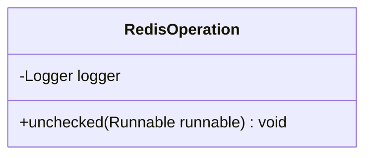
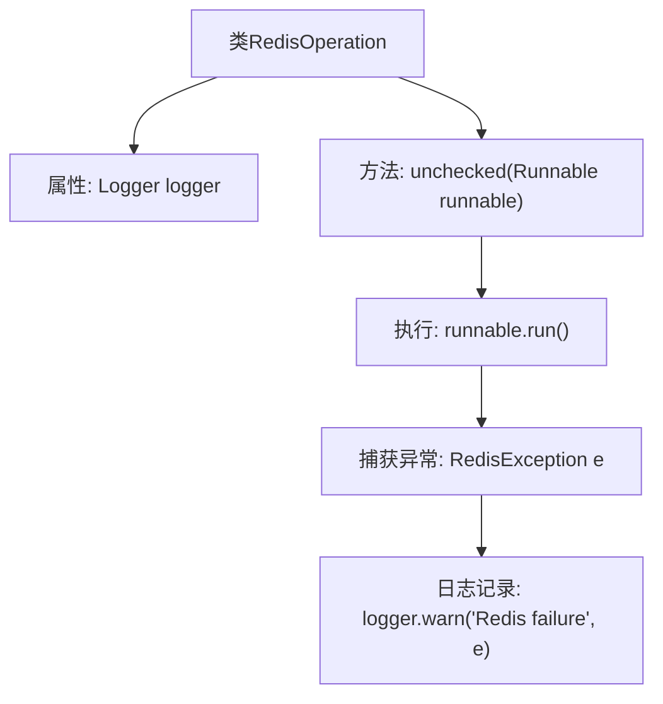

# 基础信息

|      |      |
|------|------|
| 名称 | RedisOperation |
| 编码语言 | .java |
| 代码路径 | Signal-Server/service/src/main/java/org/whispersystems/textsecuregcm/redis/RedisOperation.java |
| 包名 | org.whispersystems.textsecuregcm.redis |
| 依赖项 | ['io.lettuce.core.RedisException', 'org.slf4j.Logger', 'org.slf4j.LoggerFactory'] |
| 概述说明 | RedisOperation类提供unchecked方法，执行Redis任务并记录异常日志。 |

# 说明

RedisOperation类提供了一个名为unchecked的方法，该方法用于执行Redis相关任务。在执行过程中，如果发生异常，该方法会自动捕获这些异常，并将其记录到日志中，以便后续分析和处理。这种方法设计旨在确保Redis操作的稳定性和可追溯性，同时简化异常处理流程。

# 类列表 Class Summary

| 名称   | 类型  | 说明 |
|-------|------|-------------|
| RedisOperation | class | RedisOperation类提供unchecked方法，执行Redis任务并捕获异常记录日志。 |

## 类 RedisOperation

|      |      |
|------|------|
| 访问范围 | public |
| 类型 | class |
| 名称 | RedisOperation |
| 说明 | RedisOperation类提供unchecked方法，执行Redis任务并捕获异常记录日志。 |

### UML类图

**描述：**
`RedisOperation` 类包含一个静态方法 `unchecked`，该方法执行传入的 `Runnable` 任务，并捕获并记录可能抛出的 `RedisException` 异常。这种方法适用于那些即使失败也不会影响主流程的任务，例如收集指标。`logger` 是类的私有成员，用于记录异常信息。

### 内部方法调用关系图

这段代码定义了一个名为 `RedisOperation` 的类，其中包含一个静态方法 `unchecked`。该方法接受一个 `Runnable` 类型的参数，并尝试执行该任务。如果在执行过程中抛出 `RedisException` 异常，方法会捕获该异常并记录警告日志。此方法适用于那些即使失败也不会影响程序主要功能的“尽力而为”任务，例如收集指标。

### 字段列表 Field List

| 名称  | 类型  | 说明 |
|-------|-------|------|
| logger = LoggerFactory.getLogger(RedisOperation.class) | Logger | RedisOperation类中定义了静态日志记录器logger。 |

### 方法列表 Method List

| 名称  | 类型  | 说明 |
|-------|-------|------|
| unchecked | void | 静态方法捕获Redis异常并记录警告日志。 |

