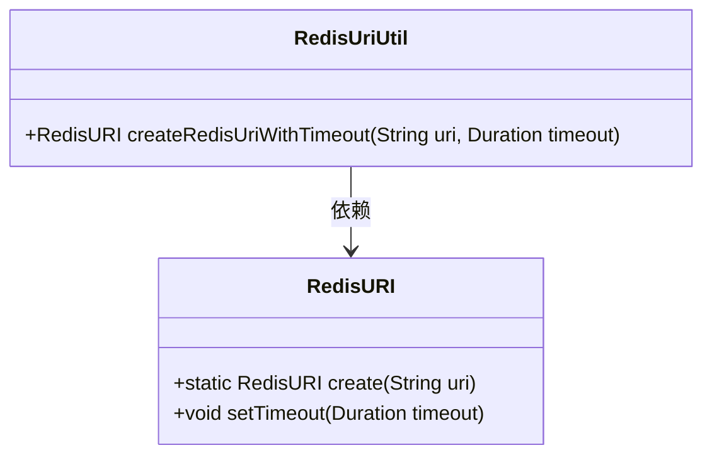
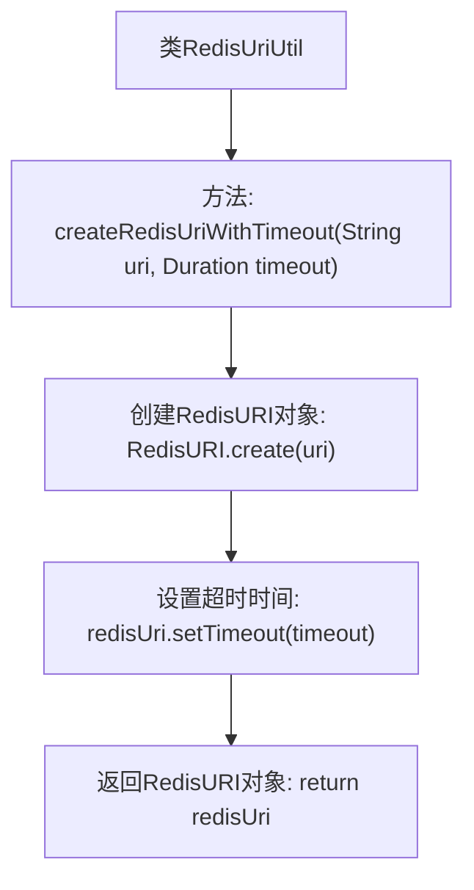

# 基础信息

|      |      |
|------|------|
| 名称 | RedisUriUtil |
| 编码语言 | .java |
| 代码路径 | Signal-Server/service/src/main/java/org/whispersystems/textsecuregcm/redis/RedisUriUtil.java |
| 包名 | org.whispersystems.textsecuregcm.redis |
| 依赖项 | ['io.lettuce.core.RedisURI', 'java.time.Duration'] |
| 概述说明 | RedisUriUtil类用于生成带超时的RedisURI。 |

# 说明

RedisUriUtil类是一个工具类，专门用于创建带有超时设置的RedisURI对象。该类的主要功能是简化RedisURI的生成过程，特别是在需要设置超时参数的情况下。通过使用RedisUriUtil类，开发人员可以更便捷地配置与Redis服务器连接的超时时间，从而优化连接管理和性能。该类适用于需要精确控制Redis连接超时时间的应用场景。

# 类列表 Class Summary

| 名称   | 类型  | 说明 |
|-------|------|-------------|
| RedisUriUtil | class | RedisUriUtil类提供创建带超时的RedisURI方法。 |

## 类 RedisUriUtil

|      |      |
|------|------|
| 访问范围 | public |
| 类型 | class |
| 名称 | RedisUriUtil |
| 说明 | RedisUriUtil类提供创建带超时的RedisURI方法。 |

### UML类图

这段代码定义了一个 `RedisUriUtil` 类，其中包含一个静态方法 `createRedisUriWithTimeout`，用于创建带有超时设置的 `RedisURI` 对象。`RedisURI` 类提供了创建 URI 和设置超时的方法。`RedisUriUtil` 类依赖于 `RedisURI` 类来实现其功能。

### 内部方法调用关系图

这段代码定义了一个名为 `RedisUriUtil` 的工具类，其中包含一个静态方法 `createRedisUriWithTimeout`。该方法接收一个URI字符串和一个 `Duration` 类型的超时时间作为参数，创建一个 `RedisURI` 对象，并设置其超时时间，最后返回该对象。流程图清晰地展示了从方法调用到最终返回 `RedisURI` 对象的整个过程。

### 字段列表 Field List

| 名称  | 类型  | 说明 |
|-------|-------|------|

### 方法列表 Method List

| 名称  | 类型  | 说明 |
|-------|-------|------|
| createRedisUriWithTimeout | RedisURI | 创建带超时的RedisURI对象，适用于同步命令和初始连接。 |

