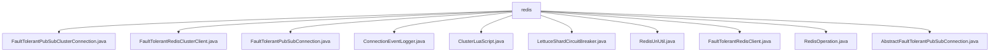

# 基础信息

|      |      |
|------|------|
| 名称 | redis |
| 编码语言 | .java |
| 代码路径 | Signal-Server/service/src/main/java/org/whispersystems/textsecuregcm/redis |
| 包名 | Signal-Server.service.src.main.java.org.whispersystems.textsecuregcm.redis |
| 概述说明 | 处理Redis集群拓扑变化，增强容错性和稳定性。 |

# 说明

## 概述
该代码模块是一个高容错的Redis集群客户端工具集，主要用于处理Redis集群的发布订阅、连接管理、拓扑变化、脚本执行以及断路器机制等核心功能。模块中的各个类通过容错机制、重试机制、事件过滤和监控等手段，确保系统在Redis集群拓扑变化、网络波动或节点故障时仍能保持稳定运行。该模块适用于高可用性和高性能要求的Redis集群应用场景，特别适合需要动态适应集群结构变化、确保数据操作可靠性的场景。

## 主要业务场景
1. **Redis集群拓扑变化处理**  
   - `FaultTolerantPubSubClusterConnection` 和 `FaultTolerantRedisClusterClient` 负责在Redis集群拓扑发生变化时，自动重新订阅相关频道或更新节点信息，确保系统能够动态适应集群结构的变化。
   - `ConnectionEventLogger` 记录连接事件和集群拓扑变化，并通过事件计数器监控系统状态。

2. **高容错发布订阅**  
   - `FaultTolerantPubSubConnection` 和 `AbstractFaultTolerantPubSubConnection` 提供容错的发布订阅功能，利用状态管理和计时器确保在发布订阅模式下的可靠连接与消息传递。

3. **Lua脚本执行**  
   - `ClusterLuaScript` 支持在Redis集群中高效执行Lua脚本，提供同步、异步和响应式三种操作模式，并优化脚本缓存以提升性能。

4. **断路器机制**  
   - `LettuceShardCircuitBreaker` 实现Redis集群的断路器功能，监控和执行Redis命令，确保在异常情况下及时切断连接，防止系统崩溃或数据丢失。

5. **连接管理与超时控制**  
   - `RedisUriUtil` 简化RedisURI的生成过程，支持配置超时参数，优化连接管理和性能。
   - `FaultTolerantRedisClient` 提供容错的Redis客户端实现，集成断路器机制和重试机制，确保在Redis服务故障时自动进行故障隔离和重试。

6. **异常处理与日志记录**  
   - `RedisOperation` 提供`unchecked`方法，自动捕获并记录Redis操作中的异常，确保操作的稳定性和可追溯性。

通过这些功能，该模块为Redis集群应用提供了全面的容错、监控和管理能力，确保系统在高可用性和高性能场景下的稳定运行。

### 包内部结构视图

该流程图展示了`redis`目录下的文件层级关系。所有文件均位于`redis`目录下，包括`FaultTolerantPubSubClusterConnection.java`、`FaultTolerantRedisClusterClient.java`、`FaultTolerantPubSubConnection.java`等。这些文件代表了不同的Redis相关功能实现，如集群连接、客户端、操作日志等，反映了Redis在Signal-Server服务中的多样化应用。

# 文件列表 File List

| 名称   | 类型  | 说明 |
|-------|------|-------------|
| [RedisOperation.java](RedisOperation.md) | file | RedisOperation类提供unchecked方法，执行Redis任务并记录异常日志。 |
| [ClusterLuaScript.java](ClusterLuaScript.md) | file | ClusterLuaScript类在Redis集群中执行Lua脚本，支持同步、异步和响应式操作，处理脚本缓存。 |
| [ConnectionEventLogger.java](ConnectionEventLogger.md) | file | ConnectionEventLogger类记录连接与集群拓扑变化，更新事件计数器。 |
| [FaultTolerantPubSubClusterConnection.java](FaultTolerantPubSubClusterConnection.md) | file | FaultTolerantPubSubClusterConnection类处理Redis集群拓扑变化，支持重订阅和事件过滤。 |
| [AbstractFaultTolerantPubSubConnection.java](AbstractFaultTolerantPubSubConnection.md) | file | 抽象类实现Redis容错发布订阅，支持连接管理和函数调用。 |
| [FaultTolerantRedisClient.java](FaultTolerantRedisClient.md) | file | 容错Redis客户端，支持字符串和二进制连接，集成断路器与重试机制。 |
| [RedisUriUtil.java](RedisUriUtil.md) | file | RedisUriUtil类用于生成带超时的RedisURI。 |
| [LettuceShardCircuitBreaker.java](LettuceShardCircuitBreaker.md) | file | LettuceShardCircuitBreaker实现NettyCustomizer，管理Redis集群断路器，处理拓扑变化和命令执行。 |
| [FaultTolerantPubSubConnection.java](FaultTolerantPubSubConnection.md) | file | FaultTolerantPubSubConnection继承Abstract类，使用StatefulRedisPubSubConnection。 |
| [FaultTolerantRedisClusterClient.java](FaultTolerantRedisClusterClient.md) | file | 高容错Redis集群客户端，支持字符串和二进制连接，具备重试和拓扑变化处理功能。 |

