# 基础信息

|      |      |
|------|------|
| 名称 | IdentityTokenCallCredentials |
| 编码语言 | .java |
| 代码路径 | Signal-Server/service/src/main/java/org/whispersystems/textsecuregcm/registration/IdentityTokenCallCredentials.java |
| 包名 | org.whispersystems.textsecuregcm.registration |
| 依赖项 | ['com.google.auth.oauth2.ExternalAccountCredentials', 'com.google.auth.oauth2.ImpersonatedCredentials', 'com.google.common.annotations.VisibleForTesting', 'io.dropwizard.lifecycle.Managed', 'io.github.resilience4j.core.IntervalFunction', 'io.github.resilience4j.retry.Retry', 'io.github.resilience4j.retry.RetryConfig', 'io.grpc.CallCredentials', 'io.grpc.Metadata', 'java.io.ByteArrayInputStream', 'java.io.IOException', 'java.io.InputStream', 'java.io.UncheckedIOException', 'java.nio.charset.StandardCharsets', 'java.time.Duration', 'java.util.List', 'java.util.concurrent.Executor', 'java.util.concurrent.ScheduledExecutorService', 'java.util.concurrent.ScheduledFuture', 'java.util.concurrent.TimeUnit', 'org.apache.commons.lang3.tuple.Pair', 'org.slf4j.Logger', 'org.slf4j.LoggerFactory'] |
| 概述说明 | IdentityTokenCallCredentials类负责管理身份令牌，定时刷新并应用于请求元数据。 |

# 说明

IdentityTokenCallCredentials类负责管理和维护身份令牌，确保令牌的有效性和安全性。该类具备定时刷新令牌的功能，以防止令牌过期。在每次请求时，该类将刷新后的令牌自动应用于请求的元数据中，确保请求的合法性和身份验证的准确性。这一机制提升了系统的安全性和可靠性，避免了因令牌失效导致的请求失败或安全漏洞。

# 类列表 Class Summary

| 名称   | 类型  | 说明 |
|-------|------|-------------|
| IdentityTokenCallCredentials | class | IdentityTokenCallCredentials类管理身份令牌，定时刷新并应用于请求元数据。 |

## 类 IdentityTokenCallCredentials

|      |      |
|------|------|
| 访问范围 | public |
| 类型 | class |
| 名称 | IdentityTokenCallCredentials |
| 说明 | IdentityTokenCallCredentials类管理身份令牌，定时刷新并应用于请求元数据。 |

### UML类图

```mermaid
classDiagram
    class IdentityTokenCallCredentials {
        -Duration IDENTITY_TOKEN_LIFETIME
        -Duration IDENTITY_TOKEN_REFRESH_BUFFER
        -Metadata.Key~String~ AUTHORIZATION_METADATA_KEY
        -Logger logger
        -Retry retry
        -ImpersonatedCredentials impersonatedCredentials
        -String audience
        -ScheduledFuture~?~ scheduledFuture
        -Pair~String, RuntimeException~ currentIdentityToken
        +IdentityTokenCallCredentials(RetryConfig retryConfig, ImpersonatedCredentials impersonatedCredentials, String audience, ScheduledExecutorService scheduledExecutorService)
        +IdentityTokenCallCredentials fromCredentialConfig(String credentialConfigJson, String audience, ScheduledExecutorService scheduledExecutorService) throws IOException
        +void refreshIdentityToken()
        +void applyRequestMetadata(RequestInfo requestInfo, Executor appExecutor, MetadataApplier applier)
        +void stop()
    }
    class CallCredentials {
        <<Interface>>
        +void applyRequestMetadata(RequestInfo requestInfo, Executor appExecutor, MetadataApplier applier)
    }
    class Managed {
        <<Interface>>
        +void stop()
    }
    class Retry {
        +Retry of(String name, RetryConfig config)
        +void executeRunnable(Runnable runnable)
    }
    class ImpersonatedCredentials {
        +ImpersonatedCredentials create(ExternalAccountCredentials credentials, String serviceAccountEmail, String targetPrincipal, List~String~ delegates, int lifetime)
        +String idTokenWithAudience(String audience, String format)
        +ExternalAccountCredentials getSourceCredentials()
    }
    class ExternalAccountCredentials {
        +ExternalAccountCredentials fromStream(InputStream configInputStream)
        +String getServiceAccountEmail()
    }
    class Metadata {
        +void put(Metadata.Key~String~ key, String value)
    }
    class MetadataApplier {
        <<Interface>>
        +void apply(Metadata metadata)
    }
    class Pair~L, R~ {
        +L getLeft()
        +R getRight()
    }
    class RequestInfo {
        // Placeholder for RequestInfo class
    }
    class Executor {
        <<Interface>>
        // Placeholder for Executor class
    }
    class ScheduledExecutorService {
        <<Interface>>
        +ScheduledFuture~?~ scheduleAtFixedRate(Runnable command, long initialDelay, long period, TimeUnit unit)
    }
    class ScheduledFuture~?~ {
        +boolean isDone()
        +boolean cancel(boolean mayInterruptIfRunning)
    }
    class Logger {
        +void warn(String message, Throwable throwable)
        +void error(String message, Throwable throwable)
    }
    IdentityTokenCallCredentials --> CallCredentials : 实现
    IdentityTokenCallCredentials --> Managed : 实现
    IdentityTokenCallCredentials --> Retry : 依赖
    IdentityTokenCallCredentials --> ImpersonatedCredentials : 依赖
    IdentityTokenCallCredentials --> ScheduledExecutorService : 依赖
    IdentityTokenCallCredentials --> Metadata : 依赖
    IdentityTokenCallCredentials --> MetadataApplier : 依赖
    IdentityTokenCallCredentials --> Pair : 依赖
    IdentityTokenCallCredentials --> Logger : 依赖
    ImpersonatedCredentials --> ExternalAccountCredentials : 依赖
    ExternalAccountCredentials --> InputStream : 依赖
```

类图描述：
`IdentityTokenCallCredentials` 类实现了 `CallCredentials` 和 `Managed` 接口，用于管理和刷新身份令牌。它依赖于 `Retry` 类来处理重试逻辑，`ImpersonatedCredentials` 类用于获取模拟凭据，`ScheduledExecutorService` 用于定期刷新令牌，`Metadata` 和 `MetadataApplier` 用于处理元数据应用，`Pair` 类用于存储令牌和异常，`Logger` 用于日志记录。该类通过 `ExternalAccountCredentials` 获取外部账户凭据，并通过 `ScheduledFuture` 管理定时任务。

### 内部方法调用关系图

该流程图展示了`IdentityTokenCallCredentials`类的结构及其内部属性和方法的关系。类中包含多个属性，如`IDENTITY_TOKEN_LIFETIME`、`AUTHORIZATION_METADATA_KEY`等，以及构造方法和多个关键方法，如`refreshIdentityToken`、`applyRequestMetadata`和`stop`。这些方法分别用于刷新身份令牌、应用请求元数据和停止定时任务。类的设计旨在通过定时刷新令牌来确保身份验证的有效性，并在请求时应用相应的元数据。

### 字段列表 Field List

| 名称  | 类型  | 说明 |
|-------|-------|------|
| IDENTITY_TOKEN_LIFETIME = Duration.ofHours(1) | Duration | 身份令牌有效期为1小时。 |
| IDENTITY_TOKEN_REFRESH_BUFFER = Duration.ofMinutes(10) | Duration | 身份令牌刷新缓冲时间为10分钟。 |
| retry | Retry | 私有且不可变的Retry类型变量retry。 |
| impersonatedCredentials | ImpersonatedCredentials | 私有不可变的ImpersonatedCredentials对象。 |
| audience | String | 私有字符串变量audience的声明。 |
| currentIdentityToken | Pair<String, RuntimeException> | 私有易变变量存储身份令牌和运行时异常对。 |
| AUTHORIZATION_METADATA_KEY =      Metadata.Key.of("Authorization", Metadata.ASCII_STRING_MARSHALLER) | Metadata.Key<String> | 定义静态常量AUTHORIZATION_METADATA_KEY，用于存储授权元数据。 |
| scheduledFuture | ScheduledFuture<?> | 私有最终类型的ScheduledFuture对象scheduledFuture。 |
| logger = LoggerFactory.getLogger(IdentityTokenCallCredentials.class) | Logger | IdentityTokenCallCredentials类中定义了一个私有的静态日志记录器。 |

### 方法列表 Method List

| 名称  | 类型  | 说明 |
|-------|-------|------|
| refreshIdentityToken | void | 刷新身份令牌，处理异常并记录错误。 |
| stop | void | 方法stop同步取消未完成的scheduledFuture任务。 |
| fromCredentialConfig | IdentityTokenCallCredentials | 从JSON配置生成身份令牌调用凭证，包含重试机制和令牌刷新。 |
| applyRequestMetadata | void | 方法应用请求元数据，检查身份令牌并抛出异常或应用授权元数据。 |

