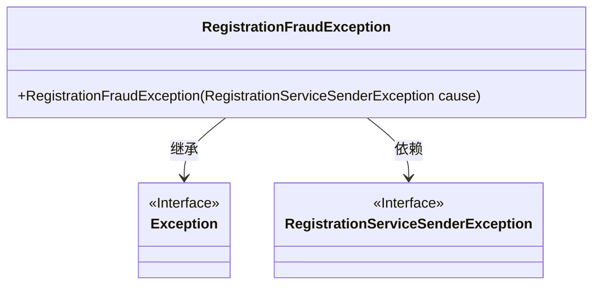
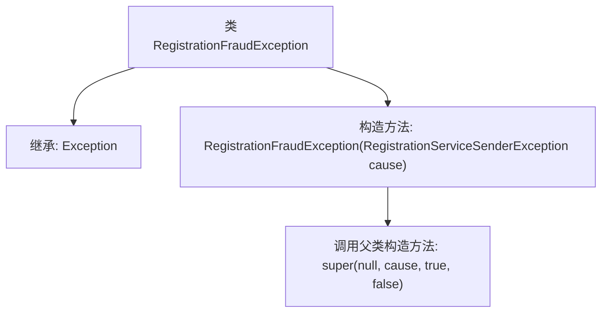

# 基础信息

|      |      |
|------|------|
| 名称 | RegistrationFraudException |
| 编码语言 | .java |
| 代码路径 | Signal-Server/service/src/main/java/org/whispersystems/textsecuregcm/registration/RegistrationFraudException.java |
| 包名 | org.whispersystems.textsecuregcm.registration |
| 依赖项 | [] |
| 概述说明 | 注册欺诈异常类继承自异常类，用于处理注册服务异常。 |

# 说明

注册欺诈异常类是一个专门用于处理注册服务发送异常的类，它继承自通用的异常类。该类的主要功能是捕获和处理在注册过程中可能出现的欺诈行为或异常情况，确保注册服务的正常运行和安全性。通过继承异常类，注册欺诈异常类能够利用异常处理机制，有效地管理和响应注册服务中的各种异常事件。

# 类列表 Class Summary

| 名称   | 类型  | 说明 |
|-------|------|-------------|
| RegistrationFraudException | class | 注册欺诈异常类继承自异常类，用于处理注册服务发送异常。 |

## 类 RegistrationFraudException

|      |      |
|------|------|
| 访问范围 | public |
| 类型 | class |
| 名称 | RegistrationFraudException |
| 说明 | 注册欺诈异常类继承自异常类，用于处理注册服务发送异常。 |

### UML类图

### 描述：
`RegistrationFraudException` 是一个自定义异常类，继承自 `Exception` 类。它通过构造函数接收一个 `RegistrationServiceSenderException` 类型的参数，并将其作为异常的原因传递给父类 `Exception` 的构造函数。该异常类用于处理注册过程中的欺诈行为，并通过 `RegistrationServiceSenderException` 提供更详细的错误信息。

### 内部方法调用关系图

这段代码定义了一个名为`RegistrationFraudException`的类，它继承自`Exception`类。该类包含一个构造方法，接受一个`RegistrationServiceSenderException`类型的参数`cause`。在构造方法中，调用了父类`Exception`的构造方法，传递了`null`、`cause`、`true`和`false`四个参数。这段代码主要用于处理注册过程中的欺诈异常，通过调用父类构造方法来初始化异常对象。

### 字段列表 Field List

| 名称  | 类型  | 说明 |
|-------|-------|------|

### 方法列表 Method List

| 名称  | 类型  | 说明 |
|-------|-------|------|

