# 基础信息

|      |      |
|------|------|
| 名称 | RegistrationServiceClient |
| 编码语言 | .java |
| 代码路径 | Signal-Server/service/src/main/java/org/whispersystems/textsecuregcm/registration/RegistrationServiceClient.java |
| 包名 | org.whispersystems.textsecuregcm.registration |
| 依赖项 | ['com.google.i18n.phonenumbers.NumberParseException', 'com.google.i18n.phonenumbers.PhoneNumberUtil', 'com.google.i18n.phonenumbers.Phonenumber', 'com.google.protobuf.ByteString', 'io.dropwizard.lifecycle.Managed', 'io.grpc.CallCredentials', 'io.grpc.ChannelCredentials', 'io.grpc.Deadline', 'io.grpc.Grpc', 'io.grpc.ManagedChannel', 'io.grpc.TlsChannelCredentials', 'java.io.ByteArrayInputStream', 'java.io.IOException', 'java.nio.charset.StandardCharsets', 'java.security.InvalidKeyException', 'java.security.NoSuchAlgorithmException', 'java.time.Duration', 'java.util.Base64', 'java.util.Optional', 'java.util.concurrent.CompletableFuture', 'java.util.concurrent.CompletionException', 'java.util.concurrent.Executor', 'java.util.concurrent.TimeUnit', 'javax.crypto.Mac', 'javax.crypto.spec.SecretKeySpec', 'org.apache.commons.lang3.StringUtils', 'org.checkerframework.checker.nullness.qual.Nullable', 'org.signal.registration.rpc.CheckVerificationCodeRequest', 'org.signal.registration.rpc.CreateRegistrationSessionRequest', 'org.signal.registration.rpc.GetRegistrationSessionMetadataRequest', 'org.signal.registration.rpc.RegistrationServiceGrpc', 'org.signal.registration.rpc.RegistrationSessionMetadata', 'org.signal.registration.rpc.SendVerificationCodeRequest', 'org.whispersystems.textsecuregcm.controllers.RateLimitExceededException', 'org.whispersystems.textsecuregcm.controllers.VerificationSessionRateLimitExceededException', 'org.whispersystems.textsecuregcm.entities.RegistrationServiceSession', 'org.whispersystems.textsecuregcm.util.CompletableFutureUtil'] |
| 概述说明 | 注册服务客户端支持会话管理、验证码收发，采用gRPC和HMAC加密。 |

# 说明

注册服务客户端提供会话创建、验证码发送与验证功能，采用gRPC通信协议确保高效传输，并使用HMAC加密技术保障数据安全。该客户端设计用于高效处理用户注册流程，确保通信的可靠性和安全性。

# 类列表 Class Summary

| 名称   | 类型  | 说明 |
|-------|------|-------------|
| RegistrationServiceClient | class | 注册服务客户端，支持会话创建、验证码发送与验证，使用gRPC通信和HMAC加密。 |


## 类 RegistrationServiceClient

|      |      |
|------|------|
| 访问范围 | public |
| 类型 | class |
| 名称 | RegistrationServiceClient |
| 说明 | 注册服务客户端，支持会话创建、验证码发送与验证，使用gRPC通信和HMAC加密。 |


### UML类图

```mermaid
classDiagram
    class RegistrationServiceClient {
        -static final Base64.Encoder BASE64_UNPADDED_ENCODER
        -ManagedChannel channel
        -RegistrationServiceGrpc.RegistrationServiceFutureStub stub
        -Executor callbackExecutor
        -byte[] collationKeySalt
        +static String convertNumeralE164ToString(long from)
        +RegistrationServiceClient(String host, int port, CallCredentials callCredentials, String caCertificatePem, byte[] collationKeySalt, Executor callbackExecutor)
        +CompletableFuture~RegistrationServiceSession~ createRegistrationSession(Phonenumber.PhoneNumber phoneNumber, String sourceHost, boolean accountExistsWithPhoneNumber, Duration timeout)
        +CompletableFuture~RegistrationServiceSession~ sendVerificationCode(byte[] sessionId, MessageTransport messageTransport, ClientType clientType, String acceptLanguage, String senderOverride, Duration timeout)
        +CompletableFuture~RegistrationServiceSession~ checkVerificationCode(byte[] sessionId, String verificationCode, Duration timeout)
        +CompletableFuture~Optional~RegistrationServiceSession~~ getSession(byte[] sessionId, Duration timeout)
        +void start()
        +void stop()
        -static RegistrationServiceSession buildSessionResponseFromMetadata(RegistrationSessionMetadata sessionMetadata)
        -static Deadline toDeadline(Duration timeout)
        -static org.signal.registration.rpc.ClientType getRpcClientType(ClientType clientType)
        -static org.signal.registration.rpc.MessageTransport getRpcMessageTransport(MessageTransport transport)
        -String hmac(String sourceHost)
        -Mac getInitializedMac()
        -static Mac getInitializedMac(byte[] key)
    }
    interface Managed {
        <<Interface>>
        +void start()
        +void stop()
    }
    RegistrationServiceClient --> Managed : 实现
```

### 类图描述
`RegistrationServiceClient` 是一个实现了 `Managed` 接口的类，主要用于处理注册服务的客户端逻辑。它包含多个方法，如 `createRegistrationSession`、`sendVerificationCode`、`checkVerificationCode` 和 `getSession`，用于创建会话、发送验证码、检查验证码和获取会话信息。类中还包含一些私有方法，如 `hmac` 和 `getInitializedMac`，用于生成 HMAC 签名和初始化 MAC 实例。该类依赖于 `ManagedChannel`、`RegistrationServiceGrpc.RegistrationServiceFutureStub` 等组件来与服务器进行通信。


### 内部方法调用关系图

```mermaid
graph TD
    A["类RegistrationServiceClient"]
    B["属性: Base64.Encoder BASE64_UNPADDED_ENCODER"]
    C["属性: ManagedChannel channel"]
    D["属性: RegistrationServiceGrpc.RegistrationServiceFutureStub stub"]
    E["属性: Executor callbackExecutor"]
    F["属性: byte[] collationKeySalt"]
    G["方法: convertNumeralE164ToString(long from)"]
    H["方法: RegistrationServiceClient(String host, int port, CallCredentials callCredentials, String caCertificatePem, byte[] collationKeySalt, Executor callbackExecutor)"]
    I["方法: createRegistrationSession(Phonenumber.PhoneNumber phoneNumber, String sourceHost, boolean accountExistsWithPhoneNumber, Duration timeout)"]
    J["方法: sendVerificationCode(byte[] sessionId, MessageTransport messageTransport, ClientType clientType, String acceptLanguage, String senderOverride, Duration timeout)"]
    K["方法: checkVerificationCode(byte[] sessionId, String verificationCode, Duration timeout)"]
    L["方法: getSession(byte[] sessionId, Duration timeout)"]
    M["方法: buildSessionResponseFromMetadata(RegistrationSessionMetadata sessionMetadata)"]
    N["方法: toDeadline(Duration timeout)"]
    O["方法: getRpcClientType(ClientType clientType)"]
    P["方法: getRpcMessageTransport(MessageTransport transport)"]
    Q["方法: start()"]
    R["方法: stop()"]
    S["方法: hmac(String sourceHost)"]
    T["方法: getInitializedMac()"]
    U["方法: getInitializedMac(byte[] key)"]

    A --> B
    A --> C
    A --> D
    A --> E
    A --> F
    A --> G
    A --> H
    A --> I
    A --> J
    A --> K
    A --> L
    A --> M
    A --> N
    A --> O
    A --> P
    A --> Q
    A --> R
    A --> S
    A --> T
    A --> U
```



这段代码定义了一个`RegistrationServiceClient`类，主要用于处理用户注册服务的客户端逻辑。它包含多个方法，用于创建注册会话、发送验证码、检查验证码、获取会话等操作。类中还包含一些辅助方法，如`convertNumeralE164ToString`用于将电话号码从`long`类型转换为`String`格式，`hmac`用于生成HMAC签名等。类还实现了`Managed`接口，提供了`start`和`stop`方法用于管理服务的生命周期。

### 字段列表 Field List

| 名称  | 类型  | 说明 |
|-------|-------|------|
| BASE64_UNPADDED_ENCODER = Base64.getEncoder().withoutPadding() | Base64.Encoder | 定义无填充的Base64编码器常量。 |
| collationKeySalt | byte[] | 私有字节数组用于排序键盐值。 |
| channel | ManagedChannel | 私有且不可变的ManagedChannel通道实例。 |
| stub | RegistrationServiceGrpc.RegistrationServiceFutureStub | 私有变量stub用于注册服务的异步调用。 |
| callbackExecutor | Executor | 私有最终执行器用于回调操作。 |

### 方法列表 Method List

| 名称  | 类型  | 说明 |
|-------|-------|------|
| stop | void | 重写stop方法，关闭非空channel。 |
| start | void | 重写start方法，可能抛出异常。 |
| getRpcMessageTransport | org.signal.registration.rpc.MessageTransport | 将MessageTransport转换为RPC消息传输类型。 |
| getRpcClientType | org.signal.registration.rpc.ClientType | 将客户端类型映射为RPC客户端类型。 |
| buildSessionResponseFromMetadata | RegistrationServiceSession | 根据元数据构建注册服务会话响应。 |
| toDeadline | Deadline | 将Duration转换为Deadline对象，单位毫秒。 |
| getInitializedMac | Mac | 静态方法初始化HmacSHA256 MAC实例并返回。 |
| createRegistrationSession | CompletableFuture<RegistrationServiceSession> | 创建注册会话，处理电话号码、源主机、账户存在及超时，返回会话或错误。 |
| getSession | CompletableFuture<Optional<RegistrationServiceSession>> | 异步获取会话信息，处理错误并返回会话对象或空值。 |
| convertNumeralE164ToString | String | 将长整型数字转换为E164格式的国际电话号码字符串。 |
| getInitializedMac | Mac | 私有方法getInitializedMac尝试初始化Mac，失败时抛出AssertionError。 |
| hmac | String | 该方法使用HMAC-SHA256算法对输入字符串进行加密并返回Base64编码结果。 |
| checkVerificationCode | CompletableFuture<RegistrationServiceSession> | 异步验证码检查方法，处理错误响应并返回会话结果。 |
| sendVerificationCode | CompletableFuture<RegistrationServiceSession> | 发送验证码方法，处理会话、传输、客户端类型，支持语言和发送者覆盖，超时处理，返回会话信息或错误。 |


