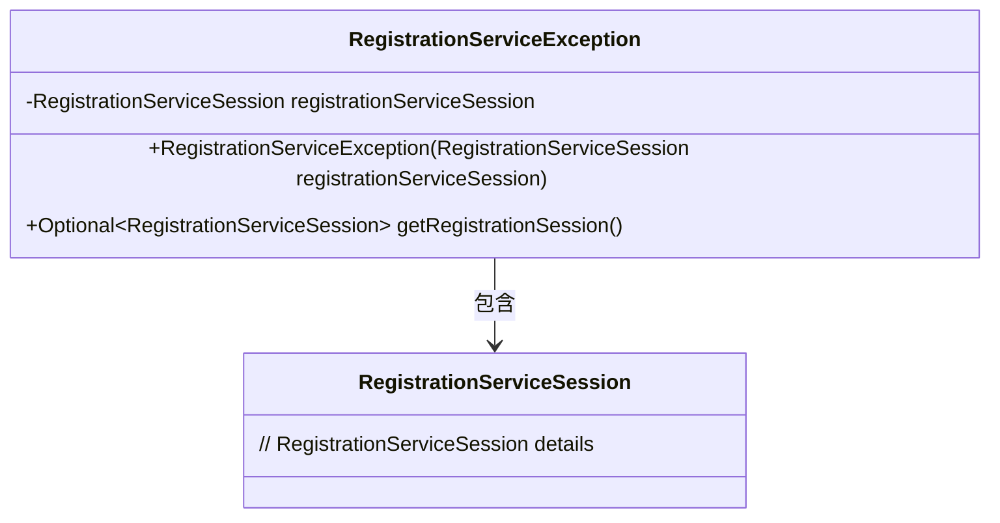
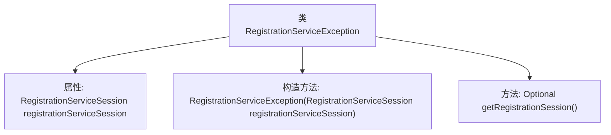

# 基础信息

|      |      |
|------|------|
| 名称 | RegistrationServiceException |
| 编码语言 | .java |
| 代码路径 | Signal-Server/service/src/main/java/org/whispersystems/textsecuregcm/registration/RegistrationServiceException.java |
| 包名 | org.whispersystems.textsecuregcm.registration |
| 依赖项 | ['java.util.Optional', 'org.whispersystems.textsecuregcm.entities.RegistrationServiceSession'] |
| 概述说明 | RegistrationServiceException继承Exception，包含RegistrationServiceSession并提供获取会话方法。 |

# 说明

RegistrationServiceException继承自Exception类，包含一个RegistrationServiceSession对象，并提供了一个用于获取会话的方法。该类用于处理与注册服务相关的异常情况，能够捕获并管理会话信息，以便在异常发生时进行相应的处理。

# 类列表 Class Summary

| 名称   | 类型  | 说明 |
|-------|------|-------------|
| RegistrationServiceException | class | RegistrationServiceException继承Exception，包含RegistrationServiceSession，提供获取会话方法。 |

## 类 RegistrationServiceException

|      |      |
|------|------|
| 访问范围 | public |
| 类型 | class |
| 名称 | RegistrationServiceException |
| 说明 | RegistrationServiceException继承Exception，包含RegistrationServiceSession，提供获取会话方法。 |

### UML类图

类图描述：
`RegistrationServiceException` 是一个自定义异常类，继承自 `Exception`。它包含一个私有的 `RegistrationServiceSession` 对象，并通过构造函数进行初始化。该类提供了一个公有方法 `getRegistrationSession()`，返回一个 `Optional` 类型的 `RegistrationServiceSession` 对象，用于获取异常发生时关联的会话。如果会话为空，则表示会话可能不存在并可被丢弃。

### 内部方法调用关系图

该流程图描述了`RegistrationServiceException`类的结构。该类包含一个属性`registrationServiceSession`，一个构造方法用于初始化该属性，以及一个方法`getRegistrationSession()`用于返回该属性的`Optional`包装对象。构造方法调用了父类`Exception`的构造方法，并设置了特定的参数。`getRegistrationSession()`方法返回一个可能为空的`Optional`对象，用于处理会话不存在的情况。

### 字段列表 Field List

| 名称  | 类型  | 说明 |
|-------|-------|------|
| registrationServiceSession | RegistrationServiceSession | 私有且不可变的注册服务会话实例。 |

### 方法列表 Method List

| 名称  | 类型  | 说明 |
|-------|-------|------|
| getRegistrationSession | Optional<RegistrationServiceSession> | 获取注册服务会话，可能为空。 |

