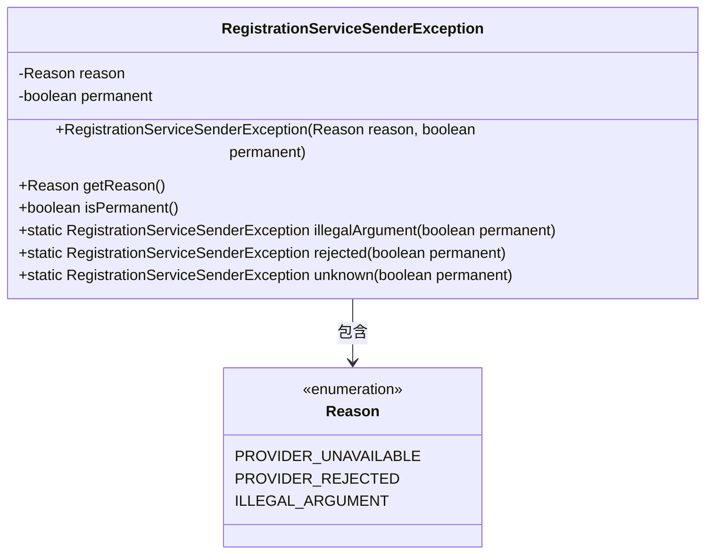
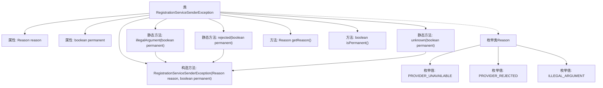

# 基础信息

|      |      |
|------|------|
| 名称 | RegistrationServiceSenderException |
| 编码语言 | .java |
| 代码路径 | Signal-Server/service/src/main/java/org/whispersystems/textsecuregcm/registration/RegistrationServiceSenderException.java |
| 包名 | org.whispersystems.textsecuregcm.registration |
| 依赖项 | ['com.fasterxml.jackson.annotation.JsonProperty'] |
| 概述说明 | RegistrationServiceSenderException类处理注册异常，含原因和永久性标志。 |

# 说明

RegistrationServiceSenderException类专门用于处理注册服务过程中出现的异常情况。该类不仅记录了异常的具体原因，还包含一个永久性标志，用于指示该异常是否具有持久性影响。通过这种方式，开发者可以更准确地识别和处理不同类型的注册服务异常，确保系统的稳定性和可靠性。

# 类列表 Class Summary

| 名称   | 类型  | 说明 |
|-------|------|-------------|
| RegistrationServiceSenderException | class | RegistrationServiceSenderException类处理注册服务异常，包含原因和永久性标志。 |

## 类 RegistrationServiceSenderException

|      |      |
|------|------|
| 访问范围 | public |
| 类型 | class |
| 名称 | RegistrationServiceSenderException |
| 说明 | RegistrationServiceSenderException类处理注册服务异常，包含原因和永久性标志。 |

### UML类图

这段代码定义了一个名为 `RegistrationServiceSenderException` 的异常类，该类继承自 `Exception`。该类包含两个私有字段：`reason` 和 `permanent`，分别表示异常的原因和是否为永久性异常。类中提供了三个静态工厂方法 `illegalArgument`、`rejected` 和 `unknown`，用于创建不同类型的异常实例。`Reason` 是一个枚举类型，定义了三种可能的异常原因。该类的主要作用是封装与注册服务发送相关的异常信息，并提供便捷的异常创建方式。

### 内部方法调用关系图

这段代码定义了一个名为 `RegistrationServiceSenderException` 的异常类，包含两个属性 `reason` 和 `permanent`，分别表示异常的原因和是否永久性。类中提供了三个静态工厂方法 `illegalArgument`、`rejected` 和 `unknown`，用于创建不同类型的异常实例。此外，类中定义了一个枚举 `Reason`，表示异常的具体原因。流程图展示了类的结构、方法调用关系以及枚举类的定义。

### 字段列表 Field List

| 名称  | 类型  | 说明 |
|-------|-------|------|
| reason | Reason | 私有不可变的Reason类型变量reason。 |
| permanent | boolean | 该代码定义了一个不可变的布尔类型私有变量permanent。 |

### 方法列表 Method List

| 名称  | 类型  | 说明 |
|-------|-------|------|
| getReason | Reason | 获取原因对象的方法。 |
| unknown | RegistrationServiceSenderException | 静态方法返回不可用提供者的注册服务发送异常。 |
| isPermanent | boolean | 方法isPermanent返回布尔值permanent。 |
| rejected | RegistrationServiceSenderException | 静态方法返回因提供者拒绝导致的注册服务发送异常。 |
| illegalArgument | RegistrationServiceSenderException | 静态方法生成非法参数异常，参数为永久性标识。 |

