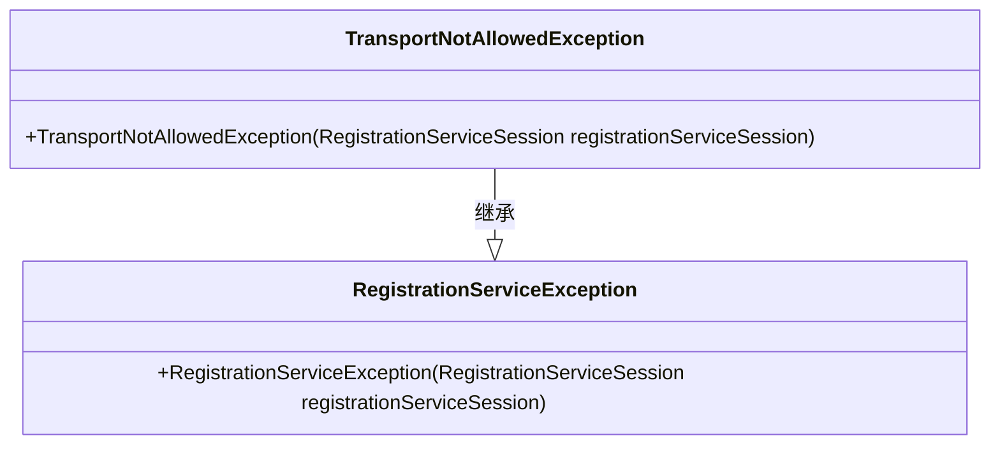
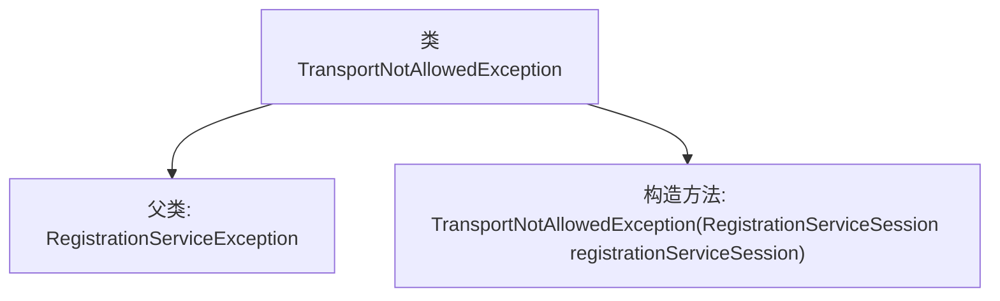

# 基础信息

|      |      |
|------|------|
| 名称 | TransportNotAllowedException |
| 编码语言 | .java |
| 代码路径 | Signal-Server/service/src/main/java/org/whispersystems/textsecuregcm/registration/TransportNotAllowedException.java |
| 包名 | org.whispersystems.textsecuregcm.registration |
| 依赖项 | ['org.whispersystems.textsecuregcm.entities.RegistrationServiceSession'] |
| 概述说明 | TransportNotAllowedException继承RegistrationServiceException，处理注册服务的传输禁止异常。 |

# 说明

TransportNotAllowedException是RegistrationServiceException的子类，专门用于处理在注册服务过程中出现的传输禁止异常。该异常类用于捕获和管理在注册服务中由于传输被禁止而引发的错误情况，确保系统能够正确处理此类异常并提供相应的错误处理机制。

# 类列表 Class Summary

| 名称   | 类型  | 说明 |
|-------|------|-------------|
| TransportNotAllowedException | class | TransportNotAllowedException继承RegistrationServiceException，用于处理注册服务中的传输禁止异常。 |

## 类 TransportNotAllowedException

|      |      |
|------|------|
| 访问范围 | public |
| 类型 | class |
| 名称 | TransportNotAllowedException |
| 说明 | TransportNotAllowedException继承RegistrationServiceException，用于处理注册服务中的传输禁止异常。 |

### UML类图

这段代码定义了一个名为 `TransportNotAllowedException` 的异常类，它继承自 `RegistrationServiceException`。`TransportNotAllowedException` 类有一个构造函数，接受一个 `RegistrationServiceSession` 类型的参数，并将其传递给父类的构造函数。这个异常类可能用于在处理运输相关操作时，当某些条件不满足时抛出异常。通过继承 `RegistrationServiceException`，`TransportNotAllowedException` 继承了父类的行为和属性，使得异常处理更加灵活和一致。

### 内部方法调用关系图

这段代码定义了一个名为 `TransportNotAllowedException` 的异常类，它继承自 `RegistrationServiceException` 类。该类包含一个构造方法，接受一个 `RegistrationServiceSession` 类型的参数，并调用父类的构造方法进行初始化。该异常类用于处理在注册服务中不允许的传输操作。

### 字段列表 Field List

| 名称  | 类型  | 说明 |
|-------|-------|------|

### 方法列表 Method List

| 名称  | 类型  | 说明 |
|-------|-------|------|

