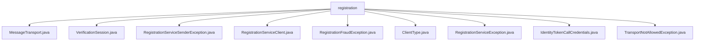

# 基础信息

|      |      |
|------|------|
| 名称 | registration |
| 编码语言 | .java |
| 代码路径 | Signal-Server/service/src/main/java/org/whispersystems/textsecuregcm/registration |
| 包名 | Signal-Server.service.src.main.java.org.whispersystems.textsecuregcm.registration |
| 概述说明 | 各类异常处理注册服务中的传输、验证、欺诈等问题，确保系统安全可靠。 |

# 说明

## 概述

该代码模块主要处理用户注册流程中的各种业务逻辑和异常情况。模块的核心功能包括会话创建、验证码的发送与验证、身份令牌的管理以及异常处理。模块采用gRPC通信协议确保高效传输，并使用HMAC加密技术保障数据安全。此外，模块还设计了一系列异常类，用于捕获和处理注册过程中可能出现的各种异常情况，确保系统的稳定性和安全性。

## 主要业务场景

1. **用户注册流程**：
   - 通过`RegistrationServiceClient`类，模块提供会话创建、验证码发送与验证功能，确保用户注册流程的高效性和安全性。
   - `IdentityTokenCallCredentials`类负责管理和维护身份令牌，确保令牌的有效性和安全性，并在每次请求时自动刷新令牌，防止令牌过期。

2. **异常处理**：
   - `RegistrationServiceException`及其子类（如`TransportNotAllowedException`、`RegistrationFraudException`、`RegistrationServiceSenderException`）用于捕获和处理注册过程中可能出现的各种异常情况，确保系统能够正确处理异常并提供相应的错误处理机制。
   - `VerificationSession`类通过记录异常的具体原因和永久性标志，帮助开发者更准确地识别和处理不同类型的注册服务异常。

3. **安全性保障**：
   - 模块采用gRPC通信协议和HMAC加密技术，确保数据传输的安全性和可靠性。
   - `IdentityTokenCallCredentials`类通过定时刷新令牌，防止令牌过期，提升系统的安全性和可靠性。

4. **欺诈检测与处理**：
   - `RegistrationFraudException`类专门用于捕获和处理注册过程中可能出现的欺诈行为，确保注册服务的正常运行和安全性。

通过以上功能，该代码模块能够高效、安全地处理用户注册流程，并在出现异常时提供可靠的错误处理机制，确保系统的稳定性和安全性。

### 包内部结构视图

该流程图展示了`registration`目录下的所有文件及其层级关系。`registration`作为根节点，直接包含了多个Java文件，这些文件分别处理不同的功能，如消息传输、验证会话、注册服务异常等。每个文件都直接隶属于`registration`目录，没有进一步的子目录结构。

# 文件列表 File List

| 名称   | 类型  | 说明 |
|-------|------|-------------|
| [VerificationSession.java](VerificationSession.md) | file | 信息为空，无法生成概要描述。 |
| [MessageTransport.java](MessageTransport.md) | file | 信息为空，无法生成概要描述。 |
| [RegistrationServiceException.java](RegistrationServiceException.md) | file | RegistrationServiceException继承Exception，包含RegistrationServiceSession并提供获取会话方法。 |
| [ClientType.java](ClientType.md) | file | 输入为空，无法生成概要描述。 |
| [TransportNotAllowedException.java](TransportNotAllowedException.md) | file | TransportNotAllowedException继承RegistrationServiceException，处理注册服务的传输禁止异常。 |
| [IdentityTokenCallCredentials.java](IdentityTokenCallCredentials.md) | file | IdentityTokenCallCredentials类负责管理身份令牌，定时刷新并应用于请求元数据。 |
| [RegistrationFraudException.java](RegistrationFraudException.md) | file | 注册欺诈异常类继承自异常类，用于处理注册服务异常。 |
| [RegistrationServiceClient.java](RegistrationServiceClient.md) | file | 注册服务客户端支持会话管理、验证码收发，采用gRPC和HMAC加密。 |
| [RegistrationServiceSenderException.java](RegistrationServiceSenderException.md) | file | RegistrationServiceSenderException类处理注册异常，含原因和永久性标志。 |

