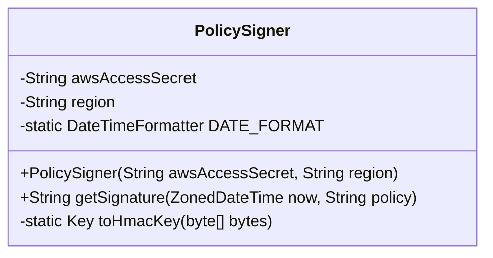

# 基础信息

|      |      |
|------|------|
| 名称 | PolicySigner |
| 编码语言 | .java |
| 代码路径 | Signal-Server/service/src/main/java/org/whispersystems/textsecuregcm/s3/PolicySigner.java |
| 包名 | org.whispersystems.textsecuregcm.s3 |
| 依赖项 | ['java.nio.charset.StandardCharsets', 'java.security.InvalidKeyException', 'java.security.Key', 'java.security.NoSuchAlgorithmException', 'java.time.ZonedDateTime', 'java.time.format.DateTimeFormatter', 'java.util.HexFormat', 'javax.crypto.Mac', 'javax.crypto.spec.SecretKeySpec'] |
| 概述说明 | PolicySigner类生成AWS签名，含密钥和区域，使用HmacSHA256算法。 |

# 说明

PolicySigner类用于生成AWS签名，该类包含AWS访问密钥和区域信息，并利用HmacSHA256算法进行签名计算。该类的核心功能是通过提供必要的AWS凭证和区域信息，确保请求的合法性和安全性。通过HmacSHA256算法，PolicySigner能够生成一个唯一的签名，用于验证请求的完整性和来源。这一过程是AWS服务中确保数据传输安全的重要步骤。

# 类列表 Class Summary

| 名称   | 类型  | 说明 |
|-------|------|-------------|
| PolicySigner | class | PolicySigner类用于生成AWS签名，包含AWS访问密钥和区域信息，使用HmacSHA256算法计算签名。 |

## 类 PolicySigner

|      |      |
|------|------|
| 访问范围 | public |
| 类型 | class |
| 名称 | PolicySigner |
| 说明 | PolicySigner类用于生成AWS签名，包含AWS访问密钥和区域信息，使用HmacSHA256算法计算签名。 |

### UML类图

这段代码定义了一个 `PolicySigner` 类，用于生成 AWS 请求的签名。该类包含两个私有成员变量 `awsAccessSecret` 和 `region`，以及一个静态的 `DateTimeFormatter` 对象 `DATE_FORMAT`。类中提供了一个公有方法 `getSignature`，用于根据当前时间和策略生成签名。此外，还有一个私有静态方法 `toHmacKey`，用于将字节数组转换为 `HmacSHA256` 密钥。该类的主要功能是通过多次 HMAC 计算生成 AWS 请求的签名。

### 内部方法调用关系图

```mermaid
graph TD
    A["类PolicySigner"]
    B["属性: String awsAccessSecret"]
    C["属性: String region"]
    D["常量: DateTimeFormatter DATE_FORMAT"]
    E["构造方法: PolicySigner(String awsAccessSecret, String region)"]
    F["方法: String getSignature(ZonedDateTime now, String policy)"]
    G["方法: Key toHmacKey(byte[] bytes)"]
    H["创建Mac实例: Mac.getInstance('HmacSHA256')"]
    I["初始化Mac: mac.init(toHmacKey('AWS4' + awsAccessSecret))"]
    J["生成dateKey: mac.doFinal(now.format(DATE_FORMAT))"]
    K["初始化Mac: mac.init(toHmacKey(dateKey))"]
    L["生成dateRegionKey: mac.doFinal(region.getBytes(StandardCharsets.UTF_8))"]
    M["初始化Mac: mac.init(toHmacKey(dateRegionKey))"]
    N["生成dateRegionServiceKey: mac.doFinal('s3'.getBytes(StandardCharsets.UTF_8))"]
    O["初始化Mac: mac.init(toHmacKey(dateRegionServiceKey))"]
    P["生成signingKey: mac.doFinal('aws4_request'.getBytes(StandardCharsets.UTF_8))"]
    Q["初始化Mac: mac.init(toHmacKey(signingKey))"]
    R["生成签名: HexFormat.of().formatHex(mac.doFinal(policy.getBytes(StandardCharsets.UTF_8)))"]

    A --> B
    A --> C
    A --> D
    A --> E
    A --> F
    A --> G
    F --> H
    F --> I
    F --> J
    F --> K
    F --> L
    F --> M
    F --> N
    F --> O
    F --> P
    F --> Q
    F --> R
```

这段代码描述了一个`PolicySigner`类，用于生成AWS签名。该类包含两个私有属性`awsAccessSecret`和`region`，以及一个常量`DATE_FORMAT`。构造方法初始化这两个属性。`getSignature`方法通过一系列步骤生成签名，包括创建Mac实例、初始化Mac、生成不同阶段的密钥，并最终生成签名。`toHmacKey`方法用于将字节数组转换为HmacKey。流程图展示了这些步骤的调用顺序和依赖关系。

### 字段列表 Field List

| 名称  | 类型  | 说明 |
|-------|-------|------|
| region | String | 私有且不可变的字符串变量region。 |
| awsAccessSecret | String | 声明了一个私有的最终字符串变量awsAccessSecret。 |
| DATE_FORMAT = DateTimeFormatter.ofPattern("yyyyMMdd") | DateTimeFormatter | 定义日期格式化器，格式为“yyyyMMdd”。 |

### 方法列表 Method List

| 名称  | 类型  | 说明 |
|-------|-------|------|
| toHmacKey | Key | 将字节数组转换为HmacSHA256密钥。 |
| getSignature | String | 该方法使用HmacSHA256算法生成AWS签名，通过多次初始化密钥并加密数据，最终返回十六进制格式的签名。 |

