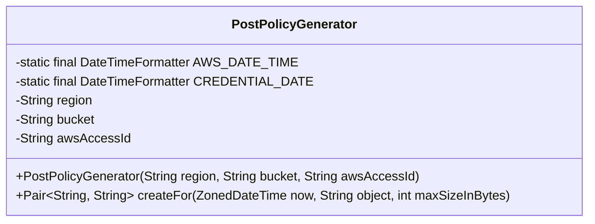
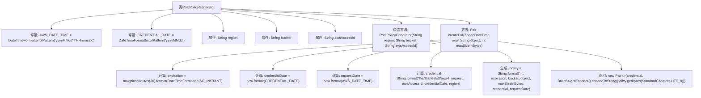

# 基础信息

|      |      |
|------|------|
| 名称 | PostPolicyGenerator |
| 编码语言 | .java |
| 代码路径 | Signal-Server/service/src/main/java/org/whispersystems/textsecuregcm/s3/PostPolicyGenerator.java |
| 包名 | org.whispersystems.textsecuregcm.s3 |
| 依赖项 | ['java.nio.charset.StandardCharsets', 'java.time.ZonedDateTime', 'java.time.format.DateTimeFormatter', 'java.util.Base64', 'org.whispersystems.textsecuregcm.util.Pair'] |
| 概述说明 | PostPolicyGenerator类生成AWS S3 POST策略，含区域、存储桶、访问ID等参数。 |

# 说明

PostPolicyGenerator类用于生成AWS S3的POST策略，主要涉及区域、存储桶、访问ID等关键参数。该类通过整合这些参数，确保生成的策略符合AWS S3的要求，便于用户通过POST请求上传数据到指定的存储桶中。

# 类列表 Class Summary

| 名称   | 类型  | 说明 |
|-------|------|-------------|
| PostPolicyGenerator | class | PostPolicyGenerator类用于生成AWS S3的POST策略，包含区域、存储桶、访问ID等参数。 |

## 类 PostPolicyGenerator

|      |      |
|------|------|
| 访问范围 | public |
| 类型 | class |
| 名称 | PostPolicyGenerator |
| 说明 | PostPolicyGenerator类用于生成AWS S3的POST策略，包含区域、存储桶、访问ID等参数。 |

### UML类图

### 描述
`PostPolicyGenerator` 类用于生成 AWS S3 的上传策略（Post Policy）。它包含两个静态的日期格式化器 `AWS_DATE_TIME` 和 `CREDENTIAL_DATE`，用于格式化日期字符串。类的构造函数接收 `region`、`bucket` 和 `awsAccessId` 作为参数，并提供了 `createFor` 方法，该方法根据当前时间、对象名称和最大文件大小生成上传策略和凭证。生成的策略和凭证以 `Pair` 形式返回，策略会被 Base64 编码。

### 内部方法调用关系图

这段代码定义了一个`PostPolicyGenerator`类，用于生成AWS S3的上传策略。类中包含两个常量日期格式化器，三个属性（区域、存储桶、AWS访问ID），以及一个构造方法和一个`createFor`方法。`createFor`方法根据当前时间、对象名称和最大文件大小生成一个包含凭证和Base64编码策略的`Pair`对象。流程图展示了类结构和方法内部的计算步骤。

### 字段列表 Field List

| 名称  | 类型  | 说明 |
|-------|-------|------|
| bucket | String | 定义私有不可变的字符串变量bucket。 |
| awsAccessId | String | 私有字符串变量awsAccessId用于存储AWS访问ID。 |
| region | String | 定义了一个私有且不可变的字符串变量region。 |
| CREDENTIAL_DATE = DateTimeFormatter.ofPattern("yyyyMMdd") | DateTimeFormatter | 定义私有静态日期格式化器，格式为"yyyyMMdd"。 |
| AWS_DATE_TIME = DateTimeFormatter.ofPattern("yyyyMMdd'T'HHmmssX") | DateTimeFormatter | 定义AWS日期时间格式为"yyyyMMdd'T'HHmmssX"。 |

### 方法列表 Method List

| 名称  | 类型  | 说明 |
|-------|-------|------|
| createFor | Pair<String, String> | 生成AWS凭证和Base64编码策略对，用于S3上传。 |

