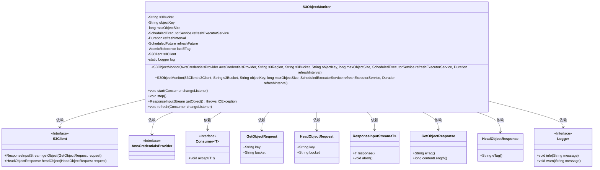

# 基础信息

|      |      |
|------|------|
| 名称 | S3ObjectMonitor |
| 编码语言 | .java |
| 代码路径 | Signal-Server/service/src/main/java/org/whispersystems/textsecuregcm/s3/S3ObjectMonitor.java |
| 包名 | org.whispersystems.textsecuregcm.s3 |
| 依赖项 | ['com.google.common.annotations.VisibleForTesting', 'java.io.IOException', 'java.io.InputStream', 'java.time.Duration', 'java.util.concurrent.ScheduledExecutorService', 'java.util.concurrent.ScheduledFuture', 'java.util.concurrent.TimeUnit', 'java.util.concurrent.atomic.AtomicReference', 'java.util.function.Consumer', 'org.apache.commons.lang3.StringUtils', 'org.slf4j.Logger', 'org.slf4j.LoggerFactory', 'software.amazon.awssdk.auth.credentials.AwsCredentialsProvider', 'software.amazon.awssdk.core.ResponseInputStream', 'software.amazon.awssdk.regions.Region', 'software.amazon.awssdk.services.s3.S3Client', 'software.amazon.awssdk.services.s3.model.GetObjectRequest', 'software.amazon.awssdk.services.s3.model.GetObjectResponse', 'software.amazon.awssdk.services.s3.model.HeadObjectRequest', 'software.amazon.awssdk.services.s3.model.HeadObjectResponse'] |
| 概述说明 | S3ObjectMonitor类监控S3对象变化，支持定时刷新和大小限制。 |

# 说明

S3ObjectMonitor类是一个用于监控S3对象变化的工具，具备定时刷新功能，能够定期检查对象的状态变化。此外，该类还支持设置大小限制，确保监控过程在可控范围内进行，避免资源过度消耗。

# 类列表 Class Summary

| 名称   | 类型  | 说明 |
|-------|------|-------------|
| S3ObjectMonitor | class | S3ObjectMonitor类用于监控S3对象变化，支持定时刷新和大小限制。 |

## 类 S3ObjectMonitor

|      |      |
|------|------|
| 访问范围 | public |
| 类型 | class |
| 名称 | S3ObjectMonitor |
| 说明 | S3ObjectMonitor类用于监控S3对象变化，支持定时刷新和大小限制。 |

### UML类图

这段代码定义了一个`S3ObjectMonitor`类，用于监控Amazon S3存储桶中的对象变化。它通过定期调用S3 API来检查对象的元数据，并在对象发生变化时通知监听器。类中包含了多个私有成员变量和公有方法，用于初始化、启动、停止监控以及获取对象数据。`S3Client`和`AwsCredentialsProvider`是依赖的外部接口，用于与S3服务进行交互。`Consumer`接口用于处理对象变化时的回调。整个类图展示了`S3ObjectMonitor`与其他类之间的依赖关系及其内部结构。

### 内部方法调用关系图

```mermaid
graph TD
    A["类S3ObjectMonitor"]
    B["属性: String s3Bucket"]
    C["属性: String objectKey"]
    D["属性: long maxObjectSize"]
    E["属性: ScheduledExecutorService refreshExecutorService"]
    F["属性: Duration refreshInterval"]
    G["属性: ScheduledFuture<?> refreshFuture"]
    H["属性: AtomicReference<String> lastETag"]
    I["属性: S3Client s3Client"]
    J["属性: Logger log"]
    K["构造方法: S3ObjectMonitor(AwsCredentialsProvider, String, String, String, long, ScheduledExecutorService, Duration)"]
    L["构造方法: S3ObjectMonitor(S3Client, String, String, long, ScheduledExecutorService, Duration)"]
    M["方法: start(Consumer<InputStream>)"]
    N["方法: stop()"]
    O["方法: getObject()"]
    P["方法: refresh(Consumer<InputStream>)"]
    Q["输出: log.info('Initial request for s3://{}/{}', s3Bucket, objectKey)"]
    R["调用: refresh(changeListener)"]
    S["调用: refreshExecutorService.scheduleAtFixedRate(...)"]
    T["调用: refreshFuture.cancel(true)"]
    U["调用: s3Client.getObject(GetObjectRequest.builder().key(objectKey).bucket(s3Bucket).build())"]
    V["调用: lastETag.set(response.response().eTag())"]
    W["调用: response.abort()"]
    X["调用: s3Client.headObject(HeadObjectRequest.builder().bucket(s3Bucket).key(objectKey).build())"]
    Y["调用: lastETag.compareAndSet(initialETag, refreshedETag)"]
    Z["调用: changeListener.accept(response)"]

    A --> B
    A --> C
    A --> D
    A --> E
    A --> F
    A --> G
    A --> H
    A --> I
    A --> J
    A --> K
    A --> L
    A --> M
    A --> N
    A --> O
    A --> P
    M --> Q
    M --> R
    M --> S
    N --> T
    O --> U
    O --> V
    O --> W
    P --> X
    P --> Y
    P --> Z
```

**描述：**
`S3ObjectMonitor` 类用于监控 Amazon S3 对象的变化。它通过定期检查对象的 ETag 来判断对象是否发生变化，并在变化时通知监听器。类中包含构造方法、启动和停止监控的方法、获取对象的方法以及刷新对象状态的方法。流程图展示了类的属性、方法及其调用关系，清晰地描述了对象监控的流程。

### 字段列表 Field List

| 名称  | 类型  | 说明 |
|-------|-------|------|
| s3Bucket | String | 私有字符串变量s3Bucket声明为final。 |
| s3Client | S3Client | 私有S3客户端实例变量。 |
| objectKey | String | 定义私有不可变字符串变量objectKey。 |
| log = LoggerFactory.getLogger(S3ObjectMonitor.class) | Logger | S3ObjectMonitor类中定义了一个静态日志记录器。 |
| refreshInterval | Duration | 私有常量refreshInterval用于定义刷新间隔时间。 |
| refreshFuture | ScheduledFuture<?> | 私有ScheduledFuture对象用于计划任务刷新。 |
| lastETag = new AtomicReference<>() | AtomicReference<String> | 定义了一个原子引用变量，用于存储字符串类型的ETag值。 |
| refreshExecutorService | ScheduledExecutorService | 私有且最终的定时任务执行服务。 |
| maxObjectSize | long | 私有长整型变量maxObjectSize用于存储最大对象大小。 |

### 方法列表 Method List

| 名称  | 类型  | 说明 |
|-------|-------|------|
| stop | void | 同步方法stop取消refreshFuture任务。 |
| refresh | void | 测试用方法，刷新S3对象并触发监听器。 |
| start | void | 启动S3对象管理器，立即执行首次请求，之后按固定间隔定期刷新。 |
| getObject | ResponseInputStream<GetObjectResponse> | 从S3获取对象流，检查大小，超限则中止并抛出异常。 |

