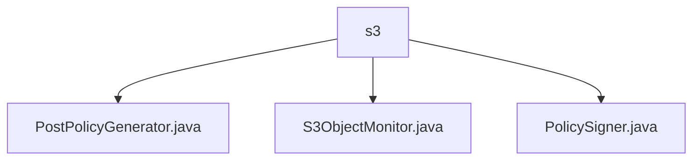

# 基础信息

|      |      |
|------|------|
| 名称 | s3 |
| 编码语言 | .java |
| 代码路径 | Signal-Server/service/src/main/java/org/whispersystems/textsecuregcm/s3 |
| 包名 | Signal-Server.service.src.main.java.org.whispersystems.textsecuregcm.s3 |
| 概述说明 | PostPolicyGenerator生成S3 POST策略，S3ObjectMonitor监控对象变化，PolicySigner生成AWS签名确保安全。 |

# 说明

## 概述

该代码模块主要围绕AWS S3服务的集成与管理展开，提供了生成POST策略、监控S3对象变化以及生成AWS签名等功能。通过这些功能，模块确保了与AWS S3的交互既符合其要求，又具备安全性和可控性。模块中的各个类协同工作，支持用户通过POST请求上传数据、监控S3对象的状态变化，并确保请求的合法性和安全性。

## 主要业务场景

1. **生成POST策略**：`PostPolicyGenerator`类用于生成符合AWS S3要求的POST策略，涉及区域、存储桶、访问ID等关键参数。该功能主要用于支持用户通过POST请求将数据上传到指定的S3存储桶中，确保上传过程的合规性和安全性。

2. **监控S3对象变化**：`S3ObjectMonitor`类提供了定时刷新功能，能够定期检查S3对象的状态变化。该功能适用于需要实时监控S3存储桶中对象变化的场景，同时支持设置大小限制，避免监控过程中资源过度消耗，确保监控过程的可控性。

3. **生成AWS签名**：`PolicySigner`类用于生成AWS签名，通过HmacSHA256算法确保请求的合法性和安全性。该功能是AWS服务中确保数据传输安全的重要步骤，适用于需要通过签名验证请求完整性和来源的场景，确保与AWS S3的交互安全可靠。

这些功能共同构成了一个完整的AWS S3管理模块，支持用户在安全、可控的环境下与S3服务进行交互。

### 包内部结构视图

该流程图展示了Signal-Server项目中`s3`目录下的文件结构。`s3`作为根节点，包含了三个子节点：`PostPolicyGenerator.java`、`S3ObjectMonitor.java`和`PolicySigner.java`。这些文件分别负责生成S3策略、监控S3对象以及签署策略的功能。

# 文件列表 File List

| 名称   | 类型  | 说明 |
|-------|------|-------------|
| [S3ObjectMonitor.java](S3ObjectMonitor.md) | file | S3ObjectMonitor类监控S3对象变化，支持定时刷新和大小限制。 |
| [PolicySigner.java](PolicySigner.md) | file | PolicySigner类生成AWS签名，含密钥和区域，使用HmacSHA256算法。 |
| [PostPolicyGenerator.java](PostPolicyGenerator.md) | file | PostPolicyGenerator类生成AWS S3 POST策略，含区域、存储桶、访问ID等参数。 |

