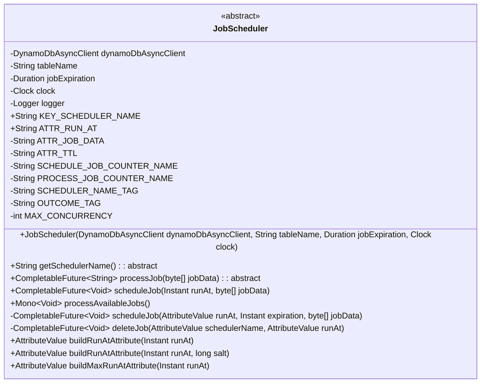

# 基础信息

|      |      |
|------|------|
| 名称 | JobScheduler |
| 编码语言 | .java |
| 代码路径 | Signal-Server/service/src/main/java/org/whispersystems/textsecuregcm/scheduler/JobScheduler.java |
| 包名 | org.whispersystems.textsecuregcm.scheduler |
| 依赖项 | ['com.google.common.annotations.VisibleForTesting', 'io.micrometer.core.instrument.Metrics', 'org.slf4j.Logger', 'org.slf4j.LoggerFactory', 'org.whispersystems.textsecuregcm.metrics.MetricsUtil', 'org.whispersystems.textsecuregcm.util.Util', 'reactor.core.publisher.Flux', 'reactor.core.publisher.Mono', 'reactor.util.retry.Retry', 'software.amazon.awssdk.core.SdkBytes', 'software.amazon.awssdk.services.dynamodb.DynamoDbAsyncClient', 'software.amazon.awssdk.services.dynamodb.model.AttributeValue', 'software.amazon.awssdk.services.dynamodb.model.DeleteItemRequest', 'software.amazon.awssdk.services.dynamodb.model.PutItemRequest', 'software.amazon.awssdk.services.dynamodb.model.QueryRequest', 'javax.annotation.Nullable', 'java.nio.ByteBuffer', 'java.time.Clock', 'java.time.Duration', 'java.time.Instant', 'java.util.HashMap', 'java.util.Map', 'java.util.concurrent.CompletableFuture', 'java.util.concurrent.ThreadLocalRandom'] |
| 概述说明 | JobScheduler类调度DynamoDB任务，支持过期和并发处理。 |

# 说明

JobScheduler类是一个用于调度和处理DynamoDB中任务的工具，具备任务过期和并发处理功能。它能够有效地管理任务的执行时间，确保任务在指定时间内完成，同时支持多个任务同时处理，提升系统的整体效率和响应速度。

# 类列表 Class Summary

| 名称   | 类型  | 说明 |
|-------|------|-------------|
| JobScheduler | class | JobScheduler类用于调度和处理DynamoDB中的任务，支持任务过期和并发处理。 |

## 类 JobScheduler

|      |      |
|------|------|
| 访问范围 | public abstract |
| 类型 | class |
| 名称 | JobScheduler |
| 说明 | JobScheduler类用于调度和处理DynamoDB中的任务，支持任务过期和并发处理。 |

### UML类图

**描述：**  
`JobScheduler` 是一个抽象类，用于调度和处理任务。它依赖于 `DynamoDbAsyncClient` 来与 DynamoDB 进行异步交互，支持任务的调度、处理和删除。类中定义了多个常量和方法，包括任务的调度时间、任务数据的处理、任务的最大并发数等。`JobScheduler` 提供了抽象方法 `getSchedulerName` 和 `processJob`，需要子类实现。通过 `scheduleJob` 方法可以调度任务，`processAvailableJobs` 方法则用于处理所有到期的任务。

### 内部方法调用关系图

```mermaid
graph TD
    A["类JobScheduler"]
    B["属性: DynamoDbAsyncClient dynamoDbAsyncClient"]
    C["属性: String tableName"]
    D["属性: Duration jobExpiration"]
    E["属性: Clock clock"]
    F["属性: Logger logger"]
    G["常量: String KEY_SCHEDULER_NAME"]
    H["常量: String ATTR_RUN_AT"]
    I["常量: String ATTR_JOB_DATA"]
    J["常量: String ATTR_TTL"]
    K["常量: String SCHEDULE_JOB_COUNTER_NAME"]
    L["常量: String PROCESS_JOB_COUNTER_NAME"]
    M["常量: String SCHEDULER_NAME_TAG"]
    N["常量: String OUTCOME_TAG"]
    O["常量: int MAX_CONCURRENCY"]
    P["构造方法: JobScheduler(DynamoDbAsyncClient, String, Duration, Clock)"]
    Q["抽象方法: String getSchedulerName()"]
    R["抽象方法: CompletableFuture<String> processJob(byte[] jobData)"]
    S["方法: CompletableFuture<Void> scheduleJob(Instant runAt, byte[] jobData)"]
    T["方法: CompletableFuture<Void> scheduleJob(AttributeValue runAt, Instant expiration, byte[] jobData)"]
    U["方法: Mono<Void> processAvailableJobs()"]
    V["方法: CompletableFuture<Void> deleteJob(AttributeValue schedulerName, AttributeValue runAt)"]
    W["方法: AttributeValue buildRunAtAttribute(Instant runAt)"]
    X["方法: AttributeValue buildRunAtAttribute(Instant runAt, long salt)"]
    Y["静态方法: AttributeValue buildMaxRunAtAttribute(Instant runAt)"]

    A --> B
    A --> C
    A --> D
    A --> E
    A --> F
    A --> G
    A --> H
    A --> I
    A --> J
    A --> K
    A --> L
    A --> M
    A --> N
    A --> O
    A --> P
    A --> Q
    A --> R
    A --> S
    A --> T
    A --> U
    A --> V
    A --> W
    A --> X
    A --> Y
```

这段代码定义了一个抽象类 `JobScheduler`，用于调度和处理作业。它包含多个属性和常量，以及构造方法和抽象方法。主要功能包括调度作业、处理作业、删除作业以及构建作业的排序键。`JobScheduler` 类通过 `DynamoDbAsyncClient` 与 DynamoDB 进行异步交互，确保作业的调度和处理具有高并发性和容错性。

### 字段列表 Field List

| 名称  | 类型  | 说明 |
|-------|-------|------|
| logger = LoggerFactory.getLogger(getClass()) | Logger | 私有日志记录器实例初始化。 |
| dynamoDbAsyncClient | DynamoDbAsyncClient | 私有异步DynamoDB客户端实例。 |
| clock | Clock | 定义一个私有的不可变时钟对象。 |
| MAX_CONCURRENCY = 16 | int | 定义最大并发数为16的私有静态常量。 |
| OUTCOME_TAG = "outcome" | String | 定义私有静态常量OUTCOME_TAG，值为"outcome"。 |
| ATTR_TTL = "E" | String | 定义私有静态常量字符串ATTR_TTL，值为"E"。 |
| ATTR_JOB_DATA = "D" | String | 私有静态常量ATTR_JOB_DATA赋值为"D"。 |
| tableName | String | 私有不可变字符串变量tableName。 |
| jobExpiration | Duration | 私有不可变变量jobExpiration表示任务过期时间。 |
| KEY_SCHEDULER_NAME = "S" | String | 测试可见的静态常量KEY_SCHEDULER_NAME值为"S"。 |
| SCHEDULER_NAME_TAG = "schedulerName" | String | 定义静态常量SCHEDULER_NAME_TAG，值为"schedulerName"。 |
| PROCESS_JOB_COUNTER_NAME = MetricsUtil.name(JobScheduler.class, "processJob") | String | JobScheduler类中定义了一个名为processJob的静态计数器。 |
| ATTR_RUN_AT = "T" | String | 测试可见的静态常量ATTR_RUN_AT，值为"T"。 |
| SCHEDULE_JOB_COUNTER_NAME = MetricsUtil.name(JobScheduler.class, "scheduleJob") | String | 定义调度任务计数器的常量名称。 |

### 方法列表 Method List

| 名称  | 类型  | 说明 |
|-------|-------|------|
| getSchedulerName | String | 获取调度器名称的抽象方法。 |
| buildRunAtAttribute | AttributeValue | 构建包含时间戳和盐值的24字节属性值。 |
| buildRunAtAttribute | AttributeValue | 构建带随机数的运行时间属性方法。 |
| scheduleJob | CompletableFuture<Void> | 方法异步调度任务，支持重试和指标计数。 |
| processJob | CompletableFuture<String> | 处理任务并返回字符串的异步方法，可接受空字节数组参数。 |
| deleteJob | CompletableFuture<Void> | 异步删除指定调度器名称和运行时间的任务条目。 |
| processAvailableJobs | Mono<Void> | 该方法异步处理可用任务，查询DynamoDB，处理并删除任务，记录指标，处理错误。 |
| scheduleJob | CompletableFuture<Void> | 方法`scheduleJob`通过DynamoDB异步客户端调度任务，包含任务名称、运行时间和过期时间，可选任务数据。 |
| buildMaxRunAtAttribute | AttributeValue | 构建包含最大运行时间的属性值，使用当前时间戳和固定值填充字节缓冲区。 |

