# 基础信息

|      |      |
|------|------|
| 名称 | SchedulingUtil |
| 编码语言 | .java |
| 代码路径 | Signal-Server/service/src/main/java/org/whispersystems/textsecuregcm/scheduler/SchedulingUtil.java |
| 包名 | org.whispersystems.textsecuregcm.scheduler |
| 依赖项 | ['com.google.common.annotations.VisibleForTesting', 'com.google.i18n.phonenumbers.NumberParseException', 'com.google.i18n.phonenumbers.PhoneNumberToTimeZonesMapper', 'com.google.i18n.phonenumbers.PhoneNumberUtil', 'com.google.i18n.phonenumbers.Phonenumber', 'org.whispersystems.textsecuregcm.storage.Account', 'java.time.Clock', 'java.time.Instant', 'java.time.LocalTime', 'java.time.ZoneId', 'java.time.ZoneOffset', 'java.time.ZonedDateTime', 'java.util.List', 'java.util.Objects', 'java.util.Optional'] |
| 概述说明 | 按账户时区或创建时间推荐最佳通知发送时间。 |

# 说明

根据账户信息推荐发送通知的最佳时间，优先使用电话号码对应的时区来确定，若无法获取电话号码时区，则参考账户创建时间来确定最佳发送时间。

# 类列表 Class Summary

| 名称   | 类型  | 说明 |
|-------|------|-------------|
| SchedulingUtil | class | 根据账户信息推荐发送通知的最佳时间，优先使用电话号码时区，否则参考账户创建时间。 |

## 类 SchedulingUtil

|      |      |
|------|------|
| 访问范围 | public |
| 类型 | class |
| 名称 | SchedulingUtil |
| 说明 | 根据账户信息推荐发送通知的最佳时间，优先使用电话号码时区，否则参考账户创建时间。 |

### UML类图

```mermaid
classDiagram
    class SchedulingUtil {
        <<Interface>>
        +getNextRecommendedNotificationTime(Account account, LocalTime preferredTime, Clock clock) Instant
        +getZoneOffset(Account account, Clock clock) Optional~ZoneOffset~
    }
    class Account {
        +getNumber() String
        +getPrimaryDevice() Device
    }
    class Device {
        +getCreated() long
    }
    class PhoneNumberUtil {
        +getInstance() PhoneNumberUtil
        +parse(String number, String defaultRegion) Phonenumber.PhoneNumber
    }
    class PhoneNumberToTimeZonesMapper {
        +getInstance() PhoneNumberToTimeZonesMapper
        +getTimeZonesForNumber(Phonenumber.PhoneNumber phoneNumber) List~String~
        +getUnknownTimeZone() String
    }
    class ZoneId {
        +of(String zoneId) ZoneId
        +getRules() ZoneRules
        +systemDefault() ZoneId
    }
    class ZoneRules {
        +getOffset(Instant instant) ZoneOffset
    }
    class ZoneOffset {
    }
    class Clock {
        +instant() Instant
    }
    class LocalTime {
        +ofInstant(Instant instant, ZoneId zone) LocalTime
        +with(LocalTime time) ZonedDateTime
    }
    class ZonedDateTime {
        +now(ZoneId zone) ZonedDateTime
        +with(LocalTime time) ZonedDateTime
        +plusDays(long days) ZonedDateTime
        +toInstant() Instant
    }
    class Instant {
        +ofEpochMilli(long epochMilli) Instant
    }
    class Optional~T~ {
        +empty() Optional~T~
        +of(T value) Optional~T~
    }
    class List~T~ {
    }
    class NumberParseException {
    }

    SchedulingUtil --> Account : 依赖
    SchedulingUtil --> Clock : 依赖
    SchedulingUtil --> PhoneNumberUtil : 依赖
    SchedulingUtil --> PhoneNumberToTimeZonesMapper : 依赖
    SchedulingUtil --> ZoneId : 依赖
    SchedulingUtil --> ZonedDateTime : 依赖
    SchedulingUtil --> Instant : 依赖
    SchedulingUtil --> Optional~ZoneOffset~ : 依赖
    Account --> Device : 依赖
    PhoneNumberUtil --> Phonenumber.PhoneNumber : 依赖
    PhoneNumberToTimeZonesMapper --> List~String~ : 依赖
    ZoneId --> ZoneRules : 依赖
    ZoneRules --> ZoneOffset : 依赖
    ZonedDateTime --> LocalTime : 依赖
    ZonedDateTime --> Instant : 依赖
    Instant --> ZonedDateTime : 依赖
    Optional~ZoneOffset~ --> ZoneOffset : 依赖
    List~String~ --> String : 依赖
    NumberParseException --> Exception : 依赖
```

### 描述
该代码实现了一个调度工具类 `SchedulingUtil`，用于获取发送通知的推荐时间。它通过分析账户的电话号码来推断时区，并基于账户的创建时间作为默认提示。如果无法从电话号码中获取时区，则使用账户的创建时间来推断合适的时间。代码中涉及多个类，如 `Account`、`Device`、`PhoneNumberUtil` 等，用于处理电话号码解析、时区映射、时间计算等操作。最终，该方法返回一个适合发送通知的时间点。

### 内部方法调用关系图

这段代码的主要功能是为给定账户计算下一个推荐的通知发送时间。首先，它尝试从账户的电话号码中获取时区偏移量，如果成功，则根据首选时间计算通知时间；如果失败，则根据账户创建时间进行推测。如果计算的时间已经过去，则推迟到第二天同一时间。流程图展示了从获取时区偏移量到最终返回通知时间的完整过程，包括异常处理和条件判断。

### 字段列表 Field List

| 名称  | 类型  | 说明 |
|-------|-------|------|

### 方法列表 Method List

| 名称  | 类型  | 说明 |
|-------|-------|------|
| getNextRecommendedNotificationTime | Instant | 根据账户时区或创建时间计算推荐通知时间，若错过则延至次日。 |
| getZoneOffset | Optional<ZoneOffset> | 根据账户号码获取时区偏移量，返回排序后的中间值，若失败则返回空。 |

