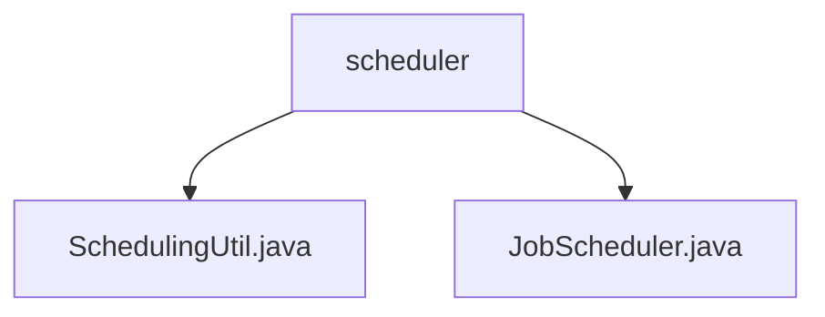

# 基础信息

|      |      |
|------|------|
| 名称 | scheduler |
| 编码语言 | .java |
| 代码路径 | Signal-Server/service/src/main/java/org/whispersystems/textsecuregcm/scheduler |
| 包名 | Signal-Server.service.src.main.java.org.whispersystems.textsecuregcm.scheduler |
| 概述说明 | 根据时区或创建时间确定通知发送时间，JobScheduler管理任务执行和并发处理。 |

# 说明

## 概述
该代码模块主要涉及任务调度和通知发送时间的优化。模块的核心功能包括根据账户信息推荐最佳通知发送时间，以及高效地调度和处理存储在DynamoDB中的任务。模块通过智能地选择发送时间和并发处理任务，提升了系统的整体效率和响应速度。

## 主要业务场景
1. **通知发送时间优化**：系统根据账户信息推荐最佳通知发送时间。优先使用电话号码对应的时区来确定发送时间，如果无法获取电话号码时区，则参考账户创建时间来确定最佳发送时间。这一功能确保通知在用户最可能活跃的时间段发送，提高通知的打开率和用户满意度。

2. **任务调度与处理**：`JobScheduler`类负责调度和处理存储在DynamoDB中的任务。它具备任务过期和并发处理功能，能够确保任务在指定时间内完成，并支持多个任务同时处理。这一功能提升了系统的任务处理能力，确保任务能够高效、及时地完成，从而提高系统的整体性能和可靠性。

### 包内部结构视图

该流程图展示了`Signal-Server`项目中`scheduler`目录下的文件层级关系。`scheduler`目录包含两个Java文件：`SchedulingUtil.java`和`JobScheduler.java`，这两个文件直接位于`scheduler`目录下，没有进一步的子目录结构。

# 文件列表 File List

| 名称   | 类型  | 说明 |
|-------|------|-------------|
| [JobScheduler.java](JobScheduler.md) | file | JobScheduler类调度DynamoDB任务，支持过期和并发处理。 |
| [SchedulingUtil.java](SchedulingUtil.md) | file | 按账户时区或创建时间推荐最佳通知发送时间。 |

