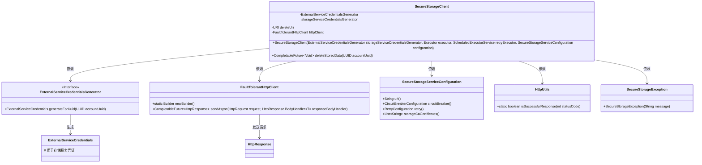
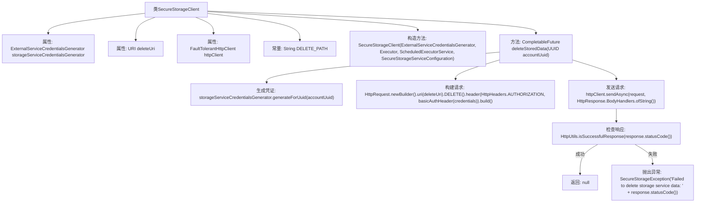

# 基础信息

|      |      |
|------|------|
| 名称 | SecureStorageClient |
| 编码语言 | .java |
| 代码路径 | Signal-Server/service/src/main/java/org/whispersystems/textsecuregcm/securestorage/SecureStorageClient.java |
| 包名 | org.whispersystems.textsecuregcm.securestorage |
| 依赖项 | ['org.whispersystems.textsecuregcm.util.HeaderUtils.basicAuthHeader', 'com.google.common.annotations.VisibleForTesting', 'com.google.common.net.HttpHeaders', 'java.net.URI', 'java.net.http.HttpClient', 'java.net.http.HttpRequest', 'java.net.http.HttpResponse', 'java.security.cert.CertificateException', 'java.time.Duration', 'java.util.UUID', 'java.util.concurrent.CompletableFuture', 'java.util.concurrent.Executor', 'java.util.concurrent.ScheduledExecutorService', 'org.whispersystems.textsecuregcm.auth.ExternalServiceCredentials', 'org.whispersystems.textsecuregcm.auth.ExternalServiceCredentialsGenerator', 'org.whispersystems.textsecuregcm.configuration.SecureStorageServiceConfiguration', 'org.whispersystems.textsecuregcm.http.FaultTolerantHttpClient', 'org.whispersystems.textsecuregcm.util.HttpUtils'] |
| 概述说明 | SecureStorageClient类提供安全删除存储数据功能，支持认证、HTTP请求和异常处理。 |

# 说明

SecureStorageClient类主要用于安全删除存储数据，具备认证、HTTP请求和异常处理功能。该类通过认证机制确保操作的安全性，利用HTTP请求与存储系统进行通信，并包含异常处理功能以应对可能出现的错误情况，确保数据删除过程的可靠性和稳定性。

# 类列表 Class Summary

| 名称   | 类型  | 说明 |
|-------|------|-------------|
| SecureStorageClient | class | SecureStorageClient类用于安全删除存储数据，包含认证、HTTP请求和异常处理功能。 |

## 类 SecureStorageClient

|      |      |
|------|------|
| 访问范围 | public |
| 类型 | class |
| 名称 | SecureStorageClient |
| 说明 | SecureStorageClient类用于安全删除存储数据，包含认证、HTTP请求和异常处理功能。 |

### UML类图

类图描述：`SecureStorageClient` 类依赖于 `ExternalServiceCredentialsGenerator` 生成凭证，使用 `FaultTolerantHttpClient` 发送 HTTP 请求，并配置 `SecureStorageServiceConfiguration` 以获取服务配置。`HttpUtils` 用于检查 HTTP 响应状态码，`SecureStorageException` 用于处理删除存储数据时的异常。

### 内部方法调用关系图

这段代码定义了一个`SecureStorageClient`类，用于与安全存储服务进行交互。类中包含一个构造方法和一个`deleteStoredData`方法。构造方法初始化了必要的属性和HTTP客户端配置。`deleteStoredData`方法通过生成凭证、构建HTTP请求并发送请求来删除存储的数据。如果请求成功，返回`null`；如果失败，抛出`SecureStorageException`异常。流程图展示了类内部的方法调用和数据流动过程。

### 字段列表 Field List

| 名称  | 类型  | 说明 |
|-------|-------|------|
| storageServiceCredentialsGenerator | ExternalServiceCredentialsGenerator | 私有且不可变的存储服务凭证生成器实例。 |
| httpClient | FaultTolerantHttpClient | 私有且不可变的容错HTTP客户端实例。 |
| deleteUri | URI | 私有不可变URI变量deleteUri。 |
| DELETE_PATH = "/v1/storage" | String | 测试可见的删除路径常量定义为"/v1/storage"。 |

### 方法列表 Method List

| 名称  | 类型  | 说明 |
|-------|-------|------|
| deleteStoredData | CompletableFuture<Void> | 异步删除存储数据，使用UUID生成凭证并发送HTTP请求，成功返回null，失败抛出异常。 |

