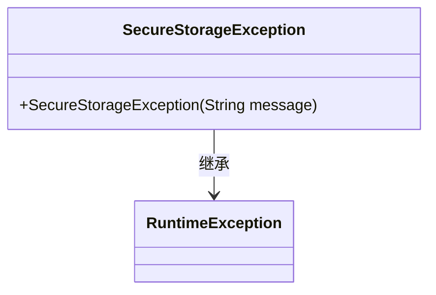
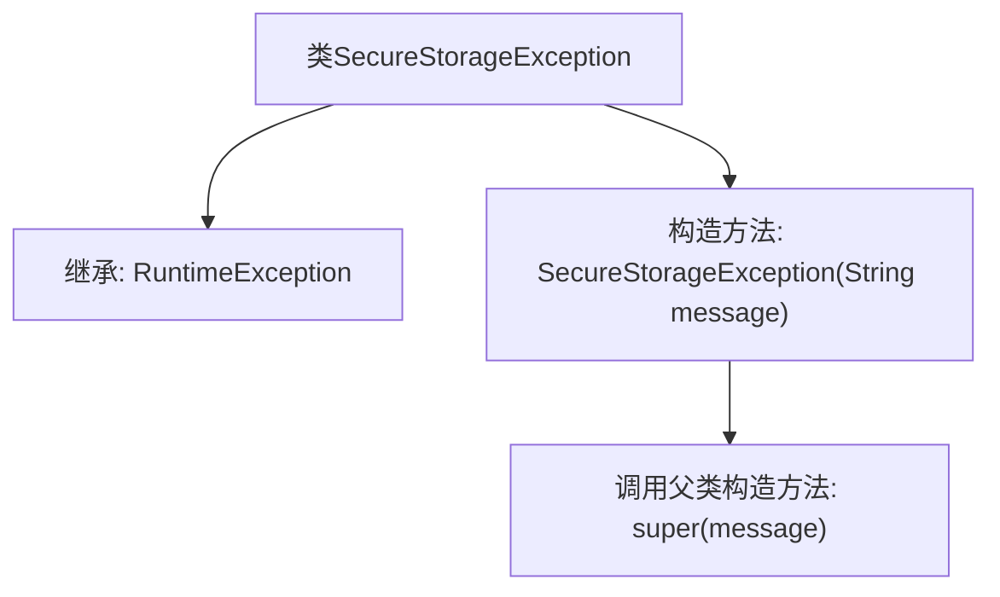

# 基础信息

|      |      |
|------|------|
| 名称 | SecureStorageException |
| 编码语言 | .java |
| 代码路径 | Signal-Server/service/src/main/java/org/whispersystems/textsecuregcm/securestorage/SecureStorageException.java |
| 包名 | org.whispersystems.textsecuregcm.securestorage |
| 依赖项 | [] |
| 概述说明 | SecureStorageException继承RuntimeException，含带消息的构造函数。 |

# 说明

SecureStorageException是一个继承自RuntimeException的异常类，它提供了一个带有消息的构造函数。该构造函数允许在抛出异常时传递特定的错误信息，以便更好地描述异常发生的原因。这种设计使得开发者能够更灵活地处理和调试异常情况，同时保持代码的简洁性和可读性。

# 类列表 Class Summary

| 名称   | 类型  | 说明 |
|-------|------|-------------|
| SecureStorageException | class | SecureStorageException继承RuntimeException，提供带消息的构造函数。 |

## 类 SecureStorageException

|      |      |
|------|------|
| 访问范围 | public |
| 类型 | class |
| 名称 | SecureStorageException |
| 说明 | SecureStorageException继承RuntimeException，提供带消息的构造函数。 |

### UML类图

这段代码定义了一个名为 `SecureStorageException` 的类，它继承自 `RuntimeException`。`SecureStorageException` 是一个自定义的异常类，用于处理安全存储相关的异常情况。它包含一个构造函数，接受一个字符串参数 `message`，并将其传递给父类 `RuntimeException` 的构造函数。通过继承 `RuntimeException`，`SecureStorageException` 可以在程序中作为未检查异常使用，通常用于表示程序运行时的错误或异常情况。

### 内部方法调用关系图

这段代码定义了一个名为`SecureStorageException`的类，它继承自`RuntimeException`。类中包含一个构造方法`SecureStorageException(String message)`，该方法接受一个字符串参数`message`，并通过`super(message)`调用父类`RuntimeException`的构造方法。这个类用于表示与安全存储相关的异常，继承自`RuntimeException`意味着它是一个未检查异常，不需要在方法签名中显式声明或捕获。

### 字段列表 Field List

| 名称  | 类型  | 说明 |
|-------|-------|------|

### 方法列表 Method List

| 名称  | 类型  | 说明 |
|-------|-------|------|

