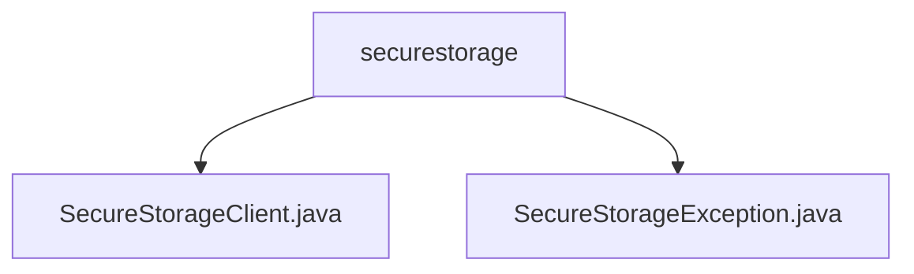

# 基础信息

|      |      |
|------|------|
| 名称 | securestorage |
| 编码语言 | .java |
| 代码路径 | Signal-Server/service/src/main/java/org/whispersystems/textsecuregcm/securestorage |
| 包名 | Signal-Server.service.src.main.java.org.whispersystems.textsecuregcm.securestorage |
| 概述说明 | SecureStorageClient类用于安全删除数据，支持认证、HTTP请求和异常处理。SecureStorageException继承RuntimeException，提供带消息的构造函数。 |

# 说明

## 概述

该代码模块主要涉及安全存储数据的删除操作，包含两个核心类：`SecureStorageClient` 和 `SecureStorageException`。`SecureStorageClient` 类负责与存储系统进行通信，确保数据删除过程的安全性和可靠性，而 `SecureStorageException` 类则用于处理在安全存储操作中可能出现的异常情况。这两个类共同构成了一个安全存储管理的基础框架，确保数据删除操作的完整性和异常处理的灵活性。

## 主要业务场景

1. **安全数据删除**：`SecureStorageClient` 类通过认证机制确保操作的安全性，利用 HTTP 请求与存储系统进行通信，执行数据删除操作。该类还包含异常处理功能，以应对可能出现的错误情况，确保数据删除过程的可靠性和稳定性。
  
2. **异常处理**：`SecureStorageException` 类继承自 `RuntimeException`，提供了一个带有消息的构造函数，允许在抛出异常时传递特定的错误信息。这种设计使得开发者能够更灵活地处理和调试异常情况，同时保持代码的简洁性和可读性。

这两个类的结合使得该模块能够在需要安全删除存储数据的场景中，提供高效、可靠且易于维护的解决方案。

### 包内部结构视图

该流程图展示了 `securestorage` 文件夹下的两个文件 `SecureStorageClient.java` 和 `SecureStorageException.java` 的层级关系。`securestorage` 作为父节点，包含两个子节点，分别对应两个Java文件。这种结构清晰地反映了文件在项目中的组织方式，便于理解和管理。

# 文件列表 File List

| 名称   | 类型  | 说明 |
|-------|------|-------------|
| [SecureStorageException.java](SecureStorageException.md) | file | SecureStorageException继承RuntimeException，含带消息的构造函数。 |
| [SecureStorageClient.java](SecureStorageClient.md) | file | SecureStorageClient类提供安全删除存储数据功能，支持认证、HTTP请求和异常处理。 |

