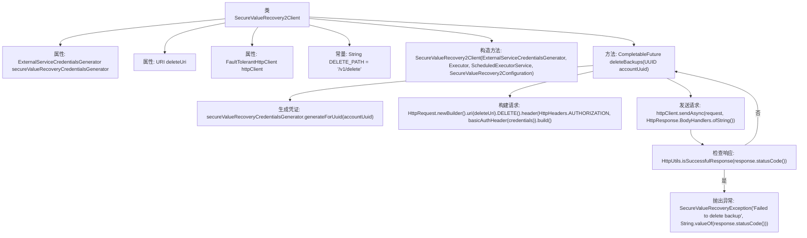

# 基础信息

|      |      |
|------|------|
| 名称 | SecureValueRecovery2Client |
| 编码语言 | .java |
| 代码路径 | Signal-Server/service/src/main/java/org/whispersystems/textsecuregcm/securevaluerecovery/SecureValueRecovery2Client.java |
| 包名 | org.whispersystems.textsecuregcm.securevaluerecovery |
| 依赖项 | ['org.whispersystems.textsecuregcm.util.HeaderUtils.basicAuthHeader', 'com.google.common.annotations.VisibleForTesting', 'com.google.common.net.HttpHeaders', 'java.net.URI', 'java.net.http.HttpClient', 'java.net.http.HttpRequest', 'java.net.http.HttpResponse', 'java.security.cert.CertificateException', 'java.time.Duration', 'java.util.UUID', 'java.util.concurrent.CompletableFuture', 'java.util.concurrent.Executor', 'java.util.concurrent.ScheduledExecutorService', 'org.whispersystems.textsecuregcm.auth.ExternalServiceCredentials', 'org.whispersystems.textsecuregcm.auth.ExternalServiceCredentialsGenerator', 'org.whispersystems.textsecuregcm.configuration.SecureValueRecovery2Configuration', 'org.whispersystems.textsecuregcm.http.FaultTolerantHttpClient', 'org.whispersystems.textsecuregcm.util.HttpUtils'] |
| 概述说明 | SecureValueRecovery2Client类用于安全删除备份，支持生成凭证、配置HTTP客户端及异步删除。 |

# 说明

SecureValueRecovery2Client类主要用于安全删除备份数据。该类提供了生成凭证的功能，以确保操作的安全性。同时，它还包含配置HTTP客户端的部分，用于与服务器进行通信。此外，该类支持异步删除功能，允许在后台执行删除操作，从而提高效率并减少对主线程的影响。通过这些功能，SecureValueRecovery2Client类能够有效地管理和删除备份数据，确保数据安全性和系统性能。

# 类列表 Class Summary

| 名称   | 类型  | 说明 |
|-------|------|-------------|
| SecureValueRecovery2Client | class | SecureValueRecovery2Client类用于安全删除备份，包含生成凭证、配置HTTP客户端及异步删除功能。 |

## 类 SecureValueRecovery2Client

|      |      |
|------|------|
| 访问范围 | public |
| 类型 | class |
| 名称 | SecureValueRecovery2Client |
| 说明 | SecureValueRecovery2Client类用于安全删除备份，包含生成凭证、配置HTTP客户端及异步删除功能。 |

### UML类图

```mermaid
classDiagram
    class SecureValueRecovery2Client {
        -ExternalServiceCredentialsGenerator secureValueRecoveryCredentialsGenerator
        -URI deleteUri
        -FaultTolerantHttpClient httpClient
        +SecureValueRecovery2Client(ExternalServiceCredentialsGenerator secureValueRecoveryCredentialsGenerator, Executor executor, ScheduledExecutorService retryExecutor, SecureValueRecovery2Configuration configuration)
        +CompletableFuture~Void~ deleteBackups(UUID accountUuid)
    }

    class ExternalServiceCredentialsGenerator {
        <<Interface>>
        +ExternalServiceCredentials generateForUuid(UUID accountUuid)
    }

    class FaultTolerantHttpClient {
        +FaultTolerantHttpClient.Builder newBuilder()
        +CompletableFuture~HttpResponse~ sendAsync(HttpRequest request, HttpResponse.BodyHandler~R~ responseBodyHandler)
    }

    class SecureValueRecovery2Configuration {
        +String uri()
        +CircuitBreaker circuitBreaker()
        +Retry retry()
        +List~String~ svrCaCertificates()
    }

    class HttpRequest {
        +HttpRequest.Builder newBuilder()
    }

    class HttpResponse {
        +HttpResponse.BodyHandlers ofString()
    }

    class HttpUtils {
        +boolean isSuccessfulResponse(int statusCode)
    }

    class SecureValueRecoveryException {
        +SecureValueRecoveryException(String message, String statusCode)
    }

    SecureValueRecovery2Client --> ExternalServiceCredentialsGenerator : 依赖
    SecureValueRecovery2Client --> FaultTolerantHttpClient : 依赖
    SecureValueRecovery2Client --> SecureValueRecovery2Configuration : 依赖
    SecureValueRecovery2Client --> HttpRequest : 依赖
    SecureValueRecovery2Client --> HttpResponse : 依赖
    SecureValueRecovery2Client --> HttpUtils : 依赖
    SecureValueRecovery2Client --> SecureValueRecoveryException : 依赖
```

**描述：**  
`SecureValueRecovery2Client` 类用于与外部服务进行安全通信，主要功能是删除备份数据。它依赖于 `ExternalServiceCredentialsGenerator` 生成凭证，使用 `FaultTolerantHttpClient` 发送HTTP请求，并通过 `SecureValueRecovery2Configuration` 获取配置信息。`deleteBackups` 方法通过异步方式发送删除请求，并根据响应状态码判断操作是否成功。若失败，则抛出 `SecureValueRecoveryException` 异常。

### 内部方法调用关系图

这段代码定义了一个名为 `SecureValueRecovery2Client` 的类，用于与外部服务进行安全通信。类中包含一个构造方法和一个 `deleteBackups` 方法。构造方法初始化了凭证生成器、删除URI和HTTP客户端。`deleteBackups` 方法通过生成凭证、构建HTTP请求并发送请求来删除备份数据，如果请求失败则抛出异常。

### 字段列表 Field List

| 名称  | 类型  | 说明 |
|-------|-------|------|
| secureValueRecoveryCredentialsGenerator | ExternalServiceCredentialsGenerator | 私有外部服务凭证生成器用于安全值恢复。 |
| deleteUri | URI | 私有不可变的URI删除地址。 |
| DELETE_PATH = "/v1/delete" | String | 测试可见的静态删除路径常量定义为"/v1/delete"。 |
| httpClient | FaultTolerantHttpClient | 私有不可变的FaultTolerantHttpClient实例httpClient。 |

### 方法列表 Method List

| 名称  | 类型  | 说明 |
|-------|-------|------|
| deleteBackups | CompletableFuture<Void> | 异步删除指定账户的备份，使用HTTP请求并处理响应结果。 |

