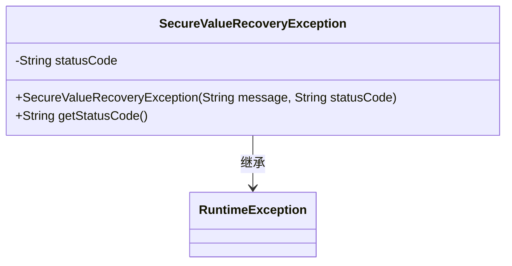
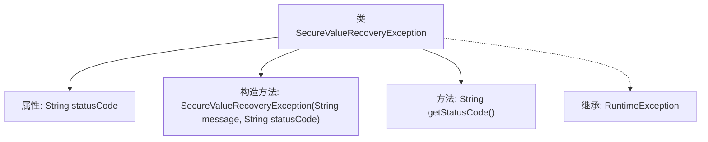

# 基础信息

|      |      |
|------|------|
| 名称 | SecureValueRecoveryException |
| 编码语言 | .java |
| 代码路径 | Signal-Server/service/src/main/java/org/whispersystems/textsecuregcm/securevaluerecovery/SecureValueRecoveryException.java |
| 包名 | org.whispersystems.textsecuregcm.securevaluerecovery |
| 依赖项 | [] |
| 概述说明 | SecureValueRecoveryException继承RuntimeException，含状态码和构造方法。 |

# 说明

SecureValueRecoveryException是一个继承自RuntimeException的异常类，它包含状态码和构造方法。状态码用于标识异常的具体类型或原因，构造方法则用于初始化异常对象并设置状态码。该异常类通常用于处理与安全值恢复相关的错误情况，确保在出现问题时能够提供详细的错误信息。

# 类列表 Class Summary

| 名称   | 类型  | 说明 |
|-------|------|-------------|
| SecureValueRecoveryException | class | SecureValueRecoveryException继承RuntimeException，包含状态码和构造方法。 |

## 类 SecureValueRecoveryException

|      |      |
|------|------|
| 访问范围 | public |
| 类型 | class |
| 名称 | SecureValueRecoveryException |
| 说明 | SecureValueRecoveryException继承RuntimeException，包含状态码和构造方法。 |

### UML类图

这段代码定义了一个名为 `SecureValueRecoveryException` 的异常类，它继承自 `RuntimeException`。该类包含一个私有成员 `statusCode`，用于存储状态码，并通过构造函数进行初始化。此外，该类提供了一个公有方法 `getStatusCode()`，用于获取状态码。这个类主要用于在安全值恢复过程中抛出异常，并携带相关的状态码信息。

### 内部方法调用关系图

这段代码定义了一个名为 `SecureValueRecoveryException` 的异常类，继承自 `RuntimeException`。该类包含一个私有属性 `statusCode`，并通过构造方法初始化该属性。此外，类中提供了一个 `getStatusCode` 方法，用于获取 `statusCode` 的值。该异常类主要用于在安全值恢复过程中抛出带有状态码的异常。

### 字段列表 Field List

| 名称  | 类型  | 说明 |
|-------|-------|------|
| statusCode | String | 定义了一个私有且不可变的字符串类型状态码变量。 |

### 方法列表 Method List

| 名称  | 类型  | 说明 |
|-------|-------|------|
| getStatusCode | String | 该方法返回状态码字符串。 |

