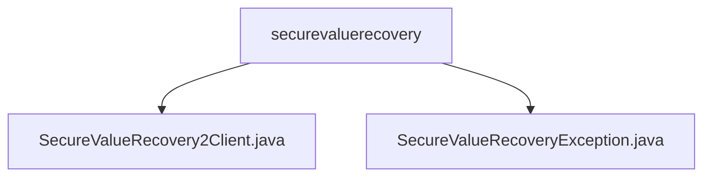

# 基础信息

|      |      |
|------|------|
| 名称 | securevaluerecovery |
| 编码语言 | .java |
| 代码路径 | Signal-Server/service/src/main/java/org/whispersystems/textsecuregcm/securevaluerecovery |
| 包名 | Signal-Server.service.src.main.java.org.whispersystems.textsecuregcm.securevaluerecovery |
| 概述说明 | SecureValueRecovery2Client类用于安全删除备份数据，支持异步操作和HTTP通信。SecureValueRecoveryException处理安全值恢复错误，包含状态码和构造方法。 |

# 说明

## 概述
该代码模块主要涉及安全删除备份数据的管理，核心功能包括生成凭证、配置HTTP客户端以及支持异步删除操作。模块通过`SecureValueRecovery2Client`类实现与服务器的通信，确保数据删除操作的安全性和效率。同时，模块还定义了`SecureValueRecoveryException`异常类，用于处理与安全值恢复相关的错误情况，提供详细的错误信息以支持问题排查。

## 主要业务场景
1. **安全删除备份数据**：通过`SecureValueRecovery2Client`类生成凭证并配置HTTP客户端，确保删除操作的安全性。
2. **异步删除操作**：支持在后台执行删除操作，减少对主线程的影响，提高系统性能。
3. **异常处理**：使用`SecureValueRecoveryException`类捕获和处理与安全值恢复相关的错误，提供状态码和详细错误信息，便于问题定位和解决。

### 包内部结构视图

该流程图展示了`securevaluerecovery`文件夹下的两个Java文件：`SecureValueRecovery2Client.java`和`SecureValueRecoveryException.java`。这两个文件都直接位于`securevaluerecovery`目录下，没有更深层次的子目录结构。通过此图可以清晰地看到文件与文件夹之间的层级关系，便于理解项目的文件组织方式。

# 文件列表 File List

| 名称   | 类型  | 说明 |
|-------|------|-------------|
| [SecureValueRecovery2Client.java](SecureValueRecovery2Client.md) | file | SecureValueRecovery2Client类用于安全删除备份，支持生成凭证、配置HTTP客户端及异步删除。 |
| [SecureValueRecoveryException.java](SecureValueRecoveryException.md) | file | SecureValueRecoveryException继承RuntimeException，含状态码和构造方法。 |

