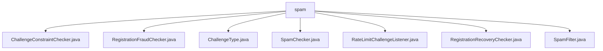

# 基础信息

|      |      |
|------|------|
| 名称 | spam |
| 编码语言 | .java |
| 代码路径 | Signal-Server/service/src/main/java/org/whispersystems/textsecuregcm/spam |
| 包名 | Signal-Server.service.src.main.java.org.whispersystems.textsecuregcm.spam |
| 概述说明 | 输入内容为空，无法生成总结描述。请提供具体信息。 |

# 说明

## 概述
该代码模块似乎专注于处理与垃圾邮件（Spam）和欺诈（Fraud）相关的功能，特别是在用户注册和挑战验证（Challenge）的上下文中。模块中的多个类涉及挑战类型（ChallengeType）、挑战约束检查（ChallengeConstraintChecker）、注册欺诈检查（RegistrationFraudChecker）、垃圾邮件检查（SpamChecker）、速率限制挑战监听（RateLimitChallengeListener）、注册恢复检查（RegistrationRecoveryChecker）以及垃圾邮件过滤（SpamFilter）等功能。这些类的命名表明它们主要用于验证用户行为的合法性，防止滥用和欺诈行为。

## 主要业务场景
1. **挑战验证**：通过`ChallengeType`和`ChallengeConstraintChecker`等类，模块可能实现了不同类型的挑战验证机制，以确保用户行为的合法性，例如防止自动化脚本或恶意用户滥用系统。
2. **注册欺诈检测**：`RegistrationFraudChecker`和`RegistrationRecoveryChecker`等类可能用于检测和防止用户在注册过程中的欺诈行为，例如使用虚假信息或重复注册。
3. **垃圾邮件过滤**：`SpamChecker`和`SpamFilter`等类可能用于识别和过滤垃圾邮件或恶意内容，确保平台的安全性和用户体验。
4. **速率限制**：`RateLimitChallengeListener`可能用于监听和处理与速率限制相关的挑战事件，防止用户或系统在短时间内进行过多请求，从而避免滥用或攻击。

总的来说，该模块的核心业务场景是确保用户行为的合法性和平台的安全性，通过多种验证和过滤机制防止垃圾邮件、欺诈和滥用行为。

### 包内部结构视图

该流程图展示了`spam`目录下的文件层级关系。`spam`作为根节点，包含多个Java文件，如`ChallengeConstraintChecker.java`、`RegistrationFraudChecker.java`等。每个文件直接隶属于`spam`目录，没有进一步的子目录层级。这种结构适用于处理与反垃圾邮件相关的逻辑，所有文件都集中在同一目录下，便于管理和维护。

# 文件列表 File List

| 名称   | 类型  | 说明 |
|-------|------|-------------|
| [SpamFilter.java](SpamFilter.md) | file | 信息为空，无法生成概要描述。 |
| [RegistrationRecoveryChecker.java](RegistrationRecoveryChecker.md) | file | 输入内容为空，无法生成概要描述。 |
| [SpamChecker.java](SpamChecker.md) | file | 无内容，无法生成概要。 |
| [RegistrationFraudChecker.java](RegistrationFraudChecker.md) | file | 无信息可总结。 |
| [RateLimitChallengeListener.java](RateLimitChallengeListener.md) | file | 信息为空，无法生成概要描述。 |
| [ChallengeType.java](ChallengeType.md) | file | 信息为空，无法生成概要描述。 |
| [ChallengeConstraintChecker.java](ChallengeConstraintChecker.md) | file | 无内容提供，无法生成概要描述。 |

