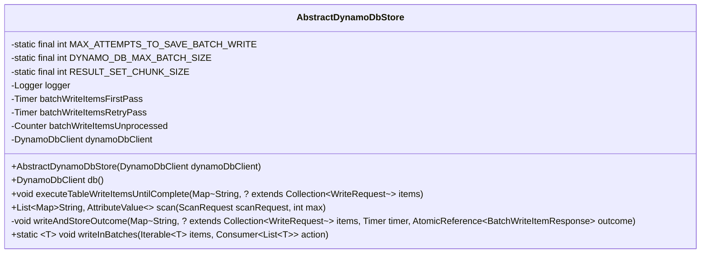
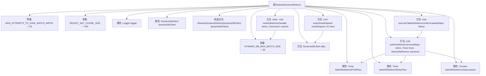

# 基础信息

|      |      |
|------|------|
| 名称 | AbstractDynamoDbStore |
| 编码语言 | .java |
| 代码路径 | Signal-Server/service/src/main/java/org/whispersystems/textsecuregcm/storage/AbstractDynamoDbStore.java |
| 包名 | org.whispersystems.textsecuregcm.storage |
| 依赖项 | ['com.codahale.metrics.MetricRegistry.name', 'io.micrometer.core.instrument.Metrics.counter', 'io.micrometer.core.instrument.Metrics.timer', 'io.micrometer.core.instrument.Counter', 'io.micrometer.core.instrument.Timer', 'java.util.ArrayList', 'java.util.Collection', 'java.util.List', 'java.util.Map', 'java.util.concurrent.atomic.AtomicReference', 'java.util.function.Consumer', 'org.slf4j.Logger', 'org.slf4j.LoggerFactory', 'software.amazon.awssdk.services.dynamodb.DynamoDbClient', 'software.amazon.awssdk.services.dynamodb.model.AttributeValue', 'software.amazon.awssdk.services.dynamodb.model.BatchWriteItemRequest', 'software.amazon.awssdk.services.dynamodb.model.BatchWriteItemResponse', 'software.amazon.awssdk.services.dynamodb.model.ScanRequest', 'software.amazon.awssdk.services.dynamodb.model.WriteRequest', 'javax.annotation.Nonnull'] |
| 概述说明 | AbstractDynamoDbStore处理DynamoDB批量写入和扫描，支持重试和分批处理。 |

# 说明

抽象类AbstractDynamoDbStore专门设计用于处理DynamoDB的批量写入和扫描操作，具备重试机制和分批次处理功能，确保操作的高效性和可靠性。

# 类列表 Class Summary

| 名称   | 类型  | 说明 |
|-------|------|-------------|
| AbstractDynamoDbStore | class | 抽象类AbstractDynamoDbStore处理DynamoDB批量写入和扫描操作，支持重试和分批次处理。 |

## 类 AbstractDynamoDbStore

|      |      |
|------|------|
| 访问范围 | public abstract |
| 类型 | class |
| 名称 | AbstractDynamoDbStore |
| 说明 | 抽象类AbstractDynamoDbStore处理DynamoDB批量写入和扫描操作，支持重试和分批次处理。 |

### UML类图

这段代码定义了一个抽象类 `AbstractDynamoDbStore`，用于管理与 Amazon DynamoDB 的交互。类中包含了一些常量、计时器、计数器以及一个 `DynamoDbClient` 实例。主要方法包括 `executeTableWriteItemsUntilComplete` 用于批量写入数据直到完成，`scan` 用于扫描 DynamoDB 表，`writeAndStoreOutcome` 用于执行批量写入并存储结果，以及 `writeInBatches` 用于将数据分批处理。该类提供了对 DynamoDB 操作的封装，支持批量写入和扫描操作，并处理了可能的未处理项。

### 内部方法调用关系图

该流程图展示了`AbstractDynamoDbStore`类的结构及其内部方法之间的关系。类中定义了多个常量和属性，包括日志记录器、计时器和计数器等。构造方法用于初始化`DynamoDbClient`，而`db()`方法返回该客户端。`executeTableWriteItemsUntilComplete`方法用于处理批量写入操作，并在失败时进行重试。`scan`方法用于扫描DynamoDB表并返回结果。`writeAndStoreOutcome`方法用于执行批量写入并记录结果。`writeInBatches`方法用于将数据分批处理并执行指定操作。

### 字段列表 Field List

| 名称  | 类型  | 说明 |
|-------|-------|------|
| batchWriteItemsUnprocessed = counter(name(getClass(), "batchWriteItemsUnprocessed")) | Counter | 私有计数器用于记录未处理的批量写入项。 |
| batchWriteItemsRetryPass = timer(name(getClass(), "batchWriteItems"), "firstAttempt", "false") | Timer | 私有定时器用于首次尝试批量写入失败后的重试操作。 |
| DYNAMO_DB_MAX_BATCH_SIZE = 25 | int | DynamoDB批量操作最大批次数为25。 |
| dynamoDbClient | DynamoDbClient | 私有且不可变的DynamoDb客户端实例。 |
| MAX_ATTEMPTS_TO_SAVE_BATCH_WRITE = 25 | int | 最大批量写入保存尝试次数为25。 |
| logger = LoggerFactory.getLogger(getClass()) | Logger | 私有日志记录器实例化，用于当前类的日志记录。 |
| batchWriteItemsFirstPass = timer(name(getClass(), "batchWriteItems"), "firstAttempt", "true") | Timer | 类中定义了一个名为batchWriteItemsFirstPass的私有Timer变量，用于首次尝试的批处理写入操作。 |
| RESULT_SET_CHUNK_SIZE = 100 | int | 常量RESULT_SET_CHUNK_SIZE值为100。 |

### 方法列表 Method List

| 名称  | 类型  | 说明 |
|-------|-------|------|
| db | DynamoDbClient | 该方法返回受保护的DynamoDbClient实例。 |
| writeInBatches | void | 将数据分批写入，达到最大批处理大小时执行操作。 |
| writeAndStoreOutcome | void | 该方法使用计时器记录批量写入DynamoDB操作，并存储结果。 |
| executeTableWriteItemsUntilComplete | void | 方法执行批量写入，重试未处理项，超限时记录错误。 |
| scan | List<Map<String, AttributeValue>> | 方法`scan`通过`ScanRequest`和最大数量`max`，使用数据库分页器获取并限制结果集。 |

