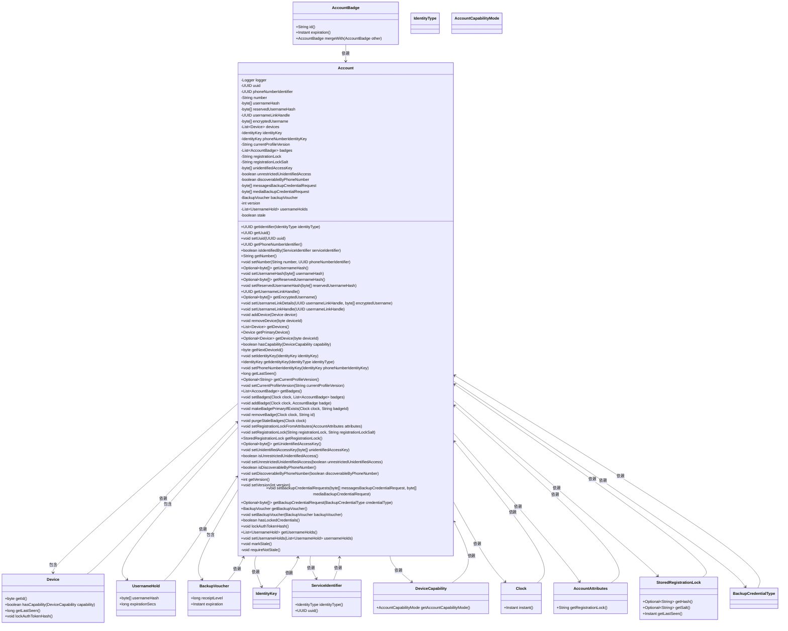

# 基础信息

|      |      |
|------|------|
| 名称 | Account |
| 编码语言 | .java |
| 代码路径 | Signal-Server/service/src/main/java/org/whispersystems/textsecuregcm/storage/Account.java |
| 包名 | org.whispersystems.textsecuregcm.storage |
| 依赖项 | ['com.fasterxml.jackson.annotation.JsonFilter', 'com.fasterxml.jackson.annotation.JsonIgnore', 'com.fasterxml.jackson.annotation.JsonProperty', 'com.fasterxml.jackson.databind.annotation.JsonDeserialize', 'com.fasterxml.jackson.databind.annotation.JsonSerialize', 'java.time.Clock', 'java.time.Instant', 'java.util.ArrayList', 'java.util.Collections', 'java.util.List', 'java.util.Objects', 'java.util.Optional', 'java.util.UUID', 'javax.annotation.Nullable', 'org.apache.commons.lang3.StringUtils', 'org.signal.libsignal.protocol.IdentityKey', 'org.signal.libsignal.zkgroup.backups.BackupCredentialType', 'org.slf4j.Logger', 'org.slf4j.LoggerFactory', 'org.whispersystems.textsecuregcm.auth.SaltedTokenHash', 'org.whispersystems.textsecuregcm.auth.StoredRegistrationLock', 'org.whispersystems.textsecuregcm.entities.AccountAttributes', 'org.whispersystems.textsecuregcm.identity.IdentityType', 'org.whispersystems.textsecuregcm.identity.ServiceIdentifier', 'org.whispersystems.textsecuregcm.util.ByteArrayBase64UrlAdapter', 'org.whispersystems.textsecuregcm.util.IdentityKeyAdapter'] |
| 概述说明 | Account类含UUID、电话、设备、密钥，支持用户名、加密、注册锁功能。 |

# 说明

Account类包含多个关键属性，包括UUID、电话号码标识符、设备列表和身份密钥。该类支持多种功能，如用户名设置、加密用户名管理以及注册锁机制。这些属性和功能共同构成了账户管理的基础，确保账户的安全性和唯一性。

# 类列表 Class Summary

| 名称   | 类型  | 说明 |
|-------|------|-------------|
| Account | class | Account类包含UUID、电话号码标识符、设备列表、身份密钥等属性，支持用户名、加密用户名、注册锁等功能。 |

## 类 Account

|      |      |
|------|------|
| 访问范围 | @JsonFilter("Account");public |
| 类型 | class |
| 名称 | Account |
| 说明 | Account类包含UUID、电话号码标识符、设备列表、身份密钥等属性，支持用户名、加密用户名、注册锁等功能。 |

### UML类图

这段代码定义了一个 `Account` 类，用于管理账户信息。`Account` 类包含了多个私有字段，如 `uuid`、`phoneNumberIdentifier`、`number` 等，以及一系列公有方法用于获取和设置这些字段的值。类中还定义了多个内部类，如 `UsernameHold` 和 `BackupVoucher`，用于存储特定类型的数据。`Account` 类与其他类（如 `Device`、`IdentityKey` 等）存在依赖关系，通过这些依赖关系，`Account` 类能够管理设备、身份密钥等信息。整体设计复杂且功能丰富，适用于需要管理多种账户信息的场景。

### 内部方法调用关系图

这段代码定义了一个名为 `Account` 的类，该类包含了多个属性和方法，用于管理账户的相关信息。属性包括账户的唯一标识符、电话号码标识符、用户名哈希、设备列表、身份密钥等。方法则提供了对这些属性的访问和修改功能，例如获取和设置账户标识符、管理设备、处理账户徽章、设置注册锁等。代码中还包含了一些验证逻辑，确保在访问或修改账户信息时，账户状态是有效的。

### 字段列表 Field List

| 名称  | 类型  | 说明 |
|-------|-------|------|
| uuid | UUID | JSON属性映射UUID字段。 |
| logger = LoggerFactory.getLogger(Account.class) | Logger | 定义Account类的私有静态日志记录器实例。 |
| unrestrictedUnidentifiedAccess | boolean | 属性uua表示是否允许无限制的未识别访问。 |
| usernameLinkHandle | UUID | 可空属性usernameLinkHandle，类型为UUID。 |
| registrationLock | String | 属性registrationLock使用JsonProperty注解进行序列化。 |
| devices = new ArrayList<>() | List<Device> | 定义私有设备列表并初始化为空数组。 |
| badges = new ArrayList<>() | List<AccountBadge> | 私有属性badges为AccountBadge类型的列表，初始化为空ArrayList。 |
| number | String | JSON属性映射为私有字符串变量number。 |
| registrationLockSalt | String | 定义私有字符串变量registrationLockSalt，并使用JsonProperty注解。 |
| mediaBackupCredentialRequest | byte[] | 可空字节数组存储媒体备份凭证请求。 |
| phoneNumberIdentityKey | IdentityKey | PNI身份键的JSON序列化与反序列化配置。 |
| stale | boolean | 忽略JSON序列化的stale布尔字段。 |
| identityKey | IdentityKey | 使用IdentityKeyAdapter进行JSON序列化和反序列化的IdentityKey属性。 |
| reservedUsernameHash | byte[] | 使用注解处理Base64编码的可空字节数组。 |
| version | int | 使用JsonProperty注解标注私有整型变量version。 |
| phoneNumberIdentifier | UUID | 类中定义了一个私有UUID类型的电话号码标识符字段。 |
| encryptedUsername | byte[] | 属性encryptedUsername可为空，存储加密用户名字节数组。 |
| discoverableByPhoneNumber = true | boolean | 属性discoverableByPhoneNumber默认为true，用于控制电话号码可发现性。 |
| usernameHolds = Collections.emptyList() | List<UsernameHold> | 属性`usernameHolds`存储`UsernameHold`对象列表，默认为空列表。 |
| usernameHash | byte[] | 使用注解处理字节数组的Base64 URL编码与解码，支持空值。 |
| messagesBackupCredentialRequest | byte[] | 代码定义了一个可为空的字节数组变量messagesBackupCredentialRequest，使用JsonProperty注解标记为bcr。 |
| currentProfileVersion | String | 类中定义私有字符串变量currentProfileVersion，使用JsonProperty注解映射为cpv。 |
| unidentifiedAccessKey | byte[] | 代码定义了一个名为unidentifiedAccessKey的字节数组私有变量，并使用JsonProperty注解标记为uak。 |
| backupVoucher | BackupVoucher | Java类中定义了一个可空的BackupVoucher类型变量backupVoucher，并使用JsonProperty注解标记为"bv"。 |

### 方法列表 Method List

| 名称  | 类型  | 说明 |
|-------|-------|------|
| setCurrentProfileVersion | void | 设置当前配置文件版本，确保状态未过期。 |
| setDiscoverableByPhoneNumber | void | 设置是否通过电话号码可被发现。 |
| hasLockedCredentials | boolean | 检查所有设备是否锁定凭据。 |
| getUsernameHash | Optional<byte[]> | 方法返回可选的用户名哈希值，确保对象未过期。 |
| setPhoneNumberIdentityKey | void | 设置电话号码身份密钥。 |
| removeDevice | void | 删除指定ID的设备。 |
| getPrimaryDevice | Device | 获取主设备，若无则抛出异常。 |
| lockAuthTokenHash | void | 锁定所有设备的认证令牌哈希值。 |
| getUnidentifiedAccessKey | Optional<byte[]> | 获取未识别访问密钥，返回可选字节数组。 |
| getIdentifier | UUID | 根据身份类型返回对应的UUID或电话号码标识符。 |
| markStale | void | 标记对象为过时状态。 |
| setUuid | void | 方法设置UUID，确保对象未过期。 |
| getDevices | List<Device> | 获取设备列表前检查状态，返回设备集合。 |
| getLastSeen | long | 获取设备列表中最近一次活动时间，若无则返回0。 |
| getVersion | int | 获取版本号前检查状态，返回当前版本号。 |
| setUsernameLinkDetails | void | 方法设置用户名链接详情，验证参数一致性及字段状态。 |
| getBadges | List<AccountBadge> | 获取账户徽章列表，确保数据非过时。 |
| isDiscoverableByPhoneNumber | boolean | 该方法检查手机号是否可被发现，返回布尔值。 |
| getUsernameLinkHandle | UUID | 方法返回非空UUID，检查状态后返回usernameLinkHandle。 |
| setUsernameLinkHandle | void | 方法设置用户名链接句柄，确保对象未过期。 |
| getEncryptedUsername | Optional<byte[]> | 方法返回加密用户名，确保数据未过期。 |
| requireNotStale | void | 检查账户状态，若过期则记录错误。 |
| setRegistrationLockFromAttributes | void | 根据账户属性设置注册锁定，生成哈希和盐值。 |
| getBackupVoucher | BackupVoucher | 获取备份凭证，需确保数据未过期。 |
| getDevice | Optional<Device> | 根据设备ID获取设备对象，返回首个匹配项。 |
| setBadges | void | 设置徽章列表并清除过期徽章。 |
| getUsernameHolds | List<UsernameHold> | 该方法返回不可修改的用户名持有列表。 |
| setBackupCredentialRequests | void | 设置备份凭证请求，包括消息和媒体备份凭证请求。 |
| getNumber | String | 该方法返回非过期的数字值。 |
| setNumber | void | 设置号码和标识符，确保数据未过期。 |
| setUsernameHolds | void | 设置用户名持有列表，确保对象未过时。 |
| setUsernameHash | void | 设置用户名字节数组哈希值，确保数据未过期。 |
| hasCapability | boolean | 检查设备是否具备指定功能，支持主设备、任意设备和所有设备模式。 |
| getPhoneNumberIdentifier | UUID | 获取非过期的电话号码标识符。 |
| getUuid | UUID | 该方法返回账户的UUID，允许在过时账户上调用。 |
| getReservedUsernameHash | Optional<byte[]> | 获取保留用户名哈希值的可选方法，确保数据未过期。 |
| setVersion | void | 该方法设置版本号，确保对象未过期。 |
| removeBadge | void | 移除指定ID的徽章并清理过期徽章。 |
| addDevice | void | 方法`addDevice`先检查状态，移除旧设备后添加新设备。 |
| getIdentityKey | IdentityKey | 该方法根据身份类型返回对应的身份密钥。 |
| getBackupCredentialRequest | Optional<byte[]> | 获取备份凭证请求，根据类型返回相应凭证。 |
| addBadge | void | 方法添加或合并徽章，确保不重复并清除过期徽章。 |
| setRegistrationLock | void | 设置注册锁及其盐值，确保数据未过期。 |
| getCurrentProfileVersion | Optional<String> | 该方法返回当前配置版本，确保数据未过期。 |
| isUnrestrictedUnidentifiedAccess | boolean | 方法检查是否允许未识别访问，返回布尔值。 |
| purgeStaleBadges | void | 清除过期徽章，基于当前时间删除已过期的账户徽章。 |
| getRegistrationLock | StoredRegistrationLock | 获取注册锁信息，包含锁值、盐值和最后访问时间。 |
| getNextDeviceId | byte | 获取下一个可用设备ID，避免溢出并返回。 |
| setBackupVoucher | void | 设置备份凭证，检查状态后更新为指定值。 |
| makeBadgePrimaryIfExists | void | 方法检查并置顶指定徽章，移除过期徽章。 |
| setIdentityKey | void | 设置身份密钥，确保非过期状态。 |
| setUnrestrictedUnidentifiedAccess | void | 设置未识别访问权限，确保对象未过期。 |
| setReservedUsernameHash | void | 设置保留用户名哈希值，确保数据未过期。 |
| setUnidentifiedAccessKey | void | 设置未识别访问密钥的方法，确保状态有效。 |
| isIdentifiedBy | boolean | 该方法根据服务标识类型检查UUID或电话号码标识符是否匹配。 |

