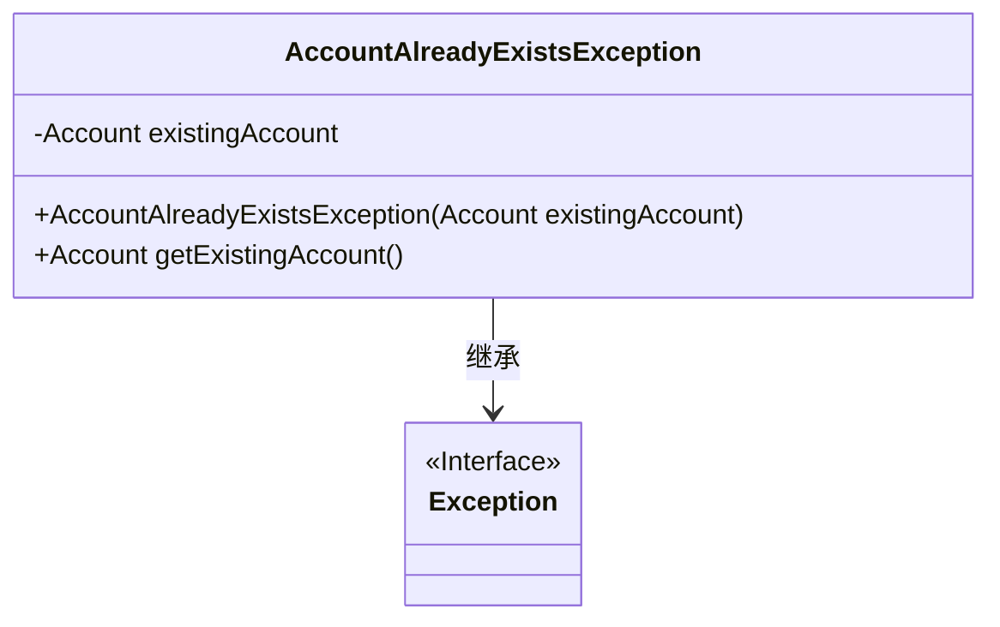
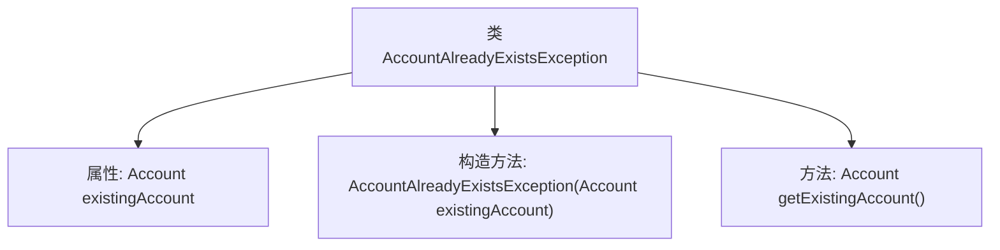

# 基础信息

|      |      |
|------|------|
| 名称 | AccountAlreadyExistsException |
| 编码语言 | .java |
| 代码路径 | Signal-Server/service/src/main/java/org/whispersystems/textsecuregcm/storage/AccountAlreadyExistsException.java |
| 包名 | org.whispersystems.textsecuregcm.storage |
| 依赖项 | [] |
| 概述说明 | AccountAlreadyExistsException继承Exception，记录现有账户信息。 |

# 说明

AccountAlreadyExistsException是一个继承自Exception的异常类，主要用于处理账户已存在的情况。该异常类包含现有账户的相关信息，以便在抛出异常时能够提供具体的上下文信息，帮助开发者更好地理解和处理账户重复创建的问题。

# 类列表 Class Summary

| 名称   | 类型  | 说明 |
|-------|------|-------------|
| AccountAlreadyExistsException | class | AccountAlreadyExistsException继承Exception，包含现有账户信息。 |

## 类 AccountAlreadyExistsException

|      |      |
|------|------|
| 访问范围 | None |
| 类型 | class |
| 名称 | AccountAlreadyExistsException |
| 说明 | AccountAlreadyExistsException继承Exception，包含现有账户信息。 |

### UML类图

**描述：**  
`AccountAlreadyExistsException` 是一个自定义异常类，继承自 `Exception` 类。它包含一个私有成员 `existingAccount`，用于存储已存在的账户信息。该类提供了一个构造函数 `AccountAlreadyExistsException`，用于初始化 `existingAccount`，并提供了一个公有方法 `getExistingAccount`，用于获取已存在的账户信息。该异常类主要用于在账户已存在时抛出异常，并提供相关账户信息。

### 内部方法调用关系图

这段代码定义了一个名为 `AccountAlreadyExistsException` 的异常类，它继承自 `Exception`。该类包含一个 `Account` 类型的私有属性 `existingAccount`，并通过构造方法进行初始化。类中还提供了一个 `getExistingAccount` 方法，用于返回已存在的账户对象。这个异常类通常用于在账户创建过程中检测到账户已存在时抛出。

### 字段列表 Field List

| 名称  | 类型  | 说明 |
|-------|-------|------|
| existingAccount | Account | 私有不可变账户实例变量。 |

### 方法列表 Method List

| 名称  | 类型  | 说明 |
|-------|-------|------|
| getExistingAccount | Account | 获取现有账户实例的方法。 |

