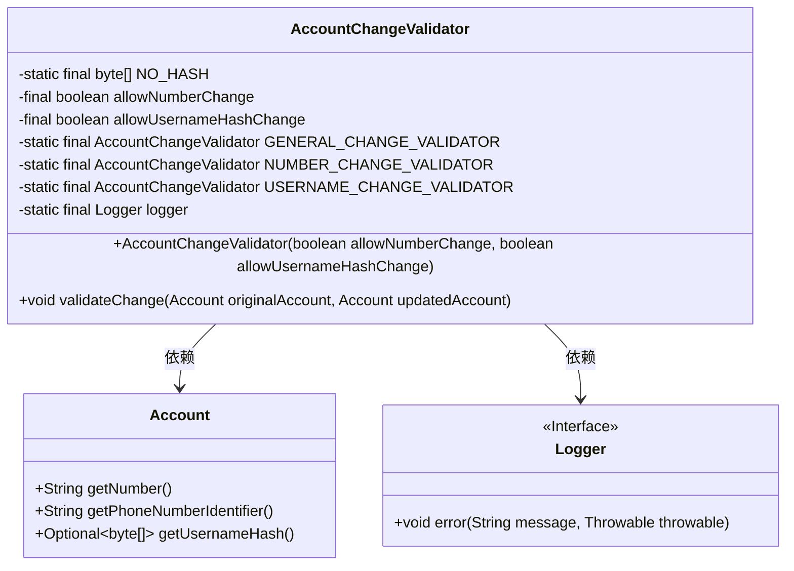
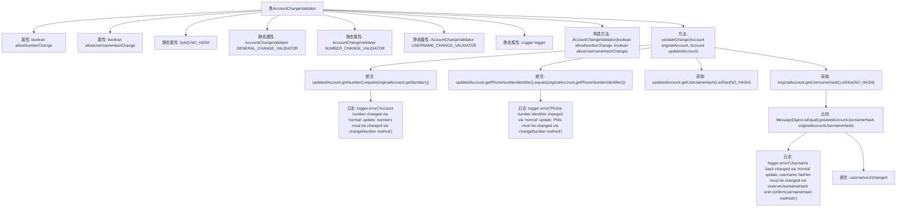

# 基础信息

|      |      |
|------|------|
| 名称 | AccountChangeValidator |
| 编码语言 | .java |
| 代码路径 | Signal-Server/service/src/main/java/org/whispersystems/textsecuregcm/storage/AccountChangeValidator.java |
| 包名 | org.whispersystems.textsecuregcm.storage |
| 依赖项 | ['java.security.MessageDigest', 'org.slf4j.Logger', 'org.slf4j.LoggerFactory'] |
| 概述说明 | 限制账户变更验证类中号码和用户名哈希的修改方式。 |

# 说明

账户变更验证类主要用于限制用户对号码和用户名哈希的修改方式。该类的设计目的是确保账户信息的安全性，防止未经授权的修改。通过特定的验证机制，用户在进行号码或用户名哈希的变更时，必须满足一定的条件或通过特定的验证流程。这种限制有助于保护用户账户的完整性和隐私，防止恶意篡改或滥用。

# 类列表 Class Summary

| 名称   | 类型  | 说明 |
|-------|------|-------------|
| AccountChangeValidator | class | 账户变更验证类，限制号码和用户名哈希的修改方式。 |

## 类 AccountChangeValidator

|      |      |
|------|------|
| 访问范围 | None |
| 类型 | class |
| 名称 | AccountChangeValidator |
| 说明 | 账户变更验证类，限制号码和用户名哈希的修改方式。 |

### UML类图

### 描述
`AccountChangeValidator` 类用于验证账户信息的更改。它包含两个布尔类型的成员变量 `allowNumberChange` 和 `allowUsernameHashChange`，用于控制是否允许更改账户号码和用户名哈希。该类提供了 `validateChange` 方法，用于比较原始账户和更新后的账户信息，并根据配置决定是否允许更改。如果检测到不允许的更改，将记录错误日志并抛出异常。`Account` 类提供了获取账户号码、电话号码标识符和用户名哈希的方法。`Logger` 接口用于记录错误信息。

### 内部方法调用关系图

这段代码定义了一个`AccountChangeValidator`类，用于验证账户信息的变更是否符合规则。类中有两个布尔属性`allowNumberChange`和`allowUsernameHashChange`，分别控制是否允许更改账户号码和用户名哈希。`validateChange`方法通过比较原始账户和更新后的账户信息，确保变更符合预设规则。如果发现非法变更，会记录错误日志并抛出断言异常。流程图展示了类的属性、构造方法以及`validateChange`方法内部的详细流程。

### 字段列表 Field List

| 名称  | 类型  | 说明 |
|-------|-------|------|
| NO_HASH = new byte[32] | byte[] | 定义了一个长度为32的空字节数组常量NO_HASH。 |
| logger = LoggerFactory.getLogger(AccountChangeValidator.class) | Logger | 定义AccountChangeValidator类的日志记录器实例。 |
| allowUsernameHashChange | boolean | 私有布尔变量控制用户名哈希更改权限。 |
| allowNumberChange | boolean | 私有布尔变量，控制是否允许号码变更。 |
| GENERAL_CHANGE_VALIDATOR = new AccountChangeValidator(false, false) | AccountChangeValidator | 定义静态常量GENERAL_CHANGE_VALIDATOR，使用AccountChangeValidator类初始化，参数为false, false。 |
| NUMBER_CHANGE_VALIDATOR = new AccountChangeValidator(true, false) | AccountChangeValidator | 静态常量NUMBER_CHANGE_VALIDATOR实例化AccountChangeValidator，参数为true和false。 |
| USERNAME_CHANGE_VALIDATOR = new AccountChangeValidator(false, true) | AccountChangeValidator | 静态常量USERNAME_CHANGE_VALIDATOR初始化为AccountChangeValidator对象，参数为false和true。 |

### 方法列表 Method List

| 名称  | 类型  | 说明 |
|-------|-------|------|
| validateChange | void | 验证账户更新，确保账号、电话标识符和用户名哈希未通过常规方法修改。 |

